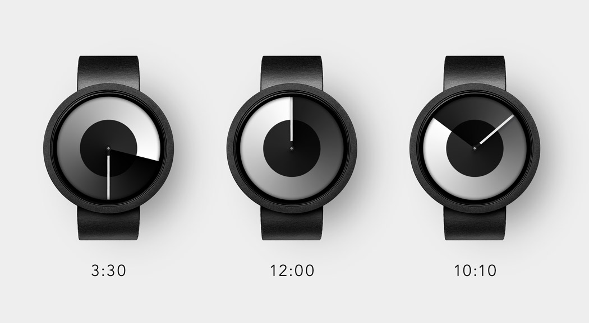
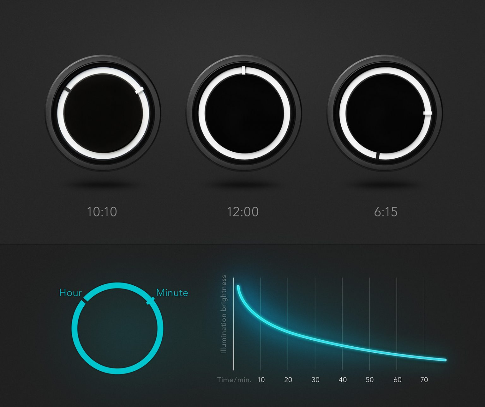
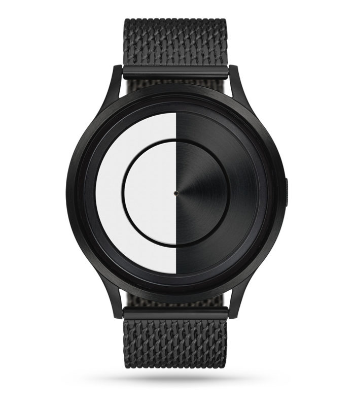
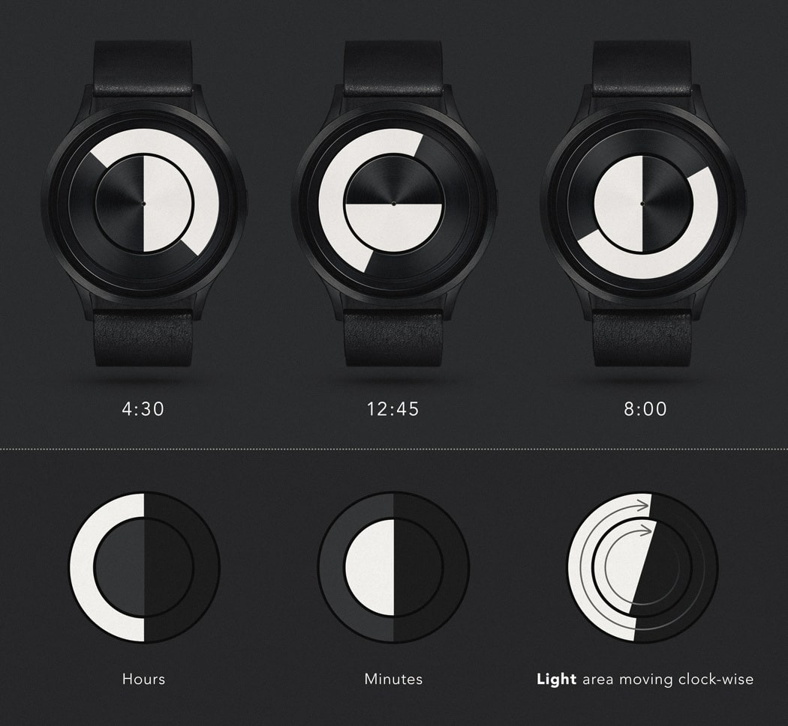
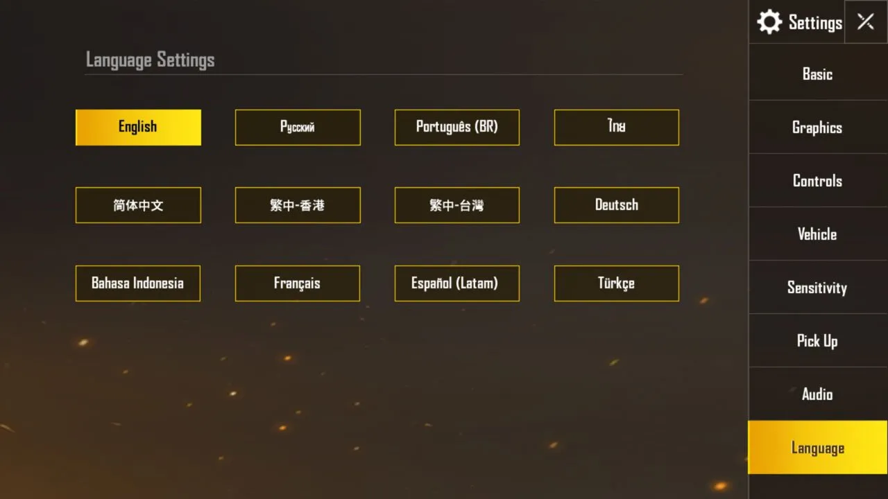
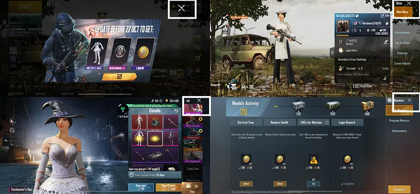
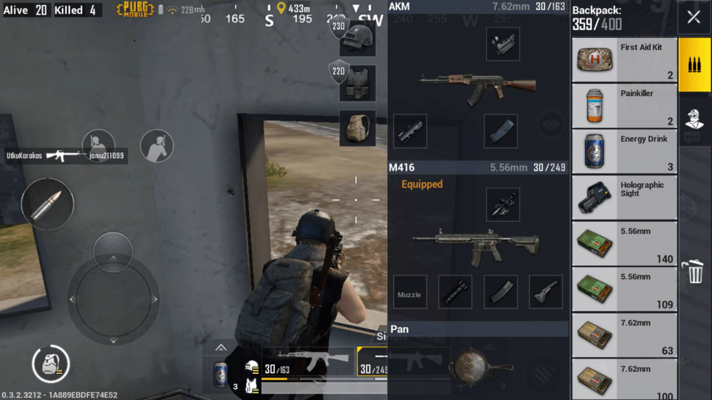
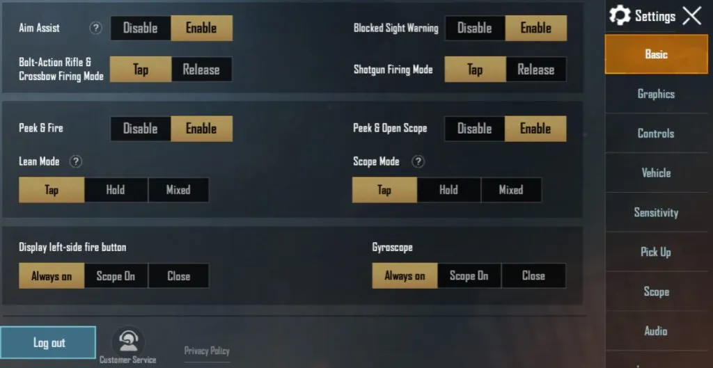
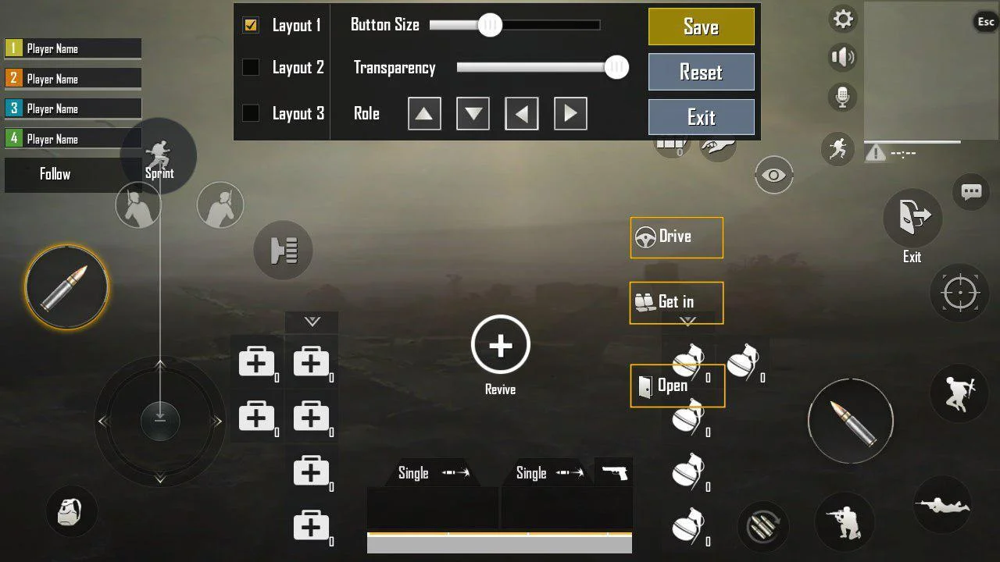
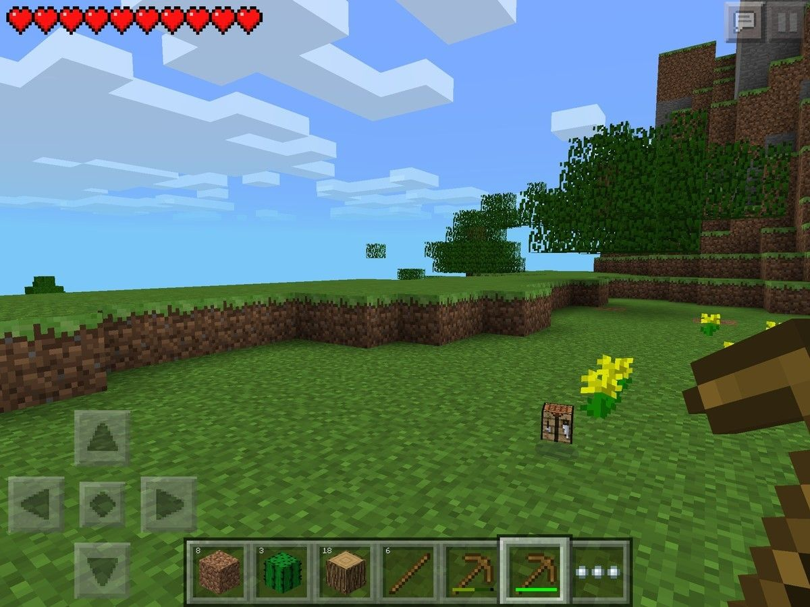

# 1. Aim and Objectives

The aim of this report is to evaluate and analyse the user experience of two products:

1. [Ziiiro Watch](https://www.ziiiro.com/)
2. [PUBG Mobile](https://www.pubgmobile.com/en-US/home.shtml)

The report focuses on the analysis of user experience and experience perspectives based on the fundemental HCI concepts that have been covered in the HCI course, which includes:

- Human capabilities
- User mental model
- Interaction metaphor
- Usability

# 1. ZIIIRO watch

## 1.1. Introduction

Welcome to the world of ZIIIRO Watches, where boldness meets minimalism and everyday timekeeping becomes an art form. ZIIIRO is a renowned brand known for its unique and fashionable timepieces that effortlessly blend style and functionality. With their sleek designs and eye-catching colors, ZIIIRO watches are the perfect accessories to complement your outfit and make a bold statement.

ZIIIRO was founded by two individuals, Robert and Derick, who shared a passion for creating timepieces that challenge traditional norms. Their journey began on the internet, where Robert, based in Germany, showcased his watch designs, catching the attention of Derick from Hong Kong. With their shared vision of minimalism and a desire to create something extraordinary, ZIIIRO was born.

## 1.2. Name and domain 
   - **Name:** The ZIIIRO watch's
   - **Domain:**
     This product is primarily intended for personal use as a stylish and innovative timepiece. The ZIIIRO watches are designed to appeal to individuals who appreciate unique designs, minimalistic aesthetics, and unconventional ways of displaying time. The watches are not only functional for timekeeping but also serve as fashion accessories, conversation starters, and collector's items for enthusiasts interested in distinctive and limited edition timepieces. The ZIIIRO watches are known for their bold and colorful designs that allow users to mix and match colors that pop. They offer a range of unique everyday watches with a focus on simplicity and sleekness, keeping the design minimal and stylish.

## 1.3. Target Audience
   
The ZIIIRO watch is specifically designed to captivate the attention of individuals who have a discerning taste for unique and minimalist timepieces, as well as a deep appreciation for aesthetics. The watch stands out from conventional designs with its unconventional display and emphasis on graphical design, offering a truly distinctive and eye-catching appearance.

   One of the key factors that appeal to the target audience is the watch's minimalist approach. The ZIIIRO watch does away with conventional hands, markings, and even clasps, embracing a philosophy of minimalism where no distracting elements are included in the designs. This design choice ensures that the focus remains on the essential function of timekeeping while creating a visually striking experience.

   The ZIIIRO watch's emphasis on graphical design is another aspect that appeals to the target audience. The watch utilizes a constant change in patterns to indicate the passage of time, relying on moving gradients and rotating discs. This unique approach not only offers a fresh and dynamic way of reading the time but also serves as an artistic expression that complements the wearer's sense of style.

## 1.4. Some core use cases of the product

The ZIIIRO watch offers several core use cases that cater to various contexts and situations, providing users with a unique and engaging timekeeping experience. Let's explore these use cases in detail, including the context, user situations, and methods of interaction with the watch's interface:

- **Everyday Timekeeping**:

	- **Context:** This use case encompasses the daily routine of users, whether at home, work, or during leisure activities.

	- **User Situations:** Users can be in a variety of positions such as sitting, standing, or walking, and engaged in various tasks or activities.

	- **Interaction:** Users interact with the ZIIIRO watch by simply glancing at its unconventional display, which may feature moving gradients, rotating discs, or other graphical elements. The watch's interface provides a visually striking representation of the time, allowing users to effortlessly read the hours and minutes. The absence of traditional hands and markings does not hinder its readability; instead, the design focuses on simplicity and minimalism. The watch's interface serves as a constant visual reminder of the time, ensuring that users can stay on schedule and manage their tasks efficiently. Whether sitting at a desk, running on a treadmill, or engaging in any other activity, users can quickly glance at the watch to stay informed without the need for distracting or intrusive notifications. It seamlessly integrates into their daily lives, providing a unique and intuitive timekeeping experience.
		
- **Fashion and Style**:
	- **Context:** This use case revolves around users who appreciate the ZIIIRO watch as a fashionable accessory, allowing them to express their personal style and make a statement.

	- **User Situations:** Users can wear the watch while attending social events, parties, or gatherings, or as part of their daily attire to enhance their overall look.

	- **Interaction:** The watch's interface serves as a captivating centerpiece, drawing attention with its distinctive and eye-catching design. Users have the freedom to mix and match colors, choosing from a range of options, to create personalized combinations that perfectly complement their outfits. The ZIIIRO watch becomes an integral part of their fashion ensemble, adding a touch of creativity and individuality. Its seamless integration with their style allows users to showcase their fashion-forward mindset and appreciation for unique accessories.

	
In all of these use cases, the ZIIIRO watch offers a seamless and intuitive user experience. The unconventional display and emphasis on graphical design allow users to interact with the watch effortlessly, relying on visual cues rather than traditional timekeeping elements. This makes it suitable for various contexts and user situations, enhancing both functionality and style.

 

## 1.5. Benefits and drawbacks of the product's interface
### **Benefits**:
  - **Simplicity**: The ZIIIRO watch's interface embraces simplicity by utilizing a minimalistic design approach. It eliminates complex buttons, dials, and markings commonly found on traditional watches, resulting in a clean and sleek appearance. This simplicity enhances the user experience by reducing cognitive load and making it easy to read and interpret the time.
    _Use case_: Busy professionals who are constantly on the go can benefit from the ZIIIRO watch's simplicity. Its minimalist design allows them to quickly glance at the time without being distracted by unnecessary details. Whether they are in a meeting, attending an event, or managing their schedule, the simplicity of the watch's interface helps them prioritize their time and stay focused.

  - **Visual Clarity**: The watch employs a combination of colors, shapes, and patterns to represent the time. This visual clarity allows users to quickly understand the current time at a glance. By removing unnecessary elements, the ZIIIRO watch provides a focused and unambiguous display.
    _Use case_: In a diverse professional setting, the ZIIIRO watch's visual clarity proves valuable. Professionals such as engineers, designers, and architects can easily glance at the watch during meetings without being distracted by unnecessary details. This allows them to maintain focus, adhere to schedules, and seamlessly transition between tasks. The minimalist design adds sophistication to their attire, making it a subtle fashion statement.

  - **Aesthetic Appeal**: The unique design of the ZIIIRO watch's interface appeals to users who appreciate unconventional and modern aesthetics. The watch serves as a fashion statement and conversation starter, appealing to those who value style and individuality.
  _Use case_: Fashion-forward individuals who seek to express their individuality through accessories can benefit from the ZIIIRO watch's aesthetic appeal. Whether they are attending parties, social events, or simply want to stand out in their day-to-day activities, the watch serves as a conversation starter and complements their personal style choices.

### **Drawbacks**:

  - **Learning Curve**: Due to its unconventional interface, users may initially find it challenging to understand how to read the time on the ZIIIRO watch. It deviates from the traditional watch face format, requiring users to learn a new time-telling method. This learning curve can be a drawback for users who prefer familiarity and ease of use.
    _Use case_: Elderly users who are accustomed to traditional watch designs and may have difficulty adapting to new technologies could find the learning curve of the ZIIIRO watch challenging. Its unconventional interface might cause confusion and frustration for individuals who are used to reading time in a more traditional manner.
    

  - **Precision and Accuracy**: The abstract representation of time on the ZIIIRO watch sacrifices precise timekeeping. The absence of minute and second markers makes it difficult to determine time with high accuracy. While the watch may suffice for general timekeeping, it may not be suitable for situations that require precise timing.
    _Use case_: Sports and fitness enthusiasts who require precise timing for activities such as interval training, timing laps, or monitoring rest periods may find the abstract time representation of the ZIIIRO watch insufficient. The lack of minute and second markers makes it difficult to track time precisely, potentially impacting their performance or training routines
    
    

  - **Limited Functionality**: The ZIIIRO watch's interface focuses solely on displaying the time. It lacks additional features commonly found in modern watches, such as date display, alarms, or timers. Users who require these functionalities may find the ZIIIRO watch limited in its capabilities.
    _Use case_: Travelers who rely on watches to not only tell time but also track multiple time zones or use alarms to manage their schedules may find the limited functionality of the ZIIIRO watch inconvenient. The absence of additional features like date display, world time, or alarms may hinder their ability to efficiently manage their travel plans or stay organized in different time zones.
   

  - **Accessibility**: The abstract representation of time on the ZIIIRO watch may pose challenges for individuals with visual impairments or certain cognitive disabilities. The lack of clear, standardized time indicators can hinder accessibility for a portion of the user population.
  _Use case_: Visually impaired users who heavily rely on tactile or audible feedback to interact with devices may find the abstract time representation of the ZIIIRO watch inaccessible. The lack of clear indicators or tactile markings makes it difficult for these users to independently read and interpret the time, potentially excluding them from using the watch effectively.
   

## 1.6. Different types of users

- **Tech Novices**:
  Users who are not accustomed to modern technology or have limited experience with digital devices may face difficulties understanding and operating the ZIIIRO watch's unconventional interface. The abstract representation of time may be confusing, leading to a steep learning curve for these users.

- **Elderly Users**:
  Elderly users who are more accustomed to traditional watches with standard time displays may find it challenging to adapt to the abstract time representation used in the ZIIIRO watch. The lack of clear minute and second markers could lead to confusion and difficulty accurately reading the time.

- **Visually Impaired Users**:
  Visually impaired users who rely on clear and tactile indicators to read time may encounter difficulties with the ZIIIRO watch's interface. The absence of standardized markings or tactile feedback could hinder their ability to independently interpret the time.

- **Users in Time-Critical Situations**:
  In time-critical situations where precise timing is crucial, such as sports events or professional settings with strict deadlines, the abstract representation of time on the ZIIIRO watch might not provide the accuracy and precision needed. The lack of minute and second markers could make it challenging for users to track time precisely.

- **Multitaskers**:
  Users who frequently rely on additional functions, such as alarms, timers, or date displays, may find the limited functionality of the ZIIIRO watch restrictive. In contexts where managing multiple tasks and schedules is essential, the absence of these features may hinder their productivity and organizational abilities.

- **Individuals with Cognitive Disabilities**:
  Users with certain cognitive disabilities that affect their ability to interpret abstract representations or learn new interfaces may find it challenging to use the ZIIIRO watch. The unconventional time display might pose difficulties for these individuals, potentially limiting their ability to independently read and understand the time.

# 2. PUBG Mobile

## 2.1. Introduction

PUBG Mobile is a free-to-play battle royale video game developed by LightSpeed & Quantum Studio, a division of Tencent Games. It is a mobile game adaptation of PUBG: Battlegrounds. It was initially released for Android and iOS on 19 March 2018.

It was published by multiple publishers in different regions, including Krafton, Tencent, and VNG Games. By December 2022, PUBG Mobile had accumulated around 1.3 billion downloads while grossing over $9 billion, making it the third highest-grossing mobile game. It is also the second most-played mobile video game of all time. In 2021, the game spawned an Indian version, Battlegrounds Mobile India, and a separate game taking place in the PUBG Universe, called New State Mobile. 

## 2.2. Target Audience

PUBG Mobile is a game that is played by people of all ages. However, the game is rated 17+ by the ESRB, which means that the game is not suitable for children under the age of 17. The game is also rated 16+ by PEGI, which means that the game is not suitable for children under the age of 16.

<!-- ## 2.3. Some core use cases of the product

### 2.3.1. Use Case 1: Playing the game

- Context: The user is playing the game on their mobile device.
- User Situation: The user is sitting down and holding their mobile device in their hands.
- Methods of Interaction: The user interacts with the game by using the touch screen on their mobile device. They can tap on the screen to move their character, shoot, and interact with objects in the game world. They can also use the device's gyroscope to aim and look around. 

### 2.3.2. Use Case 2: Customizing the game settings

- Context: The user is customizing the game settings on their mobile device.
- User Situation: The user is sitting down and holding their mobile device in their hands.
- Methods of Interaction: The user interacts with the game by using the touch screen on their mobile device. They can tap on the screen to select different options and adjust settings to best suit their preferences. -->

## 2.3. Analysis of UX in terms of Human Capabilities

### 2.3.1. Perception

PUBG Mobile leverages players' perceptual abilities, including visual and auditory perception. Visual perception is crucial for spotting opponents, identifying resources, and navigating the game world. The game's graphics and visual cues provide important information about the environment, such as terrain, structures, and object interactions. Auditory perception allows players to locate opponents based on sound cues, such as footsteps, gunshots, or vehicle sounds. PUBG Mobile engages players' perceptual abilities to enhance situational awareness and decision-making.

### 2.3.2. Cognition

PUBG minimize the user’s memory load by making objects, actions, and options visible. The user should not have to remember information from one part of the dialogue to another. Instructions for use of the system should be visible or easily retrievable whenever appropriate.

The weapons and bullets have different types in the PUBG mobile and players feel difficult to figure out what they need at that time. The highlighted stuff is an automatic reminder for players to recognize the weapon they have and what bullets they should pick up.

## 2.4. User Mental Model

### 2.4.1. Real-world References

PUBG Mobile incorporates real-world references to enhance the user experience and facilitate learning. The game draws inspiration from real-world military tactics, weapons, and equipment. This allows players to leverage their existing knowledge and understanding of these concepts to improve their performance in the game. For example, players can apply real-world knowledge of weapon characteristics, such as recoil and bullet drop, to improve their aim and accuracy in PUBG Mobile.

PUBG Mobile also incorporates real-world references in its user interface. For example, the inventory system is designed to mimic a backpack, allowing players to organize and manage their items in a way that is familiar and intuitive. Similarly, the map interface resembles a paper map, providing a recognizable and intuitive way to navigate the game world.

### 2.4.2. Familiarity with Battle Royale Genre and Gaming Conventions

PUBG Mobile is a battle royale game, and many players are already familiar with the genre. Moreover, most players are familiar with the placing of crosshair in the middle of the screen and the shooting mechanics. PUBG Mobile leverages this familiarity to enhance the user experience and facilitate learning. For example, players can apply their existing knowledge of aiming and shooting mechanics to improve their performance in PUBG Mobile, or players who have played other battle royale games may already be familiar with concepts such as looting, inventory management, and combat tactics. This prior knowledge can be applied to PUBG Mobile, allowing players to quickly adapt to the game's mechanics and interface.

### 2.4.3. Gaming Conventions

PUBG Mobile follows common gaming conventions to enhance the user experience and facilitate learning. For example, the game utilizes standard controls and button mappings that are familiar to most players. This allows players to leverage their existing knowledge of gaming conventions to quickly learn and adapt to PUBG Mobile.

## 2.5. Usability

### 2.5.1. Learnability

Learnability plays a crucial role in the overall usability of a system, and PUBG Mobile incorporates several features to ensure that new players can quickly grasp the game mechanics and navigate the interface. Here is a more detailed analysis of learnability in PUBG Mobile:

#### Good Points

**Tutorial Mode:** PUBG Mobile offers a tutorial mode specifically designed to introduce new players to the game. It provides step-by-step instructions on basic controls, movement, aiming, shooting, and looting. The tutorial mode gradually introduces more advanced concepts, such as managing inventory, using vehicles, and employing different weapon attachments.

**Tooltips and Hints:** Throughout the game, PUBG Mobile provides tooltips and hints that appear at relevant moments to guide players. These tooltips explain the purpose and functionality of various game elements, such as weapons, equipment, and consumables. Hints may also appear during gameplay to provide contextual information or suggest strategies.

**Interactive Elements:** PUBG Mobile incorporates interactive elements within the user interface to assist in the learning process. For example, players can tap on various icons, buttons, or menu options to access additional information, change settings, or perform specific actions. These interactive elements contribute to an exploratory learning experience, allowing users to experiment and discover functionalities on their own.

**Practice Modes:** In addition to the tutorial, PUBG Mobile offers practice modes where players can engage in non-competitive matches or training sessions. These modes allow users to hone their skills, experiment with different weapons and strategies, and gain familiarity with the game's mechanics in a controlled environment. Practice modes contribute to the iterative learning process, enabling players to refine their abilities gradually.

**Visual Cues and Feedback:** PUBG Mobile utilizes visual cues and feedback to assist players in understanding the consequences of their actions. For example, when players take damage, the visual representation of health bars or character animations conveys the impact. Similarly, when players successfully eliminate opponents, visual and auditory cues provide feedback and reinforce the understanding of the game's objectives.

**Community Support:** PUBG Mobile boasts a vibrant and active community of players who share tips, strategies, and tutorials through various online platforms. Players can access forums, social media groups, and video content created by the community to learn from experienced players, gain insights into advanced tactics, and discover new approaches to gameplay. The availability of community support enhances the overall learnability of the game.

#### Drawbacks and Hindrances

**Complexity Overload:** PUBG Mobile offers a wide range of gameplay mechanics, features, and strategies, which can be overwhelming for new players. The complexity of the game may lead to a steep learning curve, making it challenging for beginners to grasp all the nuances quickly.

**Lack of In-Depth Explanations:** While PUBG Mobile provides a tutorial and tooltips, some players may find that the explanations provided are not detailed enough. In-depth explanations about advanced tactics, weapon statistics, or complex game mechanics may be lacking, leaving players to seek information from external sources.

**Language Barriers:** PUBG Mobile is played by a global audience, and language barriers can pose challenges for players who are not fluent in the game's default language. In some cases, translations may not be accurate or may be incomplete, leading to confusion and difficulty in understanding instructions and tooltips.

**Time Investment:** PUBG Mobile is a complex game that requires a significant time investment to become proficient. Some players may find it difficult to dedicate the necessary time to learn and improve their skills, which can impede their progress and enjoyment of the game.

**Lack of Adaptive Learning:** PUBG Mobile currently does not have a sophisticated adaptive learning system that tailors the learning experience to individual players' needs. While the tutorial and practice modes provide a general foundation, the game does not adapt its guidance based on players' specific strengths, weaknesses, or preferred learning styles.

### 2.5.2. Efficiency

#### Good Points

**Navigation Speed:**: Players can quickly navigate through menus, settings, and in-game interfaces to access various features and options (such as where to start the match, friend list, shops, battle pass, ...). Everything is scattered around the edge of the screen to give your in-game character the highlight. Also,  there is always an Exit button on the top right to undo action and exit the dialogue.

**Effective Looting and Inventory Management:**

Players can easily perform actions such as swapping items between their inventory and the ground, dropping items from their inventory, or picking up items from the ground with the auto-pickup feature. Players just need to tap on the item they want to pick up and the item will be automatically added to their inventory. The auto-pickup feature can be customized to prioritize certain items over others, allowing players to quickly collect the items they need.

PUBG Mobile typically offers options to sort and filter the inventory based on different criteria such as item type, rarity, and quantity. This helps players quickly find and manage specific items. By selecting an item in the inventory, players can access additional information about that item, such as its stats, attachments compatibility, and any customization options available.

#### Drawbacks and Hindrances

The drawback lies in the space in which the user interacts with the game, and server connection speed will depend on many factors such as network speed, which device to use to play the game.

**Overloaded Interaction Space:**

One of the main drawbacks is the crowded interaction space in PUBG Mobile. While players typically use only 2-4 fingers to interact with the game, there are more than 20 buttons available for interaction. This overload of buttons can overwhelm users and impede their ability to perform actions swiftly and accurately.

-	**Solution:** Customizable Controller Interface
To enhance the user experience, a potential solution is to provide users with the ability to customize their controller interface. By allowing users to personalize the placement and number of buttons according to their preferences and gameplay style, the interaction space can be optimized. However, it should be noted that customization may result in the transfer of the problem to other aspects, as reducing buttons may limit certain movements or actions.

**Load-time and Matchmaking:**

The time it takes to find a match in each map in PUBG MOBILE can vary depending on several factors, including the region, time of day, and the player’s rank. On average, it typically takes around 30 seconds to a few minutes to find a match in popular maps such as Erangel, Miramar, Sanhok, and Vikendi. However, less popular or newer maps may take longer to find a match. Additionally, the time it takes to find a match can vary depending on the player’s rank. Higher-ranked players may experience longer matchmaking times due to the smaller pool of players available at their skill level.

**Lag and Frame Rate Issues:**

Lag and frame rate issues can occur in PUBG MOBILE due to a variety of factors, including network connectivity, device performance, and graphics settings. These issues can negatively impact the user experience by causing delays in gameplay, making it difficult to aim accurately, or resulting in crashes or disconnections.

### 2.5.3. Memorability

Memorability in usability refers to how easily users can remember how to interact with a system or user interface after a period of time. In the context of PUBG MOBILE, memorability plays a vital role in creating a positive user experience. Here are some aspects of memorability in the usability of PUBG MOBILE:

- **Consistent Design Patterns:** PUBG MOBILE follows consistent design patterns throughout the user interface. This means that similar actions and interactions are represented in a uniform way across different screens and menus. For example, the placement of buttons, icons, and menu structures remain consistent, making it easier for users to remember how to navigate and interact within the game.

- **Help and Support:** The game offers in-game help and support features, including tooltips, prompts, and contextual information. These resources can aid players in refreshing their memory on specific features or mechanics when needed.

- **Personalized Settings:** PUBG MOBILE allows users to customize their settings, including controls, sensitivity, and UI elements. By giving players the ability to tailor the game experience to their preferences, it increases memorability as they can configure the game to match their individual playstyle and needs.

- **Visual Cues and Feedback:** PUBG MOBILE incorporates visual cues and feedback to reinforce actions and provide information to the player. This can include highlighting interactive elements, displaying status indicators, and providing visual and audio feedback when actions are performed successfully. These cues help users remember the effects of their actions and understand the outcome of their interactions.

- **Visual Hierarchy:** PUBG MOBILE applies visual hierarchy to highlight important elements and information. By using size, color, contrast, and spacing effectively, the interface guides users' attention to key elements, making them more memorable and easier to locate and interact with in the future.

By focusing on consistent design patterns, intuitive controls, helpful onboarding, personalized settings, visual cues, and feedback, PUBG MOBILE aims to enhance the memorability of the user interface. This, in turn, improves the overall user experience by reducing the cognitive load on players and enabling them to quickly recall how to interact with the game even after periods of inactivity.

### 2.5.4. Errors

Errors in usability refer to instances where users encounter difficulties or make mistakes while interacting with the user interface. Identifying and addressing these usability errors is crucial for improving the overall user experience. Here are some common usability errors that can occur in PUBG MOBILE:

**Inconsistent Controls:**

- Changing control schemes or button mappings without clear indication or explanation, causing confusion and errors in gameplay.
- Variation in control sensitivity or responsiveness across different sections of the game, leading to inconsistent user experiences and potential errors.

For example, there are three main situations that need direction control: the landing, the walking, and the driving page. Players can figure out the direction control button on the left (the rocker pad). Pubg mobile provided the rocker pad to control directions in landing, walking status. But the directional pad of driving is directional pads with horizontal and vertical pads on two sides. The direction control is inconsistent with those three main situations. Thus, players need more effort to learn how to perform in the driving situation. As for the opportunity to improve, Pubg mobile can also provide more customized options on control layout of status.

**Poor Button Placement:**

- Placing critical buttons, such as the fire button or grenade throw button, too close together, resulting in accidental taps or erroneous actions.
- Buttons placed in non-intuitive locations, making it difficult for users to locate or access them quickly, leading to delays and errors in gameplay.

### 2.5.5. Satisfaction

Satisfaction in the context of usability refers to the overall level of enjoyment, fulfillment, and positive user experience that PUBG MOBILE provides. Here are specific aspects related to satisfaction in PUBG MOBILE:

**Gameplay Experience:**

- Engaging Gameplay: The satisfaction of players depends on the game's ability to provide engaging and immersive gameplay. This includes exciting combat encounters, strategic decision-making, and a sense of achievement when accomplishing objectives or winning matches.

- Fairness and Balance: Players' satisfaction is influenced by the game's fairness and balance. This includes factors such as matchmaking systems that create balanced matches, anti-cheat measures to ensure a level playing field, and the absence of game-breaking exploits or unfair advantages.

**Visual and Audio Design:**

- High-Quality Graphics: Well-designed and visually appealing graphics contribute to player satisfaction. Detailed environments, realistic character models, and special effects enhance the immersive experience and provide visual enjoyment.

- Engaging Sound Design: The game's audio effects, including background music, weapon sounds, and environmental audio, contribute to the satisfaction of players. High-quality and immersive sound design adds depth and enhances the overall gaming experience.

**Reward System:**

- Progression and Unlockables: A satisfying reward system that offers meaningful progression and unlockable content keeps players engaged. This can include character customization options, weapon skins, emotes, or in-game currency that can be earned through gameplay achievements.

- Skill-Based Rewards: Recognizing and rewarding player skill and accomplishments can increase satisfaction. This can be through ranking systems, leaderboards, or exclusive rewards for high-performing players, fostering a sense of accomplishment and healthy competition.

**Community and Social Features:**

- Social Interaction: Satisfying experiences can be fostered through robust social features, such as chat systems, friend lists, and the ability to form teams or squads with friends or other players. Strong community engagement and social interaction contribute to player satisfaction.

- Events and Tournaments: Regularly hosting in-game events, tournaments, or challenges provides additional avenues for player engagement and satisfaction. These events can offer exclusive rewards, showcase player skills, and create a sense of community participation.

## 2.6. Interaction Metaphor

**Shooting and aiming:**

- Interaction metaphor: Familiar virtual firearms from other games.
- Specifics:
    - On-screen controls mimic the actions of holding a weapon.
    - Players tap or hold buttons to aim and shoot.
    - Swiping or dragging gestures can simulate the movement of adjusting aim or firing.

**Movement and navigation:**

- Interaction metaphor: Physical movement and navigation similar to that of other games, with up/down/left/right controls.
- Specifics:
    - Virtual joystick allows players to control movement, mimicking walking or running.
    - Swipe gestures enable actions like turning or changing directions.
    - Buttons or gestures for crouching, jumping, or climbing simulate real-world movements.

**Inventory management:**

- Interaction metaphor: Backpack or storage space
- Specifics:
    - Players can drag and drop items within their inventory to organize or equip them.
    - Swiping or scrolling actions allow players to navigate through their inventory.
    - Tap and hold gestures enable options like discarding or dropping items.

**Map and location:**

- Interaction metaphor: Paper map or GPS
- Specifics:
    - Pinch-to-zoom and panning gestures allow players to explore different parts of the map.
    - Markers or icons can be placed on the map to indicate specific locations or objectives.
    - Tapping on the map reveals additional details or options for navigation.

**Communication and teamwork:**

- Interaction metaphor: Real-world communication methods
- Specifics:
    - Voice chat functionality enables players to communicate verbally with teammates.
    - Text messaging interfaces allow players to type and send messages to teammates.
    - Quick chat options or predefined phrases can be used for faster communication during gameplay.

**Looting and item interaction:**

- Interaction metaphor: Searching and handling objects
- Specifics:
    - Players can tap or swipe on lootable objects to collect items, mimicking the action of picking up objects in the real world.
    - Drag and drop gestures can be used to move items between inventory slots or interact with them (e.g., combining items or using consumables).
    - Visual cues such as highlighting or tooltips provide feedback when interacting with items.

**Health management and healing:**

- Interaction metaphor: Healthbar similar to other games with some visual indicators and healing items.
- Specifics:
    - Players can tap or use gestures to access their health management interface.
    - Drag and drop gestures can be used to consume healing items, such as bandages or medkits.
    - Visual indicators or progress bars can show the healing process.

## 2.7. Possibilities of UX Hindrances

- **Visual Distractions:** Players with visual impairments succh as photosensitivity or color blindness may encounter difficulties due to visual distractions in the game. This can include excessive visual effects, such as explosions or smoke, that may obstruct their view or make it difficult to locate enemies. Similarly, players with color blindness may have difficulty distinguishing between different colors or color-coded elements in the game. 
- **Auditory Distractions:** Players with hearing impairments may encounter difficulties due to auditory distractions in the game. This can include loud or sudden sounds, such as explosions or gunfire, that may be distracting or overwhelming for players with hearing impairments.
- **Network Connectivity:** Players with poor network connectivity may experience lag or delays in gameplay, which can negatively impact their experience. This can include delays in movement, aiming, or shooting, which can hinder their ability to perform actions accurately and efficiently.
- **Level Differences:** Players with different skill levels may encounter difficulties due to level differences in the game. This can include matchmaking issues, where players of different skill levels are matched together, resulting in unfair or unbalanced matches. Similarly, players with lower skill levels may find it difficult to compete against more experienced players, leading to frustration and dissatisfaction.
