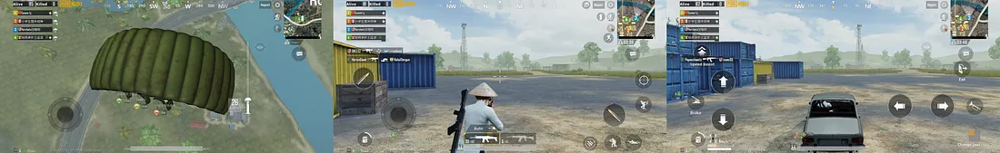

# 1. Aim and Objectives

The aim of this report is to evaluate and analyse the user experience of two products:

1. [Ziiiro Watch](https://www.ziiiro.com/)
2. [PUBG Mobile](https://www.pubgmobile.com/en-US/home.shtml)

The report focuses on the analysis of user experience and experience perspectives based on the fundemental HCI concepts that have been covered in the HCI course, which includes:

- Human capabilities
- User mental model
- Interaction metaphor
- Usability

# 1. ZIIIRO watch - CELESTE

## 1.1. Introduction

World of ZIIIRO Watches, where boldness meets minimalism and everyday timekeeping becomes an art form. ZIIIRO is a renowned brand known for its unique and fashionable timepieces that effortlessly blend style and functionality. With their sleek designs and eye-catching colors, ZIIIRO watches are the perfect accessories to complement your outfit and make a bold statement.

ZIIIRO was founded by two individuals, Robert and Derick, who shared a passion for creating timepieces that challenge traditional norms. Their journey began on the internet, where Robert, based in Germany, showcased his watch designs, catching the attention of Derick from Hong Kong. With their shared vision of minimalism and a desire to create something extraordinary, ZIIIRO was born.

## 1.2. Name and domain 
   - **Name:** The ZIIIRO watch - the CELESTE
   - **Domain:**
     The ZIIIRO watch, specially the CELESTE, is primarily intended for personal use as a stylish and innovative timepiece. The ZIIIRO watches are designed to appeal to individuals who appreciate unique designs, minimalistic aesthetics, and unconventional ways of displaying time. The watches are not only functional for timekeeping but also serve as fashion accessories, conversation starters, and collector's items for enthusiasts interested in distinctive and limited edition timepieces. 
     CELESTE is one of many collections from ZIIIRO branch, it displays time using two transparent gradient discs which make the clock face a halo of continuously changing color nuances. The Celeste comes with a 316L stainless steel casing and strap.
      

## 1.3. Target Audience
   
The CELESTE is specifically designed to captivate the attention of individuals who have a discerning taste for unique and minimalist timepieces, as well as a deep appreciation for aesthetics. The watch stands out from conventional designs with its unconventional display and emphasis on graphical design, offering a truly distinctive and eye-catching appearance.

   One of the key factors that appeal to the target audience is the watch's minimalist approach. The CELESTE does away with conventional hands, markings, and even clasps, embracing a philosophy of minimalism where no distracting elements are included in the designs. This design choice ensures that the focus remains on the essential function of timekeeping while creating a visually striking experience.

   The CELESTE emphasis on graphical design is another aspect that appeals to the target audience. The watch utilizes a constant change in patterns to indicate the passage of time, relying on moving gradients and rotating discs. This unique approach not only offers a fresh and dynamic way of reading the time but also serves as an artistic expression that complements the wearer's sense of style.

## 1.4. Some core use cases of the product

The CELESTE, offers several core use cases that cater to various contexts and situations, providing users with a unique and engaging timekeeping experience. Let's explore these use cases in detail, including the context, user situations, and methods of interaction with the watch's interface:

- **Everyday Timekeeping**:

	- **Context:** This use case encompasses the daily routine of users, whether at home, work, or during leisure activities.

	- **User Situations:** Users can be in a variety of positions such as sitting, standing, or walking, and engaged in various tasks or activities.

	- **Interaction:** Users interact with the CELESTE by simply glancing at its unconventional display, which may feature moving gradients, rotating discs, or other graphical elements. The watch's interface provides a visually striking representation of the time, allowing users to effortlessly read the hours and minutes. The absence of traditional hands and markings does not hinder its readability; instead, the design focuses on simplicity and minimalism. The watch's interface serves as a constant visual reminder of the time, ensuring that users can stay on schedule and manage their tasks efficiently. Whether sitting at a desk, running on a treadmill, or engaging in any other activity, users can quickly glance at the watch to stay informed without the need for distracting or intrusive notifications. It seamlessly integrates into their daily lives, providing a unique and intuitive timekeeping experience.
		
- **Fashion and Style**:
	- **Context:** This use case revolves around users who appreciate the CELESTE as a fashionable accessory, allowing them to express their personal style and make a statement.

	- **User Situations:** Users can wear the watch while attending social events, parties, or gatherings, or as part of their daily attire to enhance their overall look.

	- **Interaction:** The watch's interface serves as a captivating centerpiece, drawing attention with its distinctive and eye-catching design. Users have the freedom to mix and match colors, choosing from a range of options, to create personalized combinations that perfectly complement their outfits. The CELESTE becomes an integral part of their fashion ensemble, adding a touch of creativity and individuality. Its seamless integration with their style allows users to showcase their fashion-forward mindset and appreciation for unique accessories.

	
In all of these use cases, the CELESTE offers a seamless and intuitive user experience. The unconventional display and emphasis on graphical design allow users to interact with the watch effortlessly, relying on visual cues rather than traditional timekeeping elements. This makes it suitable for various contexts and user situations, enhancing both functionality and style.

  
   

## 1.5. Benefits and drawbacks of the product's interface
### **Benefits**:
  - **Simplicity**: The CELESTE interface embraces simplicity by utilizing a minimalistic design approach. It eliminates complex buttons, dials, and markings commonly found on traditional watches, resulting in a clean and sleek appearance. This simplicity enhances the user experience by reducing cognitive load and making it easy to read and interpret the time.
  _Use case_: Busy professionals who are constantly on the go can benefit from the CELESTE simplicity. Its minimalist design allows them to quickly glance at the time without being distracted by unnecessary details. Whether they are in a meeting, attending an event, or managing their schedule, the simplicity of the watch's interface helps them prioritize their time and stay focused.

  - **Visual Clarity**: The watch employs a combination of colors, shapes, and patterns to represent the time. This visual clarity allows users to quickly understand the current time at a glance. By removing unnecessary elements, the CELESTE provides a focused and unambiguous display.
  _Use case_: In a diverse professional setting, the CELESTE visual clarity proves valuable. Professionals such as engineers, designers, and architects can easily glance at the watch during meetings without being distracted by unnecessary details. This allows them to maintain focus, adhere to schedules, and seamlessly transition between tasks. The minimalist design adds sophistication to their attire, making it a subtle fashion statement.

  - **Aesthetic Appeal**: The unique design of the CELESTE interface appeals to users who appreciate unconventional and modern aesthetics. The watch serves as a fashion statement and conversation starter, appealing to those who value style and individuality.
  _Use case_: Fashion-forward individuals who seek to express their individuality through accessories can benefit from the CELESTE aesthetic appeal. Whether they are attending parties, social events, or simply want to stand out in their day-to-day activities, the watch serves as a conversation starter and complements their personal style choices.

### **Drawbacks**:

  - **Learning Curve**: Due to its unconventional interface, users may initially find it challenging to understand how to read the time on the CELESTE. It deviates from the traditional watch face format, requiring users to learn a new time-telling method. This learning curve can be a drawback for users who prefer familiarity and ease of use.
  _Use case_: Elderly users who are accustomed to traditional watch designs and may have difficulty adapting to new technologies could find the learning curve of the CELESTE challenging. Its unconventional interface might cause confusion and frustration for individuals who are used to reading time in a more traditional manner.
    

  - **Precision and Accuracy**: The abstract representation of time on the CELESTE sacrifices precise timekeeping. The absence of minute and second markers makes it difficult to determine time with high accuracy. While the watch may suffice for general timekeeping, it may not be suitable for situations that require precise timing.
  _Use case_: Sports and fitness enthusiasts who require precise timing for activities such as interval training, timing laps, or monitoring rest periods may find the abstract time representation of the CELESTE insufficient. The lack of minute and second markers makes it difficult to track time precisely, potentially impacting their performance or training routines
    
    
  - **Limited Functionality**: The CELESTE interface focuses solely on displaying the time. It lacks additional features commonly found in modern watches, such as date display, alarms, or timers. Users who require these functionalities may find the CELESTE limited in its capabilities.
  _Use case_: Travelers who rely on watches to not only tell time but also track multiple time zones or use alarms to manage their schedules may find the limited functionality of the CELESTE inconvenient. The absence of additional features like date display, world time, or alarms may hinder their ability to efficiently manage their travel plans or stay organized in different time zones.
   

  - **Accessibility**: The abstract representation of time on the CELESTE may pose challenges for individuals with visual impairments or certain cognitive disabilities. The lack of clear, standardized time indicators can hinder accessibility for a portion of the user population.
  _Use case_: Visually impaired users who heavily rely on tactile or audible feedback to interact with devices may find the abstract time representation of the CELESTE inaccessible. The lack of clear indicators or tactile markings makes it difficult for these users to independently read and interpret the time, potentially excluding them from using the watch effectively.
   

## 1.6. Different types of users

- **Tech Novices**:
  Users who are not accustomed to modern technology or have limited experience with digital devices may face difficulties understanding and operating the CELESTE unconventional interface. The abstract representation of time may be confusing, leading to a steep learning curve for these users.

- **Elderly Users**:
  Elderly users who are more accustomed to traditional watches with standard time displays may find it challenging to adapt to the abstract time representation used in the CELESTE. The lack of clear minute and second markers could lead to confusion and difficulty accurately reading the time.

- **Visually Impaired Users**:
  Visually impaired users who rely on clear and tactile indicators to read time may encounter difficulties with the CELESTE interface. The absence of standardized markings or tactile feedback could hinder their ability to independently interpret the time.

- **Users in Time-Critical Situations**:
  In time-critical situations where precise timing is crucial, such as sports events or professional settings with strict deadlines, the abstract representation of time on the CELESTE might not provide the accuracy and precision needed. The lack of minute and second markers could make it challenging for users to track time precisely.

- **Multitaskers**:
  Users who frequently rely on additional functions, such as alarms, timers, or date displays, may find the limited functionality of the CELESTE restrictive. In contexts where managing multiple tasks and schedules is essential, the absence of these features may hinder their productivity and organizational abilities.

- **Individuals with Cognitive Disabilities**:
  Users with certain cognitive disabilities that affect their ability to interpret abstract representations or learn new interfaces may find it challenging to use the CELESTE. The unconventional time display might pose difficulties for these individuals, potentially limiting their ability to independently read and understand the time.

# 2. PUBG Mobile

## 2.1. Introduction

PUBG Mobile is a free-to-play battle royale video game developed by LightSpeed & Quantum Studio, a division of Tencent Games. It is a mobile game adaptation of PUBG: Battlegrounds. It was initially released for Android and iOS on 19 March 2018.

It was published by multiple publishers in different regions, including Krafton, Tencent, and VNG Games. By December 2022, PUBG Mobile had accumulated around 1.3 billion downloads while grossing over $9 billion, making it the third highest-grossing mobile game. It is also the second most-played mobile video game of all time. In 2021, the game spawned an Indian version, Battlegrounds Mobile India, and a separate game taking place in the PUBG Universe, called New State Mobile. 

## 2.2. Target Audience

PUBG Mobile is a game that is played by people of all ages. However, the game is rated 17+ by the ESRB and 16+ by PEGI.

## 2.3. Welcome Interface

PUBG Mobile is very strict about the policy and also the restricted age. That is why the developers of the game have to make sure that the players are aware of the rules and regulations of the game. For newcomers, this is the first screen that they will see when they open the game.

The notice board is in the foreground and is centered on the screen for the player to read. The background is dimmed to a darker color so that it will not cause any distractions (this rule of designing applies to every notice board throughout the game). The buttons are highlighted with a bright color to attract the player's attention with well contrasted font for readability. The buttons are also placed in the bottom center of the screen so that the player can easily reach them with their thumbs.

However, the content of the policy is not very well contrasted with respect to the background, plus the font they use here is not very readable. In addition, the font size is relatively small, and on mobile devices, this will be harder to read. The developers should consider using a different font and font size to make readability easier.

The game is restricted to players under the age of 17. Therefore, the developers have to make a confirmation for the players age to modify the ingame content accordingly.

## 2.4. Downloaded Content

A good thing to note is that the game will not download all the content at once. When you first install the game from the store, it will only download the necessary data for the game to run. The rest of the content will be downloaded when you first access it. This is a good way to reduce first-time download time and also reduce the amount of data used.

Not to mention, the game also let the players choose between the HD and SD graphics. This allows for more flexibility in the game's performance if players are using low-end devices.

*(Unfortunately, the image was not taken for this interface)*

## 2.5. Typing Interface

The game is developed to be played horizontally, because of this reason, the keyboard is placed at the bottom of the screen for ease of reach. In addition, a special thing about the design of keyboard in this game is that it divides the keyboard into two parts, one for the left hand and one for the right hand. This is a good design choice because it allows the player to use their thumbs more conveniently to type, especially on larger screen devices where the keyboard is too wide for the player to reach the middle of the keyboard.

Here you can see the division part. In addition to this, the distance between the keys is also very well-spaced so that the player can easily tap on the keys without accidentally tapping on the wrong key. Although this might cause some inconvenience for players who are used to typing on a normal keyboard, it is still a good design choice and it will get easier to type once the player gets used to it.

## 2.4. Login Interface

The login interface is very simple and straightforward. It provides two methods for players to log in, either by using their Facebook account or by using their Google account. This is a good design choice because it allows players to log in quickly without having to create a new account since these two platforms are very popular and most people already have an account on them.

Plus, the login screen presents the game's logo and the splash screen in the background to catch the player's attention and to enhance the overall visual appeal of the interface.

The screen also has a few buttons on the top-right corner like the "Help" button so that players can easily access the help center if they have any problems with the game, the "Language" button allows players to change the language of the game to fits their needs (the language is default to English because this is the main language spoken and used internationally).

In addition, there is a reminder in the top-left corner which says "Play over 180 minutes a day is bad for your health". This banner will appear throughout the game to remind the players to take a break from the game to avoid any health problems. For some people, this might be annoying since it blocks a part of the screen. However, it will disapear in the main gameplay screen.

## 2.5. Welcome to the Game

For newcomers to the game, it will prompt you to play the training mode to get used to all the controls and the game mechanics. This mode allows users to train their skills, experiment with different weapons and strategies, and gain familiarity with the game's mechanics in a controlled environment. Practice modes contribute to the iterative learning process, enabling players to refine their abilities gradually.

However, the game does not force new players to go straight into training mode. Instead, it allows players to skip the training and play with others in a real battle game. By doing this, the game focuses on the main purpose of the game, a Battle Royale game, which is to survive and be the last one standing. It gives new players the sense of what the game is about and what they should expect throughout the gameplay right of the bat so that they can experience the gameplay as soon as possible, rather than having them to go through all the complex details of the non-essential features.

## Main Lobby

### Overview

The main lobby is the first screen that players see when they open the game. It is where players can access various features, such as the shop, inventory, settings, and social features. The lobby is designed to be visually appealing and intuitive, allowing players to navigate through the interface easily. It also serves as a hub for players to access other game modes, such as training, arcade, and classic matches.

There are 3 main sections in the lobby:

- **Top section**:
  - In the top-left corner, we can see the player's avatar, username, rank, and level. This provides a quick overview of the player's progress and achievements.
  - In the middle, we have the "Home" button (identified by the house icon), the PUBG brand name and the "Shop" button (identified by the shopping cart icon). The "Home" button allows players to return to the main lobby screen, while the "Shop" button allows players to access the in-game store. If there are any new items available for purchase, an exclamation mark will appear next to the "Shop" button to notify players. 
  - In the top-right corner, we have the points and ingame top-ups. The points are used to purchase items in the shop, while the ingame top-ups are used to purchase items in the in-game store. The "Plus" button (identified by the plus icon) shows that players can purchase more top-ups if they want to.
- **Middle section**: 
  - This is the main area of the lobby. We can see the actual background of ingame environment here. Our character model will be in the center, giving us the highlight of the equipments and/or inventory that we're having. Besides, when there are new people join in the game with us, their model will appear next to ours. This allows players to see their teammates and interact with them (via microphone or ingame chat system) before the match starts. It also provides a sense of community and camaraderie, which can enhance the overall user experience.
  - In addition, the game draws inspiration from real-world military tactics, weapons, and equipment. This allows players to leverage their existing knowledge and understanding of these concepts to improve their performance in the game. For example, players can apply real-world knowledge of weapon characteristics, such as recoil and bullet drop, to improve their aim and accuracy in PUBG Mobile.

- **Bottom section**:
  - The first thing that hits our eyes is the big "Start" button, displayed in a bright yellow color. This aims to attract out attention and to encourage us to start the game (which is the intention of the developers).
  - A special thing about the design of this section is that they don't put everything at once, since it will make the screen look crowded and overwhelming. Instead, they only show the buttons that are important and most relevant to the players. For example, if the player is in the lobby, they will only show the "Missions" button, "Inventory" button. Other options can be found when players click the "Arrow Up" button next to the side. This allows players to focus on the main features of the game without being distracted by unnecessary details.

### Interaction

The lobby is designed with the intention to be simple and intuitive. Most of the time, mobile devices would often have small screens, this would scale down the size of the buttons (for the sake of designing). Noticing this, the developers of the game implemented a feature that allows players to swipe, to the left or to the right, to switch between different screens of the lobby (like the Inventory or the Shop). There is also a transition animation to make the switch more smooth and visually appealing

## Hints and Tips

For new players, who will be unfamiliar with the layout and the functionality of the buttons, the game provides hints to guide them through the interface. 

For example, when players first open the game, a hint will appear on the "Start" button to encourage them to start the game, or in the picture below, there's a hint pointing at the "Newbie" button,

or various banners that appear throughout the game to notify players of new features or events.

These notifications will usually take up most of the screen to catch the player's attention, notifying them of new features or events. For instance, the shop will present latest items that are available for purchase as the main spotlight of the screen, while the background is dimmed so that it will not cause any distractions. Other items are also designed to be well contrasted and visually appealing to attract the player's attention, and potentially, to encourage them to purchase the items.

Moreover, the game also have popup notifications that appear when players complete a mission or an achievement. Or, when the players accidentally click on "dangerous" buttons, like the "Buy" button in the shop, or the "Upgrade" button in the inventory, or when the players want to exit the match, there will be a popup notification to confirm their action. This thoroughness is a good design to reduce the amount of errors that players might make.

## Visualization

The game comes with visual effects to enhance the user experience. For instance, when players want to view the details of an item, there will be a 3D model next to the side to give the players a more realistic view of the item, how it looks like, how it fits to their character models, etc. The 3D model also has the ability to rotate, allowing players to view the item from different angles. This feature is another special thing about the game because they can view all the perks and details of the item right in the game itself, instead of having to go online for reference.

## Personalization

The ingame settings are rich and diverse, allowing players to customize the game to their liking. For example, players can adjust the graphics quality, frame rate, and resolution to optimize performance. They can also customize the controls, button layout, sensitivity, crosshair, and other gameplay settings to suit their preferences. These personalization options allow players to tailor the game, and increases memorability as they can configure the game to match their individual playstyle and needs.

There is one thing to consider, however, is that the personalization options cannot fit all the players' needs. The developers have tried their best to include the most common options that players would want to customize. Doing this will cause an absurd amount of options and it will be unnecessary. An example of this is the limited color options for the crosshair,

or the limited languages supported by the game.

## Pre-game Experience

### Loading Screen

The loading screen is well-thought-out and designed to be visually appealing, while also gives players some insights of the gameplay and the chosen map. For instance, the background is a screenshot of the map environment (dimmed) to give players a sense of the gameplay. In the foreground is a big splashscreen of important mechanics of the game, like the "Danger Zone" or the "Red Zone", visualized with images and text to give players a better ease of understanding. 

Moreover, it also offers tooltips, prompts, and contextual information. These resources can aid players in refreshing their memory on specific features or mechanics when needed.

There is also a loading bar at the bottom of the screen to show the progress of the loading.  

## In-game Experience
### In-game waiting lobby

Firstly, the game will start when there is 100 players available (ready to connect). You can verify if there are enough players by viewing the top-left corner. It'll show how many players are currently are the room with a countdown timer of the game start, which is 60 seconds.

When the game begins, this banner will change to display the number of players that still survive, and how many you eliminated.

Why is it must be at the top-left corner? As to many gaming conventions, things that are important to the players should be placed at the top of the screen. This is because the top of the screen is first place that players tend to look at when they want to, for instance, navigate or check their status. This is an analogy to real-world context, where we tend to look up when we want to check the time or the weather. Following that we'll have the map at the top-right corner, as well as the settings button, micro phone access, volume access, etc.

### Compass

Navigating is as important as shooting in this game because you have to know where you are, where your teammates are, where the enemies are, where the safe zone is, etc. The game has a miniture compass in the middle-top. This will help players navigate through the map whether they're heading in the right direction. By communicating to each other, teammates can tell others what direction the enemies are at by signify the number on the compass and in which direction (North, South, West, East), just like in the real world. This will satisfied the **Human Capabilities** in both perception and cognition in terms of navigation. Not to mention, the design of it is based on the real-world compass, so it's easy for players to understand and use it.

### Teammates

Also in the left corner, we can see the number of members of our team. You will always be placed at the top (signify the person who's playing), than the others below. They'll have their in-game name together with a color tag to signal other members not to shoot at them. By tagging each member with a color symbol, will help players don't have to remember teammates by their name but rather by looking at a color tag. Furthermore, the color tag will also appear on the map, so players can easily locate their teammates.

### Action Buttons

At the bottom-right corner, base on the default display, there're some buttons perform actions like: *attack, jump, crawl, kneel*. For each button there will be a clear illustration for that specific action. However, the attack button will change depend on what type of weapon you're wielding: none -> fist, guns -> bullet, melee-weapons -> knife. For experienced gamers, this will signify them clearly what's that button will do if they press it. For new gamers, the illustration is clear enough for them to know the usage of those buttons. This attack button is also the biggest button among the others in order to signify its importance.

At the bottom-left corner, players have a joy-stick icon to control their character. The design is a circle with arrows to signify the direction of the character, in the middle is a smaller circle to simulate the joy-stick, which is familiar to most gamers.

Next to it we will have another attack button. The reason why there are two attack buttons is because in case the player wants to jump and shooting (attack) simultaneously, their right thump pressed the jump button and the other one pressed attack. In some cases, players want to perform two actions at the same time, in case they run out of fingers to press on one side, the game places the same button in the other side to assist the players. This also can be changed in the customization settings where players can custom their personal actions display which suits them best.

Next up is the backpack button for in-game storage. There is also a little circle line running around the button to signify the backpack's capacity: whether is it full and how much storage space is left just like a loading icon in real-world context. However, players can't know the exact amount of storage in it. In order to be more precise, it is better to have percentage illustration to display the amount of available space. In addition, the backpack icon can show which *tier* (the rarity) it is  by showing some yellow stripes next to it, the more stripes it has, the better the quality. This helps players to identify the quality of the backpack without having to open it.

At the bottom line we have 2 weapon slots and 2 equipment slots (on the left side is the slot for health kit, on the right is for grenades, smoke grenades, etc.), and your health bar in milky-white in the center. The health bar will change color based on the amount of health you have left and the white section will decrease as your health decreases. This gives the sense of "decreasing" and "increasing" to the players.

The weapon slot will change the icon illustration based on what weapons you choose and next to is the amount of ammunition you have (ammunition left in a round / ammunition left in the backpack).

As for the equipment slot, every kind of heal kit or grenade is packed into a single slot. This means if you're using a grenade, only the grenade icon will be displayed, if you want to use other kinds of equipment, for instance a smoke grenade, you have to choose the "more option" icon (the up-arrow over the equipment slot), then it will display every equipment you have which is of the same type. You  can select the kit and press it again in order to use it. However, this is time consuming and ineffective to the players if they want to perform a quick action. In addition, if the players use a smart phone to play, the size of it might affect the experience due to mistakenly pressing the wrong button. This is a drawback for players who mainly play this game on their smart phones.

### Crosshair Placement

The crosshair is positioned in the middle of the screen in PUBG Mobile is primarily for gameplay and user experience purposes. Placing the crosshair in the middle of the screen helps to ensure that players have a consistent and intuitive aim when engaging in combats.

By aligning the crosshair with the center of the screen, it allows players to have better control over their aim and provides a more natural and familiar shooting experience. This design choice aims to make it easier for players to accurately target their enemies and engage in gunfights.

Additionally, this allows for easier adaptation across different screen sizes and aspect ratios of mobile devices. It provides a standardized aiming reference point regardless of the device being used, promoting fairness and equal gameplay opportunities for all players.

### In-game flight

Starting the game, the players are packed in an airplane which flies across the map, the flight direction is random in each round.

On the left there is a text line to display the number of players are in the plane, and a jump button to exit (with an illustration of a man free falling with a parachute). The extension section above includes a stearing wheel, a follow button, an invite button. The stearing wheel shows who is in charge of leaving the aircraft and guiding their teammate to land at the predetermined target. By hovering the color icon over the stearing wheel, it shows who is the leader according to the color previously marked by the game. For exemple: if you assign the first person whose color is yellow to be the leader, your stearing wheel will have a yellow icon.

When we exit, the action display changes, we will have a joy stick to control the character direction, a release button to pull out the parachute, a column monitor to give us info about our fall speed, a cursor to show our altitude that will move downward as we fall. The column has 2 sections: the section where we can *free fall* is marked as transparent, *danger section*, marked as milky white, is where we must pull out the parachute to decrease our speed. If the players enter this danger area, the game automatically pulls out the players' parachute. This monitoring column perfectly executes how the game informs the players on speed and altitude of their fall. The way the cursor moves downwards as we fall gives the players a clear information.

### Map

When we open the map, we can view the longitude and the latitude, just like in real life maps. If players don't like this feature, they can turn it off.  We use the map to view our objectives, our teammates, our enemies, our location, etc. It is a very important feature in the game, and is also the most used feature .However, the map cannot show the terrain height, which is a drawback for players who want to know this information.

<!--  -->

For the ring, it's a white circle that keeps shrinking over time. This is the *safe zone* that players must stay in to avoid being killed by the *blue zone* (which is the area outside the white circle). The blue zone will keep shrinking over time, and the damage it deals to the players will increase as it shrinks. If you're in this zone, you will be vulnerable and your health bar decreases over time. This is to prevent players from camping in one place for too long. The smaller the white ring, the bigger the damage that the blue zone has. There is also a red circle, which is the *danger zone* where bombs will be dropped. The color red is common for signifying dangers in real life, and the developers of the game also use this color to signify the danger.

To illustrate the concept more precisely, you can view the image below.

The position of your character is identified with the yellow icon. There is also a small arrow to show the direction that your character is facing for better navigation.

### In-game Controller

This is the full layout of PUBG controller on walking mode. It's the default controller on mobile phone, and is the 1st layout that players can use to interact with the game. You can also customize it in the settings.

However, there are some drawbacks in this layout: **everything is so chaotic.**

#### Crowded Interaction Space

There are just too much buttons. We have the map at the top-right corner, as well as the settings button, micro phone access, volume access, etc. The information is too much for players to process at once, especially for new gamers who are still unfamiliar with the game. Moreover, due to having an excessive amount of buttons, the size of each button is reduced to fit the screen. This will cause the buttons to be smaller, and it will be harder for players to press on them. In some game scenarios where it requires players to perform quick actions, this will be a drawback for them. While players typically use only 2-4 fingers to interact with the game, there are more than 20 buttons available for interaction. This overload of buttons can overwhelm users and impede their ability to perform actions swiftly and accurately, not to mention the so-called *spider crawl* where players have to use all their fingers to press on the buttons. 

Luckily, it is customizable. The developers have thought of this issue and provided players with custom layouts. By allowing users to personalize the placement and number of buttons according to their preferences and gameplay style, the interaction space can be optimized. However, it should be noted that customization may result in the transfer of the problem to other aspects, as reducing buttons may limit certain movements or actions.

<!-- #### Inefficient Default Layout

The default layout is designed for players to play with their thumbs. However, there are still drawbacks:

- In order to do a sprint, players have to drag the joystick further than normaly. This, in some cases, might be counter-intuitive to the players and also might cause context-switching inefficient. For instance, the borderline between *walking* and *sprinting* differs by the distance that the players drag the joystick. This is not a good design choice because it requires players to remember the distance that they have to drag the joystick to perform a specific action.
So it would be inefficient for players to perform that action. The gap may cause thumb fatigue due to excessive and out of range movements.

In terms of inaccuracy, the bullet icon on the left is the size of an average person thumbs when pressed on a surface. It is optimized and well for the game, not for the user. The more people play the game, they tend to increase the size of that button to 150% and even more to have a better action time than the rest. Well you can predict that's coming because this is a very competitive game. When the button get bigger, you will run out of vertical space. So you must found another way to manage that. People tend to convert their playing device to tablets. That would be unfair to those who stay on mobile phone. Cause tablets give you more space to work with, Which mean you can be faster in quick action, increase the rate that you spoted enemies, and so on.

Observe these 2 equipment slot. The health kit slot on left seems to be smaller than the grenade slot on the right. This is quite easy to explain. Beacuse the weight of a specific kit can exceed the weight of a grenade, so there would be less slots than the right slot. However, the asymmetric layout tend to make people feel uncomfortable. In human perception, they tend to want everything to be perfect, to be whole. So they gonna lean toward something whole, something symmetric. I think that 2 of these slot need to be adjust to have the same side. -->

<!-- M chưa phân tích cái gameplay như nào, mới chỉ là map rồi layout, chưa nhắc tới có gì trên màn hình, nhận diện địch với đồng đội như nào khi chơi, cách loot đồ như nào chưa nói, độ giật rồi âm thanh như nào, những cues với tín hiệu nào,... Ở phần dưới có một vài chỗ có nhắc tới cái này, phân tích thêm đi -->

### 2.3.1. Perception

PUBG Mobile leverages players' perceptual abilities, including visual and auditory perception. Visual perception is crucial for spotting opponents, identifying resources, and navigating the game world. The game's graphics and visual cues provide important information about the environment, such as terrain, structures, and object interactions. Auditory perception allows players to locate opponents based on sound cues, such as footsteps, gunshots, or vehicle sounds. PUBG Mobile engages players' perceptual abilities to enhance situational awareness and decision-making.

### 2.3.2. Cognition

PUBG minimize the user’s memory load by making objects, actions, and options visible. The user should not have to remember information from one part of the dialogue to another. Instructions for use of the system should be visible or easily retrievable whenever appropriate.

The weapons and bullets have different types in the PUBG mobile and players feel difficult to figure out what they need at that time. The highlighted stuff is an automatic reminder for players to recognize the weapon they have and what bullets they should pick up.

## 2.4. User Mental Model

### 2.4.1. Real-world References

PUBG Mobile incorporates real-world references to enhance the user experience and facilitate learning. The game draws inspiration from real-world military tactics, weapons, and equipment. This allows players to leverage their existing knowledge and understanding of these concepts to improve their performance in the game. For example, players can apply real-world knowledge of weapon characteristics, such as recoil and bullet drop, to improve their aim and accuracy in PUBG Mobile.

PUBG Mobile also incorporates real-world references in its user interface. For example, the inventory system is designed to mimic a backpack, allowing players to organize and manage their items in a way that is familiar and intuitive. Similarly, the map interface resembles a paper map, providing a recognizable and intuitive way to navigate the game world.

### 2.4.2. Familiarity with Battle Royale Genre and Gaming Conventions

PUBG Mobile is a battle royale game, and many players are already familiar with the genre. Moreover, most players are familiar with the placing of crosshair in the middle of the screen and the shooting mechanics. PUBG Mobile leverages this familiarity to enhance the user experience and facilitate learning. For example, players can apply their existing knowledge of aiming and shooting mechanics to improve their performance in PUBG Mobile, or players who have played other battle royale games may already be familiar with concepts such as looting, inventory management, and combat tactics. This prior knowledge can be applied to PUBG Mobile, allowing players to quickly adapt to the game's mechanics and interface.

### 2.4.3. Gaming Conventions

PUBG Mobile follows common gaming conventions to enhance the user experience and facilitate learning. For example, the game utilizes standard controls and button mappings that are familiar to most players. This allows players to leverage their existing knowledge of gaming conventions to quickly learn and adapt to PUBG Mobile.

## 2.5. Usability

### 2.5.1. Learnability

Learnability plays a crucial role in the overall usability of a system, and PUBG Mobile incorporates several features to ensure that new players can quickly grasp the game mechanics and navigate the interface. Here is a more detailed analysis of learnability in PUBG Mobile:

#### Good Points

**Tutorial Mode:** PUBG Mobile offers a tutorial mode specifically designed to introduce new players to the game. It provides step-by-step instructions on basic controls, movement, aiming, shooting, and looting. The tutorial mode gradually introduces more advanced concepts, such as managing inventory, using vehicles, and employing different weapon attachments.

**Tooltips and Hints:** Throughout the game, PUBG Mobile provides tooltips and hints that appear at relevant moments to guide players. These tooltips explain the purpose and functionality of various game elements, such as weapons, equipment, and consumables. Hints may also appear during gameplay to provide contextual information or suggest strategies.

**Interactive Elements:** PUBG Mobile incorporates interactive elements within the user interface to assist in the learning process. For example, players can tap on various icons, buttons, or menu options to access additional information, change settings, or perform specific actions. These interactive elements contribute to an exploratory learning experience, allowing users to experiment and discover functionalities on their own.

**Practice Modes:** In addition to the tutorial, PUBG Mobile offers practice modes where players can engage in non-competitive matches or training sessions. These modes allow users to hone their skills, experiment with different weapons and strategies, and gain familiarity with the game's mechanics in a controlled environment. Practice modes contribute to the iterative learning process, enabling players to refine their abilities gradually.

**Visual Cues and Feedback:** PUBG Mobile utilizes visual cues and feedback to assist players in understanding the consequences of their actions. For example, when players take damage, the visual representation of health bars or character animations conveys the impact. Similarly, when players successfully eliminate opponents, visual and auditory cues provide feedback and reinforce the understanding of the game's objectives.

**Community Support:** PUBG Mobile boasts a vibrant and active community of players who share tips, strategies, and tutorials through various online platforms. Players can access forums, social media groups, and video content created by the community to learn from experienced players, gain insights into advanced tactics, and discover new approaches to gameplay. The availability of community support enhances the overall learnability of the game.

#### Drawbacks and Hindrances

**Complexity Overload:** PUBG Mobile offers a wide range of gameplay mechanics, features, and strategies, which can be overwhelming for new players. The complexity of the game may lead to a steep learning curve, making it challenging for beginners to grasp all the nuances quickly.

**Lack of In-Depth Explanations:** While PUBG Mobile provides a tutorial and tooltips, some players may find that the explanations provided are not detailed enough. In-depth explanations about advanced tactics, weapon statistics, or complex game mechanics may be lacking, leaving players to seek information from external sources.

**Language Barriers:** PUBG Mobile is played by a global audience, and language barriers can pose challenges for players who are not fluent in the game's default language. In some cases, translations may not be accurate or may be incomplete, leading to confusion and difficulty in understanding instructions and tooltips.

**Time Investment:** PUBG Mobile is a complex game that requires a significant time investment to become proficient. Some players may find it difficult to dedicate the necessary time to learn and improve their skills, which can impede their progress and enjoyment of the game.

**Lack of Adaptive Learning:** PUBG Mobile currently does not have a sophisticated adaptive learning system that tailors the learning experience to individual players' needs. While the tutorial and practice modes provide a general foundation, the game does not adapt its guidance based on players' specific strengths, weaknesses, or preferred learning styles.

### 2.5.2. Efficiency

#### Good Points

**Navigation Speed:**: Players can quickly navigate through menus, settings, and in-game interfaces to access various features and options (such as where to start the match, friend list, shops, battle pass, ...). Everything is scattered around the edge of the screen to give your in-game character the highlight. Also,  there is always an Exit button on the top right to undo action and exit the dialogue.

**Effective Looting and Inventory Management:**

Players can easily perform actions such as swapping items between their inventory and the ground, dropping items from their inventory, or picking up items from the ground with the auto-pickup feature. Players just need to tap on the item they want to pick up and the item will be automatically added to their inventory. The auto-pickup feature can be customized to prioritize certain items over others, allowing players to quickly collect the items they need.

PUBG Mobile typically offers options to sort and filter the inventory based on different criteria such as item type, rarity, and quantity. This helps players quickly find and manage specific items. By selecting an item in the inventory, players can access additional information about that item, such as its stats, attachments compatibility, and any customization options available.

#### Drawbacks and Hindrances

The drawback lies in the space in which the user interacts with the game, and server connection speed will depend on many factors such as network speed, which device to use to play the game.

**Overloaded Interaction Space:**

**Load-time and Matchmaking:**

The time it takes to find a match in each map in PUBG MOBILE can vary depending on several factors, including the region, time of day, and the player’s rank. On average, it typically takes around 30 seconds to a few minutes to find a match in popular maps such as Erangel, Miramar, Sanhok, and Vikendi. However, less popular or newer maps may take longer to find a match. Additionally, the time it takes to find a match can vary depending on the player’s rank. Higher-ranked players may experience longer matchmaking times due to the smaller pool of players available at their skill level.

**Lag and Frame Rate Issues:**

Lag and frame rate issues can occur in PUBG MOBILE due to a variety of factors, including network connectivity, device performance, and graphics settings. These issues can negatively impact the user experience by causing delays in gameplay, making it difficult to aim accurately, or resulting in crashes or disconnections.

### 2.5.3. Memorability

Memorability in usability refers to how easily users can remember how to interact with a system or user interface after a period of time. In the context of PUBG MOBILE, memorability plays a vital role in creating a positive user experience. Here are some aspects of memorability in the usability of PUBG MOBILE:

- **Consistent Design Patterns:** PUBG MOBILE follows consistent design patterns throughout the user interface. This means that similar actions and interactions are represented in a uniform way across different screens and menus. For example, the placement of buttons, icons, and menu structures remain consistent, making it easier for users to remember how to navigate and interact within the game.

- **Help and Support:** The game offers in-game help and support features, including tooltips, prompts, and contextual information. These resources can aid players in refreshing their memory on specific features or mechanics when needed.

- **Personalized Settings:** PUBG MOBILE allows users to customize their settings, including controls, sensitivity, and UI elements. By giving players the ability to tailor the game experience to their preferences, it increases memorability as they can configure the game to match their individual playstyle and needs.

- **Visual Cues and Feedback:** PUBG MOBILE incorporates visual cues and feedback to reinforce actions and provide information to the player. This can include highlighting interactive elements, displaying status indicators, and providing visual and audio feedback when actions are performed successfully. These cues help users remember the effects of their actions and understand the outcome of their interactions.

- **Visual Hierarchy:** PUBG MOBILE applies visual hierarchy to highlight important elements and information. By using size, color, contrast, and spacing effectively, the interface guides users' attention to key elements, making them more memorable and easier to locate and interact with in the future.

By focusing on consistent design patterns, intuitive controls, helpful onboarding, personalized settings, visual cues, and feedback, PUBG MOBILE aims to enhance the memorability of the user interface. This, in turn, improves the overall user experience by reducing the cognitive load on players and enabling them to quickly recall how to interact with the game even after periods of inactivity.

### 2.5.4. Errors

Errors in usability refer to instances where users encounter difficulties or make mistakes while interacting with the user interface. Identifying and addressing these usability errors is crucial for improving the overall user experience. Here are some common usability errors that can occur in PUBG MOBILE:

**Inconsistent Controls:**

- Changing control schemes or button mappings without clear indication or explanation, causing confusion and errors in gameplay.
- Variation in control sensitivity or responsiveness across different sections of the game, leading to inconsistent user experiences and potential errors.

For example, there are three main situations that need direction control: the landing, the walking, and the driving page. Players can figure out the direction control button on the left (the rocker pad). Pubg mobile provided the rocker pad to control directions in landing, walking status. But the directional pad of driving is directional pads with horizontal and vertical pads on two sides. The direction control is inconsistent with those three main situations. Thus, players need more effort to learn how to perform in the driving situation. As for the opportunity to improve, Pubg mobile can also provide more customized options on control layout of status.

**Poor Button Placement:**

- Placing critical buttons, such as the fire button or grenade throw button, too close together, resulting in accidental taps or erroneous actions.
- Buttons placed in non-intuitive locations, making it difficult for users to locate or access them quickly, leading to delays and errors in gameplay.

### 2.5.5. Satisfaction

Satisfaction in the context of usability refers to the overall level of enjoyment, fulfillment, and positive user experience that PUBG MOBILE provides. Here are specific aspects related to satisfaction in PUBG MOBILE:

**Gameplay Experience:**

- Engaging Gameplay: The satisfaction of players depends on the game's ability to provide engaging and immersive gameplay. This includes exciting combat encounters, strategic decision-making, and a sense of achievement when accomplishing objectives or winning matches.

- Fairness and Balance: Players' satisfaction is influenced by the game's fairness and balance. This includes factors such as matchmaking systems that create balanced matches, anti-cheat measures to ensure a level playing field, and the absence of game-breaking exploits or unfair advantages.

**Visual and Audio Design:**

- High-Quality Graphics: Well-designed and visually appealing graphics contribute to player satisfaction. Detailed environments, realistic character models, and special effects enhance the immersive experience and provide visual enjoyment.

- Engaging Sound Design: The game's audio effects, including background music, weapon sounds, and environmental audio, contribute to the satisfaction of players. High-quality and immersive sound design adds depth and enhances the overall gaming experience.

**Reward System:**

- Progression and Unlockables: A satisfying reward system that offers meaningful progression and unlockable content keeps players engaged. This can include character customization options, weapon skins, emotes, or in-game currency that can be earned through gameplay achievements.

- Skill-Based Rewards: Recognizing and rewarding player skill and accomplishments can increase satisfaction. This can be through ranking systems, leaderboards, or exclusive rewards for high-performing players, fostering a sense of accomplishment and healthy competition.

**Community and Social Features:**

- Social Interaction: Satisfying experiences can be fostered through robust social features, such as chat systems, friend lists, and the ability to form teams or squads with friends or other players. Strong community engagement and social interaction contribute to player satisfaction.

- Events and Tournaments: Regularly hosting in-game events, tournaments, or challenges provides additional avenues for player engagement and satisfaction. These events can offer exclusive rewards, showcase player skills, and create a sense of community participation.

## 2.6. Interaction Metaphor

**Shooting and aiming:**

- Interaction metaphor: Familiar virtual firearms from other games.
- Specifics:
    - On-screen controls mimic the actions of holding a weapon.
    - Players tap or hold buttons to aim and shoot.
    - Swiping or dragging gestures can simulate the movement of adjusting aim or firing.

**Movement and navigation:**

- Interaction metaphor: Physical movement and navigation similar to that of other games, with up/down/left/right controls.
- Specifics:
    - Virtual joystick allows players to control movement, mimicking walking or running.
    - Swipe gestures enable actions like turning or changing directions.
    - Buttons or gestures for crouching, jumping, or climbing simulate real-world movements.

**Inventory management:**

- Interaction metaphor: Backpack or storage space
- Specifics:
    - Players can drag and drop items within their inventory to organize or equip them.
    - Swiping or scrolling actions allow players to navigate through their inventory.
    - Tap and hold gestures enable options like discarding or dropping items.

**Map and location:**

- Interaction metaphor: Paper map or GPS
- Specifics:
    - Pinch-to-zoom and panning gestures allow players to explore different parts of the map.
    - Markers or icons can be placed on the map to indicate specific locations or objectives.
    - Tapping on the map reveals additional details or options for navigation.

**Communication and teamwork:**

- Interaction metaphor: Real-world communication methods
- Specifics:
    - Voice chat functionality enables players to communicate verbally with teammates.
    - Text messaging interfaces allow players to type and send messages to teammates.
    - Quick chat options or predefined phrases can be used for faster communication during gameplay.

**Looting and item interaction:**

- Interaction metaphor: Searching and handling objects
- Specifics:
    - Players can tap or swipe on lootable objects to collect items, mimicking the action of picking up objects in the real world.
    - Drag and drop gestures can be used to move items between inventory slots or interact with them (e.g., combining items or using consumables).
    - Visual cues such as highlighting or tooltips provide feedback when interacting with items.

**Health management and healing:**

- Interaction metaphor: Healthbar similar to other games with some visual indicators and healing items.
- Specifics:
    - Players can tap or use gestures to access their health management interface.
    - Drag and drop gestures can be used to consume healing items, such as bandages or medkits.
    - Visual indicators or progress bars can show the healing process.

## 2.7. Possibilities of UX Hindrances

- **Visual Distractions:** Players with visual impairments succh as photosensitivity or color blindness may encounter difficulties due to visual distractions in the game. This can include excessive visual effects, such as explosions or smoke, that may obstruct their view or make it difficult to locate enemies. Similarly, players with color blindness may have difficulty distinguishing between different colors or color-coded elements in the game. 
- **Auditory Distractions:** Players with hearing impairments may encounter difficulties due to auditory distractions in the game. This can include loud or sudden sounds, such as explosions or gunfire, that may be distracting or overwhelming for players with hearing impairments.
- **Network Connectivity:** Players with poor network connectivity may experience lag or delays in gameplay, which can negatively impact their experience. This can include delays in movement, aiming, or shooting, which can hinder their ability to perform actions accurately and efficiently.
- **Level Differences:** Players with different skill levels may encounter difficulties due to level differences in the game. This can include matchmaking issues, where players of different skill levels are matched together, resulting in unfair or unbalanced matches. Similarly, players with lower skill levels may find it difficult to compete against more experienced players, leading to frustration and dissatisfaction.

# References

- https://tournafest.com/blog/all-about-pubg-a-case-study/
- https://uxdesign.cc/what-i-learned-about-ux-research-on-pubg-mobile-as-a-player-57a673d19fe1?gi=0013e3fefac9
- https://www.invespcro.com/blog/usability-design-for-a-better-user-experience/#:~:text=As%20an%20essential%20element%20in,user%20to%20compelte%20the%20task.
- https://www.cnet.com/pictures/pubg-mobile-might-be-the-best-version-of-the-game/12/
- https://vi.wikipedia.org/wiki/PUBG_Mobile
