# 1. Aim and Objectives

The aim of this report is to evaluate and analyse the user experience of two products:

1. [Ziiiro Watch](https://www.ziiiro.com/)
2. [PUBG Mobile](https://www.pubgmobile.com/en-US/home.shtml)

The report focuses on the analysis of user experience and experience perspectives based on the fundemental HCI concepts that have been covered in the HCI course, which includes:

- Human capabilities
- User mental model
- Interaction metaphor
- Usability

# 1. ZIIIRO watch - CELESTE

## 1.1. Introduction

World of ZIIIRO Watches, where boldness meets minimalism and everyday timekeeping becomes an art form. ZIIIRO is a renowned brand known for its unique and fashionable timepieces that effortlessly blend style and functionality. With their sleek designs and eye-catching colors, ZIIIRO watches are the perfect accessories to complement your outfit and make a bold statement.

ZIIIRO was founded by two individuals, Robert and Derick, who shared a passion for creating timepieces that challenge traditional norms. Their journey began on the internet, where Robert, based in Germany, showcased his watch designs, catching the attention of Derick from Hong Kong. With their shared vision of minimalism and a desire to create something extraordinary, ZIIIRO was born.

## 1.2. Name and domain 
   - **Name:** The ZIIIRO watch - the CELESTE
   - **Domain:**
     The ZIIIRO watch, specially the CELESTE, is primarily intended for personal use as a stylish and innovative timepiece. The ZIIIRO watches are designed to appeal to individuals who appreciate unique designs, minimalistic aesthetics, and unconventional ways of displaying time. The watches are not only functional for timekeeping but also serve as fashion accessories, conversation starters, and collector's items for enthusiasts interested in distinctive and limited edition timepieces. 
     CELESTE is one of many collections from ZIIIRO branch, it displays time using two transparent gradient discs which make the clock face a halo of continuously changing color nuances. The Celeste comes with a 316L stainless steel casing and strap.
     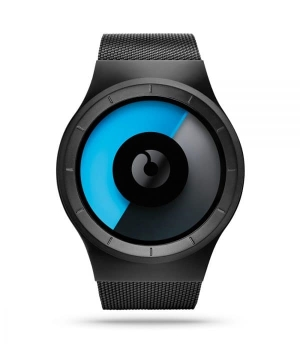 

## 1.3. Target Audience
   
The CELESTE is specifically designed to captivate the attention of individuals who have a discerning taste for unique and minimalist timepieces, as well as a deep appreciation for aesthetics. The watch stands out from conventional designs with its unconventional display and emphasis on graphical design, offering a truly distinctive and eye-catching appearance.

   One of the key factors that appeal to the target audience is the watch's minimalist approach. The CELESTE does away with conventional hands, markings, and even clasps, embracing a philosophy of minimalism where no distracting elements are included in the designs. This design choice ensures that the focus remains on the essential function of timekeeping while creating a visually striking experience.

   The CELESTE emphasis on graphical design is another aspect that appeals to the target audience. The watch utilizes a constant change in patterns to indicate the passage of time, relying on moving gradients and rotating discs. This unique approach not only offers a fresh and dynamic way of reading the time but also serves as an artistic expression that complements the wearer's sense of style.

## 1.4. Some core use cases of the product

The CELESTE, offers several core use cases that cater to various contexts and situations, providing users with a unique and engaging timekeeping experience. Let's explore these use cases in detail, including the context, user situations, and methods of interaction with the watch's interface:

- **Everyday Timekeeping**:

	- **Context:** This use case encompasses the daily routine of users, whether at home, work, or during leisure activities.

	- **User Situations:** Users can be in a variety of positions such as sitting, standing, or walking, and engaged in various tasks or activities.

	- **Interaction:** Users interact with the CELESTE by simply glancing at its unconventional display, which may feature moving gradients, rotating discs, or other graphical elements. The watch's interface provides a visually striking representation of the time, allowing users to effortlessly read the hours and minutes. The absence of traditional hands and markings does not hinder its readability; instead, the design focuses on simplicity and minimalism. The watch's interface serves as a constant visual reminder of the time, ensuring that users can stay on schedule and manage their tasks efficiently. Whether sitting at a desk, running on a treadmill, or engaging in any other activity, users can quickly glance at the watch to stay informed without the need for distracting or intrusive notifications. It seamlessly integrates into their daily lives, providing a unique and intuitive timekeeping experience.
		
- **Fashion and Style**:
	- **Context:** This use case revolves around users who appreciate the CELESTE as a fashionable accessory, allowing them to express their personal style and make a statement.

	- **User Situations:** Users can wear the watch while attending social events, parties, or gatherings, or as part of their daily attire to enhance their overall look.

	- **Interaction:** The watch's interface serves as a captivating centerpiece, drawing attention with its distinctive and eye-catching design. Users have the freedom to mix and match colors, choosing from a range of options, to create personalized combinations that perfectly complement their outfits. The CELESTE becomes an integral part of their fashion ensemble, adding a touch of creativity and individuality. Its seamless integration with their style allows users to showcase their fashion-forward mindset and appreciation for unique accessories.

	
In all of these use cases, the CELESTE offers a seamless and intuitive user experience. The unconventional display and emphasis on graphical design allow users to interact with the watch effortlessly, relying on visual cues rather than traditional timekeeping elements. This makes it suitable for various contexts and user situations, enhancing both functionality and style.

  
   

## 1.5. Benefits and drawbacks of the product's interface
### **Benefits**:
  - **Simplicity**: The CELESTE interface embraces simplicity by utilizing a minimalistic design approach. It eliminates complex buttons, dials, and markings commonly found on traditional watches, resulting in a clean and sleek appearance. This simplicity enhances the user experience by reducing cognitive load and making it easy to read and interpret the time.
  _Use case_: Busy professionals who are constantly on the go can benefit from the CELESTE simplicity. Its minimalist design allows them to quickly glance at the time without being distracted by unnecessary details. Whether they are in a meeting, attending an event, or managing their schedule, the simplicity of the watch's interface helps them prioritize their time and stay focused.

  - **Visual Clarity**: The watch employs a combination of colors, shapes, and patterns to represent the time. This visual clarity allows users to quickly understand the current time at a glance. By removing unnecessary elements, the CELESTE provides a focused and unambiguous display.
  _Use case_: In a diverse professional setting, the CELESTE visual clarity proves valuable. Professionals such as engineers, designers, and architects can easily glance at the watch during meetings without being distracted by unnecessary details. This allows them to maintain focus, adhere to schedules, and seamlessly transition between tasks. The minimalist design adds sophistication to their attire, making it a subtle fashion statement.

  - **Aesthetic Appeal**: The unique design of the CELESTE interface appeals to users who appreciate unconventional and modern aesthetics. The watch serves as a fashion statement and conversation starter, appealing to those who value style and individuality.
  _Use case_: Fashion-forward individuals who seek to express their individuality through accessories can benefit from the CELESTE aesthetic appeal. Whether they are attending parties, social events, or simply want to stand out in their day-to-day activities, the watch serves as a conversation starter and complements their personal style choices.

### **Drawbacks**:

  - **Learning Curve**: Due to its unconventional interface, users may initially find it challenging to understand how to read the time on the CELESTE. It deviates from the traditional watch face format, requiring users to learn a new time-telling method. This learning curve can be a drawback for users who prefer familiarity and ease of use.
  _Use case_: Elderly users who are accustomed to traditional watch designs and may have difficulty adapting to new technologies could find the learning curve of the CELESTE challenging. Its unconventional interface might cause confusion and frustration for individuals who are used to reading time in a more traditional manner.
    

  - **Precision and Accuracy**: The abstract representation of time on the CELESTE sacrifices precise timekeeping. The absence of minute and second markers makes it difficult to determine time with high accuracy. While the watch may suffice for general timekeeping, it may not be suitable for situations that require precise timing.
  _Use case_: Sports and fitness enthusiasts who require precise timing for activities such as interval training, timing laps, or monitoring rest periods may find the abstract time representation of the CELESTE insufficient. The lack of minute and second markers makes it difficult to track time precisely, potentially impacting their performance or training routines
    
    
  - **Limited Functionality**: The CELESTE interface focuses solely on displaying the time. It lacks additional features commonly found in modern watches, such as date display, alarms, or timers. Users who require these functionalities may find the CELESTE limited in its capabilities.
  _Use case_: Travelers who rely on watches to not only tell time but also track multiple time zones or use alarms to manage their schedules may find the limited functionality of the CELESTE inconvenient. The absence of additional features like date display, world time, or alarms may hinder their ability to efficiently manage their travel plans or stay organized in different time zones.
   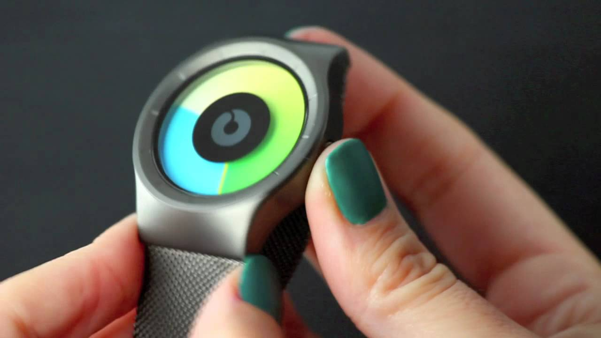

  - **Accessibility**: The abstract representation of time on the CELESTE may pose challenges for individuals with visual impairments or certain cognitive disabilities. The lack of clear, standardized time indicators can hinder accessibility for a portion of the user population.
  _Use case_: Visually impaired users who heavily rely on tactile or audible feedback to interact with devices may find the abstract time representation of the CELESTE inaccessible. The lack of clear indicators or tactile markings makes it difficult for these users to independently read and interpret the time, potentially excluding them from using the watch effectively.
   

## 1.6. Different types of users

- **Tech Novices**:
  Users who are not accustomed to modern technology or have limited experience with digital devices may face difficulties understanding and operating the CELESTE unconventional interface. The abstract representation of time may be confusing, leading to a steep learning curve for these users.

- **Elderly Users**:
  Elderly users who are more accustomed to traditional watches with standard time displays may find it challenging to adapt to the abstract time representation used in the CELESTE. The lack of clear minute and second markers could lead to confusion and difficulty accurately reading the time.

- **Visually Impaired Users**:
  Visually impaired users who rely on clear and tactile indicators to read time may encounter difficulties with the CELESTE interface. The absence of standardized markings or tactile feedback could hinder their ability to independently interpret the time.

- **Users in Time-Critical Situations**:
  In time-critical situations where precise timing is crucial, such as sports events or professional settings with strict deadlines, the abstract representation of time on the CELESTE might not provide the accuracy and precision needed. The lack of minute and second markers could make it challenging for users to track time precisely.

- **Multitaskers**:
  Users who frequently rely on additional functions, such as alarms, timers, or date displays, may find the limited functionality of the CELESTE restrictive. In contexts where managing multiple tasks and schedules is essential, the absence of these features may hinder their productivity and organizational abilities.

- **Individuals with Cognitive Disabilities**:
  Users with certain cognitive disabilities that affect their ability to interpret abstract representations or learn new interfaces may find it challenging to use the CELESTE. The unconventional time display might pose difficulties for these individuals, potentially limiting their ability to independently read and understand the time.

# 2. PUBG Mobile

## 2.1. Introduction

PUBG Mobile is a free-to-play battle royale video game developed by LightSpeed & Quantum Studio, a division of Tencent Games. It is a mobile game adaptation of PUBG: Battlegrounds. It was initially released for Android and iOS on 19 March 2018.

It was published by multiple publishers in different regions, including Krafton, Tencent, and VNG Games. By December 2022, PUBG Mobile had accumulated around 1.3 billion downloads while grossing over $9 billion, making it the third highest-grossing mobile game. It is also the second most-played mobile video game of all time. In 2021, the game spawned an Indian version, Battlegrounds Mobile India, and a separate game taking place in the PUBG Universe, called New State Mobile. 

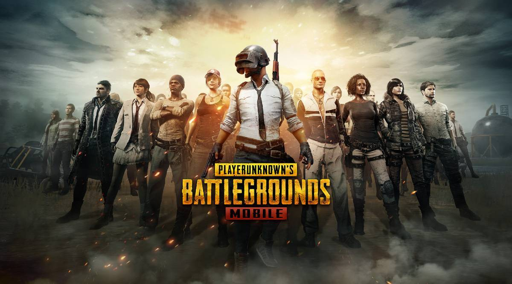

## 2.2. Target Audience

PUBG Mobile is a game that is played by people of all ages. However, the game is rated 17+ by the ESRB and 16+ by PEGI.

## 2.3. Welcome Interface

PUBG Mobile is very strict about the policy and also the restricted age. That is why the developers of the game have to make sure that the players are aware of the rules and regulations of the game. For newcomers, this is the first screen that they will see when they open the game.

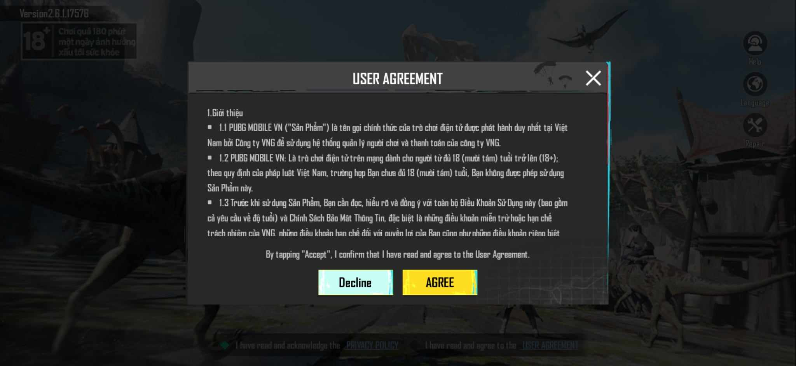

The notice board is in the foreground and is centered on the screen for the player to read. The background is dimmed to a darker color so that it will not cause any distractions (this rule of designing applies to every notice board throughout the game). The buttons are highlighted with a bright color to attract the player's attention with well contrasted font for readability. The buttons are also placed in the bottom center of the screen so that the player can easily reach them with their thumbs.

However, the content of the policy is not very well contrasted with respect to the background, plus the font they use here is not very readable. In addition, the font size is relatively small, and on mobile devices, this will be harder to read. The developers should consider using a different font and font size to make readability easier.

The game is restricted to players under the age of 17. Therefore, the developers have to make a confirmation for the players age to modify the ingame content accordingly.

## 2.4. Downloaded Content

A good thing to note is that the game will not download all the content at once. When you first install the game from the store, it will only download the necessary data for the game to run. The rest of the content will be downloaded when you first access it. This is a good way to reduce first-time download time and also reduce the amount of data used.

Not to mention, the game also let the players choose between the HD and SD graphics. This allows for more flexibility in the game's performance if players are using low-end devices.

*(Unfortunately, the image was not taken for this interface)*

## 2.5. Typing Interface

The game is developed to be played horizontally, because of this reason, the keyboard is placed at the bottom of the screen for ease of reach. In addition, a special thing about the design of keyboard in this game is that it divides the keyboard into two parts, one for the left hand and one for the right hand. This is a good design choice because it allows the player to use their thumbs more conveniently to type, especially on larger screen devices where the keyboard is too wide for the player to reach the middle of the keyboard.

Here you can see the division part. In addition to this, the distance between the keys is also very well-spaced so that the player can easily tap on the keys without accidentally tapping on the wrong key. Although this might cause some inconvenience for players who are used to typing on a normal keyboard, it is still a good design choice and it will get easier to type once the player gets used to it.

## 2.4. Login Interface

The login interface is very simple and straightforward. It provides two methods for players to log in, either by using their Facebook account or by using their Google account. This is a good design choice because it allows players to log in quickly without having to create a new account since these two platforms are very popular and most people already have an account on them.

Plus, the login screen presents the game's logo and the splash screen in the background to catch the player's attention and to enhance the overall visual appeal of the interface.

The screen also has a few buttons on the top-right corner like the "Help" button so that players can easily access the help center if they have any problems with the game, the "Language" button allows players to change the language of the game to fits their needs (the language is default to English because this is the main language spoken and used internationally).

In addition, there is a reminder in the top-left corner which says "Play over 180 minutes a day is bad for your health". This banner will appear throughout the game to remind the players to take a break from the game to avoid any health problems. For some people, this might be annoying since it blocks a part of the screen. However, it will disapear in the main gameplay screen.

## 2.5. Welcome to the Game

For newcomers to the game, it will prompt you to play the training mode to get used to all the controls and the game mechanics. This mode allows users to train their skills, experiment with different weapons and strategies, and gain familiarity with the game's mechanics in a controlled environment. Practice modes contribute to the iterative learning process, enabling players to refine their abilities gradually.

However, the game does not force new players to go straight into training mode. Instead, it allows players to skip the training and play with others in a real battle game. By doing this, the game focuses on the main purpose of the game, a Battle Royale game, which is to survive and be the last one standing. It gives new players the sense of what the game is about and what they should expect throughout the gameplay right of the bat so that they can experience the gameplay as soon as possible, rather than having them to go through all the complex details of the non-essential features.

## Main Lobby

### Overview

The main lobby is the first screen that players see when they open the game. It is where players can access various features, such as the shop, inventory, settings, and social features. The lobby is designed to be visually appealing and intuitive, allowing players to navigate through the interface easily. It also serves as a hub for players to access other game modes, such as training, arcade, and classic matches.

There are 3 main sections in the lobby:

- **Top section**:
  - In the top-left corner, we can see the player's avatar, username, rank, and level. This provides a quick overview of the player's progress and achievements.
  - In the middle, we have the "Home" button (identified by the house icon), the PUBG brand name and the "Shop" button (identified by the shopping cart icon). The "Home" button allows players to return to the main lobby screen, while the "Shop" button allows players to access the in-game store. If there are any new items available for purchase, an exclamation mark will appear next to the "Shop" button to notify players. 
  - In the top-right corner, we have the points and ingame top-ups. The points are used to purchase items in the shop, while the ingame top-ups are used to purchase items in the in-game store. The "Plus" button (identified by the plus icon) shows that players can purchase more top-ups if they want to.
- **Middle section**: 
  - This is the main area of the lobby. We can see the actual background of ingame environment here. Our character model will be in the center, giving us the highlight of the equipments and/or inventory that we're having. Besides, when there are new people join in the game with us, their model will appear next to ours. This allows players to see their teammates and interact with them (via microphone or ingame chat system) before the match starts. It also provides a sense of community and camaraderie, which can enhance the overall user experience.
  - In addition, the game draws inspiration from real-world military tactics, weapons, and equipment. This allows players to leverage their existing knowledge and understanding of these concepts to improve their performance in the game. For example, players can apply real-world knowledge of weapon characteristics, such as recoil and bullet drop, to improve their aim and accuracy in PUBG Mobile.

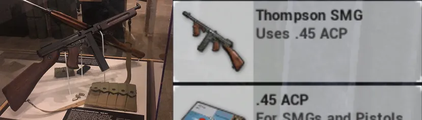

- **Bottom section**:
  - The first thing that hits our eyes is the big "Start" button, displayed in a bright yellow color. This aims to attract out attention and to encourage us to start the game (which is the intention of the developers).
  - A special thing about the design of this section is that they don't put everything at once, since it will make the screen look crowded and overwhelming. Instead, they only show the buttons that are important and most relevant to the players. For example, if the player is in the lobby, they will only show the "Missions" button, "Inventory" button. Other options can be found when players click the "Arrow Up" button next to the side. This allows players to focus on the main features of the game without being distracted by unnecessary details.

### Interaction

The lobby is designed with the intention to be simple and intuitive. Most of the time, mobile devices would often have small screens, this would scale down the size of the buttons (for the sake of designing). Noticing this, the developers of the game implemented a feature that allows players to swipe, to the left or to the right, to switch between different screens of the lobby (like the Inventory or the Shop). There is also a transition animation to make the switch more smooth and visually appealing

## Hints and Tips

For new players, who will be unfamiliar with the layout and the functionality of the buttons, the game provides hints to guide them through the interface. 

For example, when players first open the game, a hint will appear on the "Start" button to encourage them to start the game, or in the picture below, there's a hint pointing at the "Newbie" button,

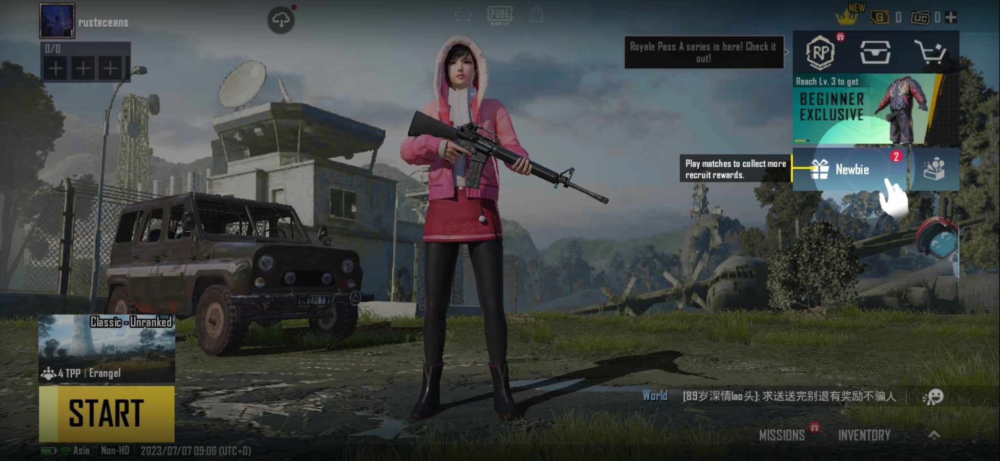

or various banners that appear throughout the game to notify players of new features or events.

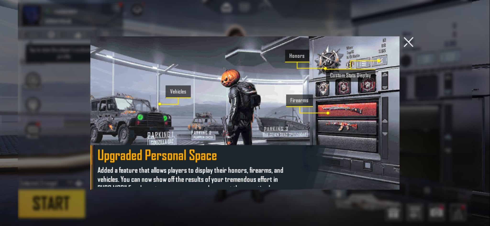

These notifications will usually take up most of the screen to catch the player's attention, notifying them of new features or events. For instance, the shop will present latest items that are available for purchase as the main spotlight of the screen, while the background is dimmed so that it will not cause any distractions. Other items are also designed to be well contrasted and visually appealing to attract the player's attention, and potentially, to encourage them to purchase the items.

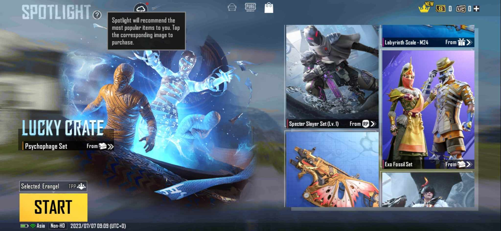

Moreover, the game also have popup notifications that appear when players complete a mission or an achievement. Or, when the players accidentally click on "dangerous" buttons, like the "Buy" button in the shop, or the "Upgrade" button in the inventory, or when the players want to exit the match, there will be a popup notification to confirm their action. This thoroughness is a good design to reduce the amount of errors that players might make.

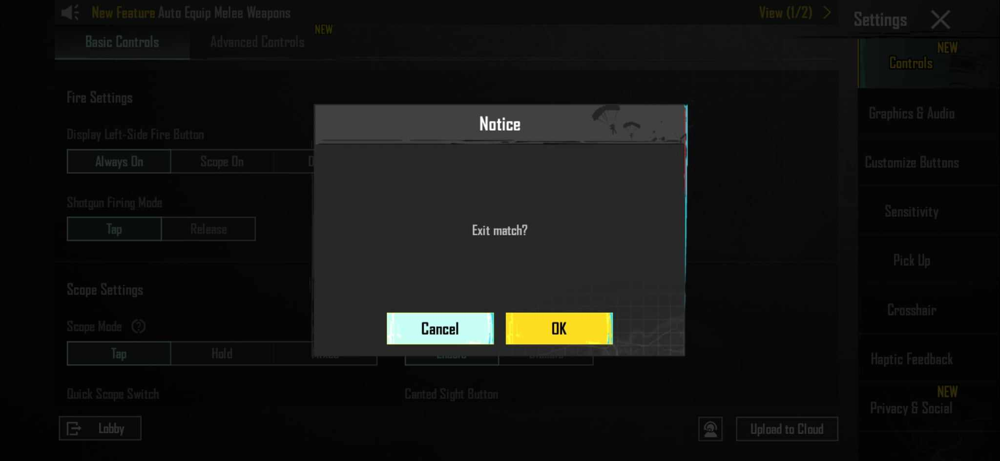

## Visualization

The game comes with visual effects to enhance the user experience. For instance, when players want to view the details of an item, there will be a 3D model next to the side to give the players a more realistic view of the item, how it looks like, how it fits to their character models, etc. The 3D model also has the ability to rotate, allowing players to view the item from different angles. This feature is another special thing about the game because they can view all the perks and details of the item right in the game itself, instead of having to go online for reference.

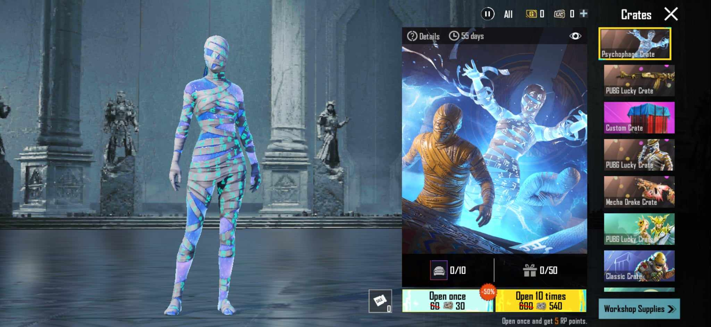

## Personalization

The ingame settings are rich and diverse, allowing players to customize the game to their liking. For example, players can adjust the graphics quality, frame rate, and resolution to optimize performance. They can also customize the controls, button layout, sensitivity, crosshair, and other gameplay settings to suit their preferences. These personalization options allow players to tailor the game, and increases memorability as they can configure the game to match their individual playstyle and needs.

There is one thing to consider, however, is that the personalization options cannot fit all the players' needs. The developers have tried their best to include the most common options that players would want to customize. Doing this will cause an absurd amount of options and it will be unnecessary. An example of this is the limited color options for the crosshair,

or the limited languages supported by the game.

## Pre-game Experience

### Loading Screen

The loading screen is well-thought-out and designed to be visually appealing, while also gives players some insights of the gameplay and the chosen map. For instance, the background is a screenshot of the map environment (dimmed) to give players a sense of the gameplay. In the foreground is a big splashscreen of important mechanics of the game, like the "Danger Zone" or the "Red Zone", visualized with images and text to give players a better ease of understanding. 

Moreover, it also offers tooltips, prompts, and contextual information. These resources can aid players in refreshing their memory on specific features or mechanics when needed.

There is also a loading bar at the bottom of the screen to show the progress of the loading.  

## In-game Experience

### In-game waiting lobby

Firstly, the game will start when there is 100 players available (ready to connect). You can verify if there are enough players by viewing the top-left corner. It'll show how many players are currently are the room with a countdown timer of the game start, which is 60 seconds.

When the game begins, this banner will change to display the number of players that still survive, and how many you eliminated.

Why is it must be at the top-left corner? As to many gaming conventions, things that are important to the players should be placed at the top of the screen. This is because the top of the screen is first place that players tend to look at when they want to, for instance, navigate or check their status. This is an analogy to real-world context, where we tend to look up when we want to check the time or the weather. Following that we'll have the map at the top-right corner, as well as the settings button, micro phone access, volume access, etc.

### Compass

Navigating is as important as shooting in this game because you have to know where you are, where your teammates are, where the enemies are, where the safe zone is, etc. The game has a miniture compass in the middle-top. This will help players navigate through the map whether they're heading in the right direction. By communicating to each other, teammates can tell others what direction the enemies are at by signify the number on the compass and in which direction (North, South, West, East), just like in the real world. This will satisfied the **Human Capabilities** in both perception and cognition in terms of navigation. Not to mention, the design of it is based on the real-world compass, so it's easy for players to understand and use it.

### Teammates

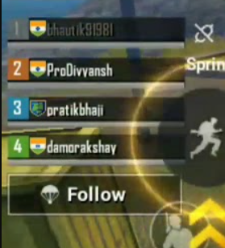

Also in the left corner, we can see the number of members of our team. You will always be placed at the top (signify the person who's playing), than the others below. They'll have their in-game name together with a color tag to signal other members not to shoot at them. By tagging each member with a color symbol, will help players don't have to remember teammates by their name but rather by looking at a color tag. Furthermore, the color tag will also appear on the map, so players can easily locate their teammates.

### Action Buttons

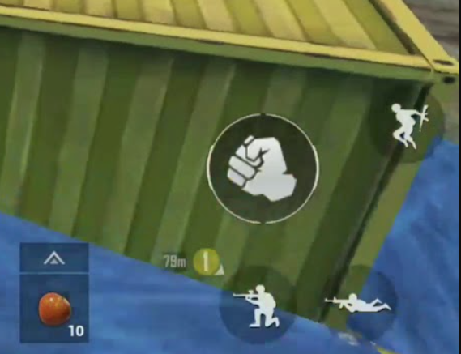

At the bottom-right corner, base on the default display, there're some buttons perform actions like: *attack, jump, crawl, kneel*. For each button there will be a clear illustration for that specific action. However, the attack button will change depend on what type of weapon you're wielding: none -> fist, guns -> bullet, melee-weapons -> knife. For experienced gamers, this will signify them clearly what's that button will do if they press it. For new gamers, the illustration is clear enough for them to know the usage of those buttons. This attack button is also the biggest button among the others in order to signify its importance.

At the bottom-left corner, players have a joy-stick icon to control their character. The design is a circle with arrows to signify the direction of the character, in the middle is a smaller circle to simulate the joy-stick, which is familiar to most gamers.

Next to it we will have another attack button. The reason why there are two attack buttons is because in case the player wants to jump and shooting (attack) simultaneously, their right thump pressed the jump button and the other one pressed attack. In some cases, players want to perform two actions at the same time, in case they run out of fingers to press on one side, the game places the same button in the other side to assist the players. This also can be changed in the customization settings where players can custom their personal actions display which suits them best.

Next up is the backpack button for in-game storage. There is also a little circle line running around the button to signify the backpack's capacity: whether is it full and how much storage space is left just like a loading icon in real-world context. However, players can't know the exact amount of storage in it. In order to be more precise, it is better to have percentage illustration to display the amount of available space. In addition, the backpack icon can show which *tier* (the rarity) it is  by showing some yellow stripes next to it, the more stripes it has, the better the quality. This helps players to identify the quality of the backpack without having to open it.

At the bottom line we have 2 weapon slots and 2 equipment slots (on the left side is the slot for health kit, on the right is for grenades, smoke grenades, etc.), and your health bar in milky-white in the center. The health bar will change color based on the amount of health you have left and the white section will decrease as your health decreases. This gives the sense of "decreasing" and "increasing" to the players.

The weapon slot will change the icon illustration based on what weapons you choose and next to is the amount of ammunition you have (ammunition left in a round / ammunition left in the backpack).

As for the equipment slot, every kind of heal kit or grenade is packed into a single slot. This means if you're using a grenade, only the grenade icon will be displayed, if you want to use other kinds of equipment, for instance a smoke grenade, you have to choose the "more option" icon (the up-arrow over the equipment slot), then it will display every equipment you have which is of the same type. You  can select the kit and press it again in order to use it. However, this is time consuming and ineffective to the players if they want to perform a quick action. In addition, if the players use a smart phone to play, the size of it might affect the experience due to mistakenly pressing the wrong button. This is a drawback for players who mainly play this game on their smart phones.

### Crosshair Placement

The crosshair is positioned in the middle of the screen in PUBG Mobile is primarily for gameplay and user experience purposes. Placing the crosshair in the middle of the screen helps to ensure that players have a consistent and intuitive aim when engaging in combats.

By aligning the crosshair with the center of the screen, it allows players to have better control over their aim and provides a more natural and familiar shooting experience. This design choice aims to make it easier for players to accurately target their enemies and engage in gunfights.

Additionally, this allows for easier adaptation across different screen sizes and aspect ratios of mobile devices. It provides a standardized aiming reference point regardless of the device being used, promoting fairness and equal gameplay opportunities for all players.

### In-game flight

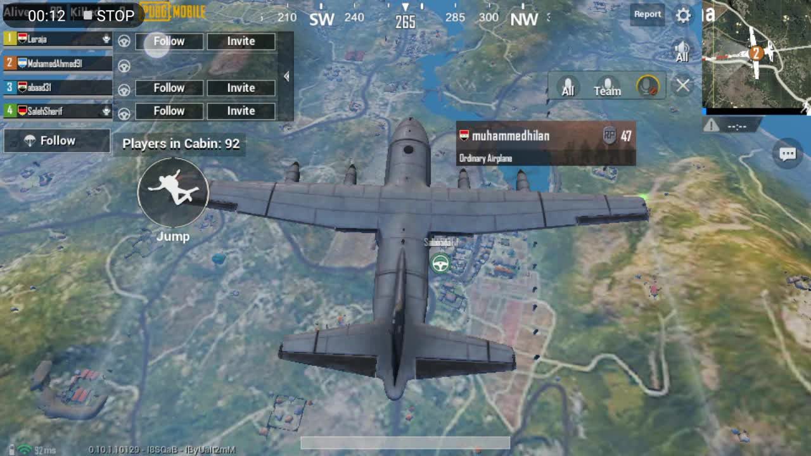

Starting the game, the players are packed in an airplane which flies across the map, the flight direction is random in each round.

On the left there is a text line to display the number of players are in the plane, and a jump button to exit (with an illustration of a man free falling with a parachute). The extension section above includes a stearing wheel, a follow button, an invite button. The stearing wheel shows who is in charge of leaving the aircraft and guiding their teammate to land at the predetermined target. By hovering the color icon over the stearing wheel, it shows who is the leader according to the color previously marked by the game. For exemple: if you assign the first person whose color is yellow to be the leader, your stearing wheel will have a yellow icon.

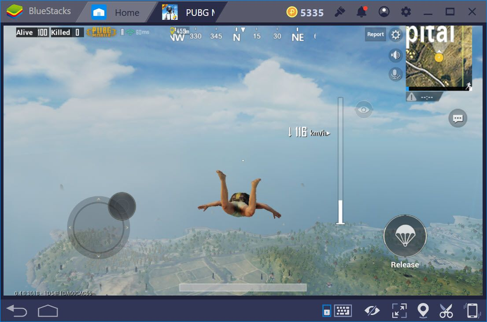

When we exit, the action display changes, we will have a joy stick to control the character direction, a release button to pull out the parachute, a column monitor to give us info about our fall speed, a cursor to show our altitude that will move downward as we fall. The column has 2 sections: the section where we can *free fall* is marked as transparent, *danger section*, marked as milky white, is where we must pull out the parachute to decrease our speed. If the players enter this danger area, the game automatically pulls out the players' parachute. This monitoring column perfectly executes how the game informs the players on speed and altitude of their fall. The way the cursor moves downwards as we fall gives the players a clear information.

### Map

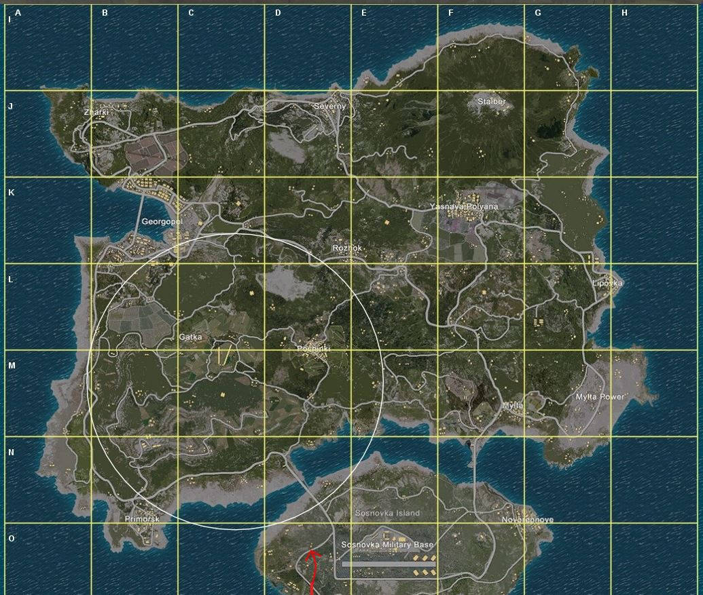

When we open the map, we can view the longitude and the latitude, just like in real life maps. If players don't like this feature, they can turn it off.  We use the map to view our objectives, our teammates, our enemies, our location, etc. It is a very important feature in the game, and is also the most used feature .However, the map cannot show the terrain height, which is a drawback for players who want to know this information.

For the ring, it's a white circle that keeps shrinking over time. This is the **safe zone** that players must stay in to avoid being killed by the **blue zone** (which is the area outside the white circle). The blue zone will keep shrinking over time, and the damage it deals to the players will increase as it shrinks. If you're in this zone, you will be vulnerable and your health bar decreases over time. This is to prevent players from camping in one place for too long. The smaller the white ring, the bigger the damage that the blue zone has. There is also a red circle, which is the *danger zone* where bombs will be dropped. The color red is common for signifying dangers in real life, and the developers of the game also use this color to signify the danger. The bombed area Where the player takes damage when bombs are dropped. If the your character is out side of a man-made structure. Your health bar will gradually decrease when hit by a bomb, which may result in you being removed from the game. This area is marked as a **red zone** on your map. This area will appear randomly in the map so we can't predict it. This will make the game more unpredictable, make the player more interested and more competitive.

To illustrate the concept more precisely, you can view the image below.

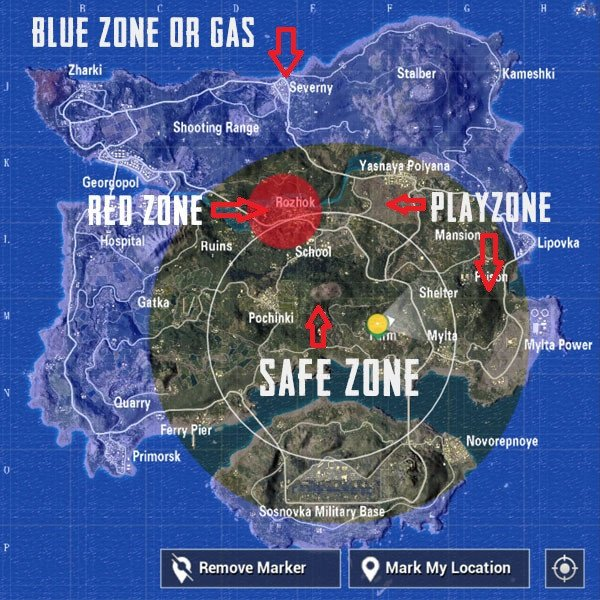

The position of your character is identified with the yellow icon. There is also a small arrow to show the direction that your character is facing for better navigation.

It's worth noting that the ring warning is still displayed even when the map is minimized. For instance, a running figure icon represents your character, while a white strip on the bar indicates that you are within the safe zone. The blue section of the bar represents the vulnerable zone, which expands over time as it gets closer to your location. This feature proves beneficial for gamers, whether they are playing in big or small map mode.

The red warning icon signifies the start of the ring shrinking process. It initiates a countdown each time, indicating when the contraction will occur. The choice of red color for the icon is fitting, as red is often associated with danger and severity. This color selection effectively communicates the imminent threat posed by the shrinking ring. The triangle shape of the icon draws inspiration from real-world road signs used for conveying danger and warnings to road users. By incorporating this familiar shape, the game leverages a metaphor that aligns with the purpose of real-world signs. The use of the red warning icon in the game serves as a meaningful and effective metaphor, alerting players to the dangerous nature of the situation and prompting them to take appropriate action.

Additionally, there are instances when you may encounter an orange bullet or footsteps with an arc shape. These visual cues indicate the direction from which the corresponding sound originates. The mechanism functions akin to a radar system, allowing players to quickly identify the source of noise and respond accordingly. The association with radar is intuitive for many individuals, as they are familiar with its operation and can easily understand how to interpret and utilize this information effectively.

### In-game Controller

This is the complete layout of the PUBG controller in walking mode, which serves as the default controller on mobile phones. This initial layout is what users first interact with when starting the game. Although customization options are available later on, let's examine the default layout provided by the game.

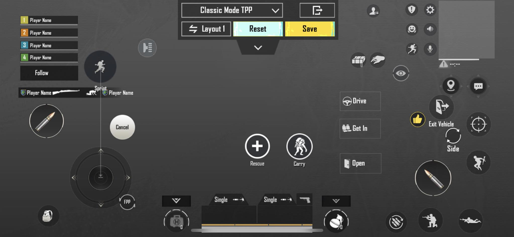

At first glance, the layout appears **quite chaotic**. The top-right corner features the map, settings button, microphone access, volume control, and potentially more, depending on personal customization. The functions of the remaining buttons may require some exploration.

Let's consider the optimization of the default layout for players who typically use their thumbs while playing. One aspect that raises concerns is the sprint action. To sprint, users must drag the joystick towards the sprint button, which creates a considerable gap. This can be inefficient and lead to thumb fatigue due to excessive and out-of-range movements, as well as subsequent inaccuracies in execution.

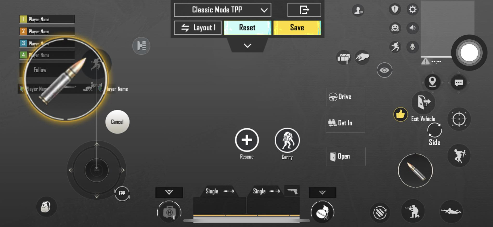

Speaking of inaccuracies, the bullet icon on the left is designed to be the size of an average person's thumb when pressed against a surface. It is optimized for the game rather than the user. As players spend more time in the game, they often increase the size of this button to 150% or more to enhance their response time compared to others. This tendency arises due to the highly competitive nature of the game. However, enlarging the button results in running out of vertical space on the screen, which prompts players to find alternative ways to manage it. Some players opt for using tablets instead of mobile phones, as tablets offer more screen space. This creates an imbalance for those who continue playing on mobile phones, as tablets provide advantages in terms of quick actions and improved enemy detection rates.

Let's examine the two equipment slots. The health kit slot on the left appears smaller than the grenade slot on the right. This can be explained by the fact that the weight of a specific health kit can exceed that of a grenade, resulting in fewer slots being available for health kits. However, the asymmetric layout can make users feel uncomfortable. Humans tend to prefer symmetry and perfection. Therefore, it might be beneficial to adjust these two slots to have an equal size and placement.

#### Crowded Interaction Space

There are just too much buttons. We have the map at the top-right corner, as well as the settings button, micro phone access, volume access, etc. The information is too much for players to process at once, especially for new gamers who are still unfamiliar with the game. Moreover, due to having an excessive amount of buttons, the size of each button is reduced to fit the screen. This will cause the buttons to be smaller, and it will be harder for players to press on them. In some game scenarios where it requires players to perform quick actions, this will be a drawback for them. While players typically use only 2-4 fingers to interact with the game, there are more than 20 buttons available for interaction. This overload of buttons can overwhelm users and impede their ability to perform actions swiftly and accurately, not to mention the so-called ***spider crawl*** where players have to use all their fingers to press on the buttons. 

Luckily, it is customizable. The developers have thought of this issue and provided players with custom layouts. By allowing users to personalize the placement and number of buttons according to their preferences and gameplay style, the interaction space can be optimized. However, it should be noted that customization may result in the transfer of the problem to other aspects, as reducing buttons may limit certain movements or actions.

## Gameplay

### Looting

When looting from an opponent or a teammate in PUBG, a scroll box appears on your screen. Typically, items are displayed with a white background, but if an item has a yellow background, it signifies that it is beneficial for you. 'Good' in this context means the item is either a weapon you don't have or the type of ammunition that is compatible with your current weapon.

The choice of the color yellow is based on human psychology. When people see the color yellow, it often evokes feelings of warmth and positivity. Yellow is also associated with a gold medal, symbolizing achievement and excellence. By using the color yellow, the game indirectly encourages players to feel a sense of increased odds and success, boosting their confidence in winning.

There is a game mechanism that enables quick looting. When this feature is turned on, you automatically collect all items beneficial to you from a nearby eliminated player until your backpack is full. However, if players haven't activated this mode or are unaware of its existence, it can put them at a disadvantage, impacting their performance and the overall fairness of the game.

Consider a scenario: I'm using a weapon that requires green ammunition, and I've collected a significant amount of it as the game progresses. When I engage in quick looting, the mechanism keeps picking up more green ammunition, causing my backpack to fill up. I then have to manually manage my inventory or disable the mechanism, which can be quite inconvenient. To address this, I propose implementing a maximum ammunition capacity. Although the chances of collecting a large amount of ammunition are low due to the presence of other consumable items like healing kits and boost items, the issue still arises, and we should enhance the user experience of the game by finding a solution.

### Responsive Feedback

The game's response and realism in terms of aiming through scopes and weapon recoil contribute to an immersive gameplay experience. To further enhance the realism, incorporating the vibration mode feature available on phones and tablets could be a viable option. Utilizing vibration feedback when firing weapons or engaging in certain actions can provide players with a tactile sensation, closely mimicking the real-world experience. While it is true that enabling vibration mode may result in increased battery consumption, offering it as an optional feature allows gamers to choose whether they prioritize the added realism or battery life. This way, players can customize their gaming experience based on their preferences and device capabilities.

### Win screen

What happen if we win, the screen start to darken and a logo in the middle said **Winner Winner Chicken Dinner**. Its the slogan of the game. What does it means, just a catchy phrase, another meaning is you are the best and everyone else is bad as a chiken. 

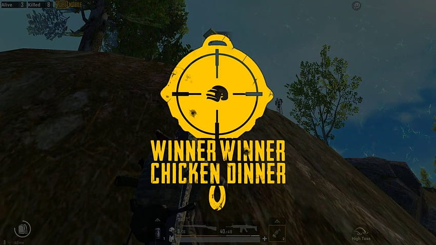
Next, we'll have another screen coming right up. Its your personal feat, include your rank in this round, your kill, your reward. Base on your feat, which include your total kill, total damage, how long did you survive in the game, how you support your team,... You will have an achievement as a dog tag on the bottom-left side.
If you have more than a achievement, so does your dog tag. The representation of your achievement as a dog tag Very similar to the etiquette in the US military when a soldier enlists they will be given a tag dog when their personal information. Even after finishing their military service, some people still wear it as a pride, to remember their glory days. This representation is tend to make people proud of themselves and the achievements they have achieved in the game. (`interaction metaphor`)

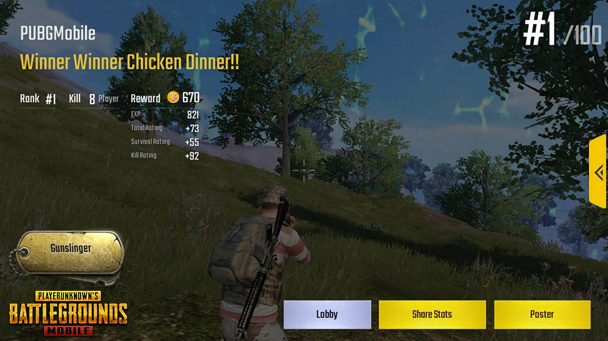

Then your next step option is on the right hand side. We have: Lobby, Share Stats, Poster and an arrow button in the middle right. Lobby means return to the lobby, i guess you know what share stats button will do, Poster button will capture your screen and display it as a poster which you can share it later on throught social media channels. 
The arrow button on the right side of the win screen in PUBG Mobile serves as a navigation tool to proceed to the next screen or stage after achieving victory in a match. By tapping or clicking on the arrow button, players can progress to the subsequent screen, which typically includes rewards, statistics, or options to return to the lobby or continue playing. It allows players to smoothly transition to the next phase of their gameplay experience after emerging victorious in the game.

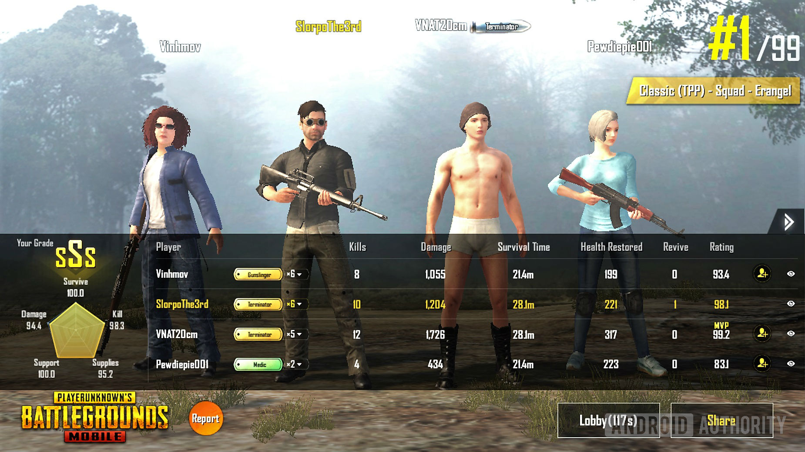

The eye icon located at the end of each row is designed to open up a person's information table. However, the choice of using an eye icon for this action can sometimes lead to confusion among users. While the eye symbol generally conveys the idea of "seeing" something, it may not immediately indicate what specific information is being referred to.

To address this potential confusion, an alternative approach could be implemented. Rather than relying solely on the eye icon, the mechanism could be modified to allow users to click anywhere within the row to access the person's information. This approach offers a more intuitive and straightforward interaction, eliminating the need for users to search for a specific icon to perform the action.

By simplifying the process and providing a clearer indication of how to access the desired information, the user experience can be enhanced. This revised mechanism would ensure that users can easily and efficiently access the person's details without any uncertainty or confusion.

To gain a comprehensive and contrasting perspective among players and determine who contributes the most within a team, it can be said that optimizing the comparison of stats between teammates is crucial. By adopting this approach, we can efficiently assess and compare various important factors such as kill count, revives, distance traveled, survival time, energy consumption, and many other aspects. By considering these metrics, we can evaluate each player's contribution within the team and identify the individuals with the best performance.

Comparing stats between teammates helps establish an evaluation and classification system, enabling us to uncover and maximize the potential of each team member. It also provides a basis for strategizing and assigning roles during matches. By leveraging this information, we can achieve better coordination and teamwork, ultimately enhancing combat capabilities and achieving success in the game.

By optimizing the comparison process through the examination of stats between teammates, we can ensure fairness and transparency in determining the player with the most significant contribution. This fosters a level playing field and motivates each player to strive for excellence and achieve their best performance in PUBG.

### Distinguish between enemies and teammates

The color tag serves as a crucial visual marker to identify and distinguish your teammates from other players. It is prominently displayed over the character model of each teammate, as well as on the map and compass sections. This color-coded system provides a quick and efficient means of recognizing your teammates' positions and movements amidst the chaos of battle. By instantly identifying the color tag associated with your teammates, you can effectively coordinate strategies, communicate vital information, and avoid accidental friendly fire.

Moreover, apart from the visual cues, the sound of your teammate's footsteps plays a significant role in distinguishing them from enemy players. The audio design in PUBG ensures that the sound generated by your teammates' movements is distinctly different from that of enemies. This intentional distinction allows you to focus on and accurately locate potential threats in the vicinity. By recognizing and distinguishing the audio cues of your teammates' footsteps, you can maintain situational awareness and respond promptly to enemy encounters, enhancing your team's chances of success.

In combination, the color tag system and differentiated sound effects for teammate footsteps create a cohesive and immersive gameplay experience. These features not only facilitate effective teamwork and coordination but also contribute to the overall realism and strategic depth of PUBG. By leveraging these visual and auditory cues, players can form cohesive units, adapt to dynamic situations, and forge a competitive advantage on the battleground.

However, in the event that you accidentally shoot your teammate, such as when the enemy and your teammate are in close proximity and you unintentionally hit your teammate while aiming at the target, the game mechanism has implemented certain safeguards to prevent your teammate from taking actual damage. Fortunately, your teammate will be spared from the actual loss of health or any detrimental effects caused by friendly fire. Nonetheless, there will still be visible hit effects on your teammate, serving as a visual indicator of the interaction. This design choice ensures that you do not bear the full responsibility for the unintended mistake, and it prevents potential frustrations and conflicts among teammates that may arise from accidental friendly fire incidents. By incorporating such protective measures, PUBG promotes a more forgiving and cooperative gameplay environment, encouraging players to focus on tactical decision-making and team synergy rather than being overly burdened by accidental errors.

# References

- https://tournafest.com/blog/all-about-pubg-a-case-study/
- https://uxdesign.cc/what-i-learned-about-ux-research-on-pubg-mobile-as-a-player-57a673d19fe1?gi=0013e3fefac9
- https://www.invespcro.com/blog/usability-design-for-a-better-user-experience/#:~:text=As%20an%20essential%20element%20in,user%20to%20compelte%20the%20task.
- https://www.cnet.com/pictures/pubg-mobile-might-be-the-best-version-of-the-game/12/
- https://vi.wikipedia.org/wiki/PUBG_Mobile
