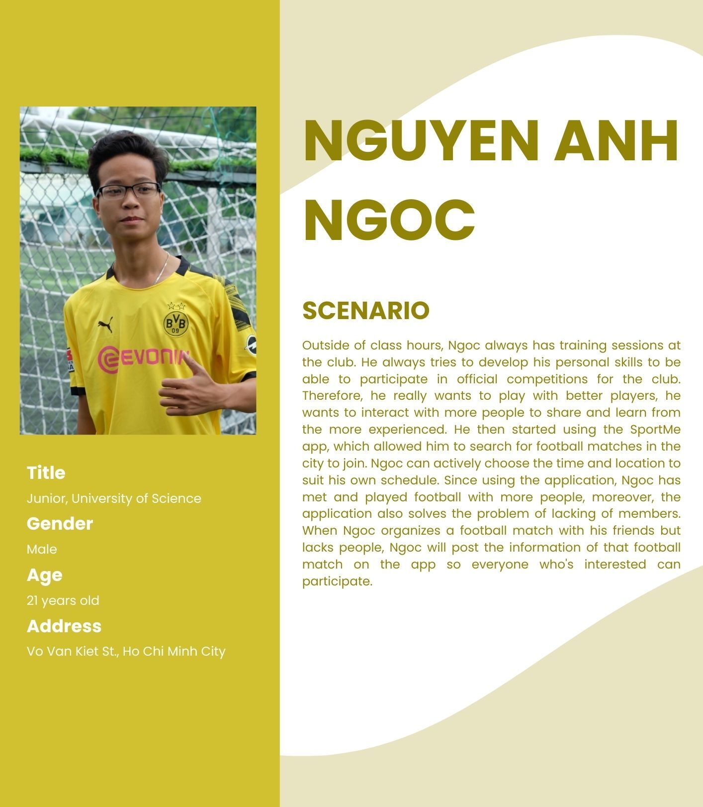
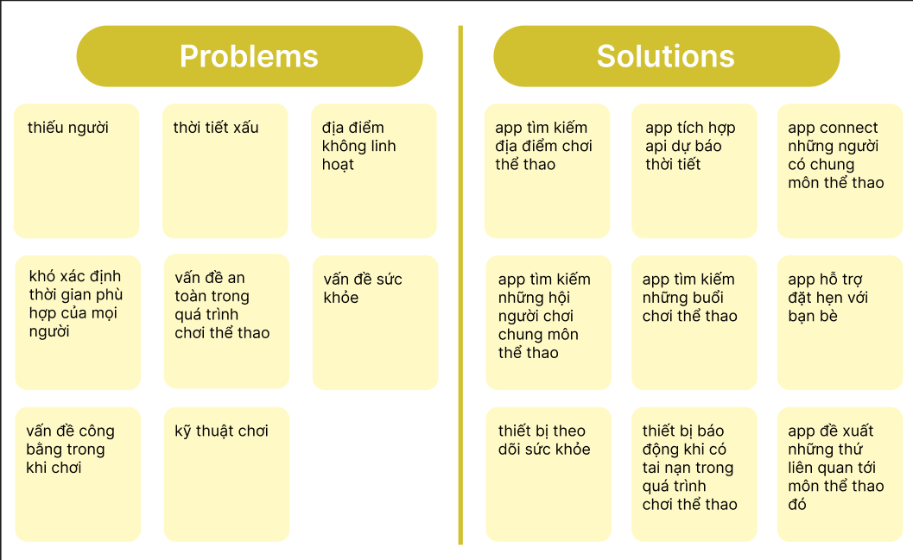

# 1. Abstract

Sports have become an essential, such that everyone should be encouraged to do it because of the benefits it brings to the body. Team-oriented games are the options that people could take to enjoy sports activites. We cannot deny the fact that there are still people who are willing to come out and do sports in a group. However, for most of the time, people do not have enough members to conduct sports activities. This situation can lead to discouragement and stopping them from doing any more sports activities due to the insufficient number of members.

Therefore, we are proposing a mobile application that can facilitate the process of finding members to play sports together. This application will be able to match people with the same interests and sports activities. It will also be able to provide a platform for people to communicate and arrange the time and place to play sports together. We hope that by doing this, we can encourage more people to do sports and participate more in sports activities as well as to promote a healthy lifestyle.

# 2. Purposes

The purpose of this report is to understand and gain insights into the user's data such as their context, environment, goals, problems, needs, etc. with respect to the problem domain, in order to better understand the users as well as to evaluate and generate potential solution ideas to the problem. Moreover, these research information will help to assess the feasibility of the proposed solution and to indentify potential problems that may arise during the development of the solution. 

# 3. Scope

The research will be conducted, mainly but not limited to, university students who are interested in sports activities. The scope is planned to be in such a way for the following factors:

- We think that university students are more likely to be interested in sports activities as they are still young and energetic, though might suffer from the lack of members due to various reasons, for instance, they are new to the university and do not know many people yet, and/or some might have different schedules and are not able to play sports together.
- We think that university students are more likely to be willing to try out new things, such as a new mobile application, and are more likely to provide feedbacks and suggestions for improvement.
- Since we are also university students, we are more likely to understand the problems that university students are facing and are more likely to come up with solutions that are more suitable for university students.

With the above reasons, though restricted to university students, we believe that the research will be able to provide sufficient information and insights.

# 4. Limitations

## 4.1. Limitation 1: Sample size

Our group interviewed 5 people. Our client’s user size ranges from 50-100 per day depending on the month (for example, holiday months are much busier than non-holiday months). Therefore, 5 people is most likely not an accurate representation of Personas's users.

## 4.2. Limitation 2: Sample Selection

Our interview participants were not randomly selected. We asked people we knew, such as classmates and friends, because they were easy to access. In order to be truly random, we could have generated a list of all our classmates, got rid of those not in our target demographic, and then randomly selected people from that list. However, this would have been time consuming and difficult to do.

## 4.3. Limitation 3: Problem Scope

The problem we are analyzing is also limited. It was somewhat difficult to create interview questions that would help us understand more about this problem without asking our participants specific usability problems or showing them the appplication. Since this phase was not concerned about an applications specific usability issues, we asked more general questions but perhaps did not receive as much as insight to the problem as we would have liked. 

# 5. Summary

The report details and analyzes a series of user research methods conducted for assessment of the problem domain. The research methods include:

- Online survey: to gather an overall understanding of the data and to identify the problems that the users are facing.
- Interview: specifically, semi-structured interview, to gain insights into more detaiSled information about the users on the problem.
- Fly on the wall: observation real-life situations of some common sports activities to gain insights into the users' context and environment.

## 5.1. Key findings 1

- **Lack of Members**: The primary concern expressed by users is the difficulty in finding enough members to participate in sports activities. Many respondents mentioned that they often face challenges in forming complete teams, leading to canceled or postponed games.
- **Recommendation**: The application should focus on facilitating the process of finding members for sports activities. It should provide a platform for users to connect with like-minded individuals and form teams for their preferred sports.

## 5.2. Key findings 2

- **Preference for Football**: Among the various sports activities, football emerged as the most popular choice among users. 
- **Recommendation**: The application should prioritize football-related activities and provide features that cater to the needs of football enthusiasts. This could help attract more users and increase participation rates. It is evident that a significant portion of potential participants is interested in football-related events.

## 5.3. Key findings 3

- **Time and Schedule Constraints**: Users often struggle to coordinate schedules and find suitable time slots that accommodate everyone's availability (Conflicting academic or work,...)
- **Recommendation**: Schedule coordination is a critical aspect of sports activity planning. The application should provide a smart scheduling system that considers users' availability and constraints to suggest suitable time slots for sports activities. This could minimize conflicts and improve participation rates.

## 5.4. Key findings 4

- **Communication**: Users emphasized the importance of efficient communication within the sports groups. 
- **Recommendation**: An ideal solution should facilitate easy coordination, notifications, and updates to ensure smooth sports activity planning.

# 6. Methods

To obtain the above findings, the following research methods were employed:

## 6.1. Online Survey: 

An online survey was designed and conducted to gather quantitative data and gain an overall understanding of the users' perspectives on sports activities. The survey was distributed to a targeted group of university students who expressed an interest in sports. The survey consisted of structured questions covering the following key aspects:

- *What sports do you like to play?*

This question aimed to identify the various sports activities that respondents were interested in engaging in. It allowed researchers to understand the diversity of sports preferences among the target audience.

- *How many times a week do you play that sport?*

The frequency of sports participation provided insights into the level of interest and dedication of respondents towards their preferred sports activities. It helped gauge the enthusiasm for regular sports engagement.

- *How many hours per game?*

This question sought to understand the typical duration of sports games or activities that respondents participated in. It helped assess the time commitment required for each sports session.

- *What do you usually prepare before playing, and how do you plan for sports activities? (e.g., choosing a place, inviting friends, renting equipment)*

This open-ended question aimed to capture the pre-game preparations and planning strategies of respondents. It provided insights into the typical steps taken by participants to organize sports activities and gather necessary resources.

- *Do you have any difficulties in preparing and planning for sports activities? If yes, please elaborate.* 

This question focused on identifying the specific challenges faced by respondents when preparing for and planning sports activities. It allowed participants to express any obstacles they encountered in the process.

- *What issues do you care about in the process of playing that sport? (e.g., safety, competitiveness, sportsmanship)*

The purpose of this question was to understand the concerns and priorities of respondents during the sports activity itself. It aimed to identify the aspects that participants valued and considered important while playing the sport.

- Link to the survey: [Survey Link](https://docs.google.com/spreadsheets/d/1oon7S1mYUGAniEh28Wl2qBwsGBZHaEN6VFHq7teFMWo/edit?fbclid=IwAR3CHA2Ibxt3VEnhRM-85_Tj6eW1UWkzzXdoRaM8KZHyZeSNti7GLIs-E1w#gid=1357530249)

## 6.2. Semi-Structured Interviews: 

To gain deeper insights into the users' experiences and to explore their motivations, challenges, and needs regarding sports activities, semi-structured interviews were conducted with selected survey participants. The participants for interviews were purposefully chosen to include individuals with diverse sports interests and varying levels of engagement.

The interviews were conducted in a one-on-one format, allowing participants to express their thoughts and experiences openly. The interview questions were designed to be open-ended, encouraging participants to share their perspectives freely. The following topics were covered during the interviews:

- **Motivations and Interests**: Participants were asked about their motivations for participating in sports activities and their specific interests in particular sports.

- **Challenges Faced**: The interviews explored the challenges and barriers participants encountered in forming teams and organizing sports events.

- **Suggestions for Improvement**: Participants were encouraged to provide suggestions and ideas for a potential solution to address the issue of finding members for sports activities.

The semi-structured interviews provided rich qualitative data that complemented the quantitative findings from the online survey.

For the interview questions, please refer to [Appendix C](#appendix-c-interview-question-scripts). As we have mentioned above, due to the sample size limitation, we only interviewed 5 people (for some people we didn't ask all of the questions from the scripts). For the interview data, please refer to [Appendix D](#appendix-d-user-research-data).

## 6.3. Still-photo survey: 

We asked users to send their own photo of their preparation for sports activities. The purpose of this method is to acquire more information about the users' preparation for sports activities.

Above are some examples of the photos that we received from the users. From the photos, we can see that the problem most of the users are facing is the lack of members. This is consistent with the results from the data we collected.

# Appendices

## Appendix A: Personas

## Appendix B: Scenarios

## Appendix C: Interview Question Scripts

- Demographics:
  - Age
  - Gender
  - Occupation
  - Hobbies
- What sports do you like to play?
- What difficulties do you often face when preparing to play that sport (number of players, yard, equipment, ...)
- How often do you play sports a week?
- If the place to play is far from where you live, do you want to go or not?
- If the weather suddenly changes, how will you feel and decide (no more participation, change schedule,...)
- When you play a sport with your friends (or other people), do you want to play with people of the same level?
- If in the match there were people more qualified than you, how would you feel?
- Are you interested in sports accessories, or other things?
- When participating in team sports, do you want a team with enough players or more players? Why?
- What format have you used to schedule and invite friends to participate in sports with?
- If there were an application that provides player search and appointment scheduling, would you want to use it? Why?
- Do you have any other comments or questions?

## Appendix D: User Research Data
### User Interview 1:

- Demographics:
    - Age: 21
    - Gender: Male
    - Occupation: Undrgraduate Student
    - Hobbies: Reading, Swimming, Sports, Traveling

1. What sport do you like to play?
    - I like to play football, basketball, badminton, and swimming.

2. How often do you play sports a week?
    - I play sports about 1-2 times a week (2-3h per time)

3. What difficulties do you often face when preparing to play that sport (number of players, yard, equipment, ...)
    - I often play badminton and often lack people because everyone is busy (same schedule, ...) or have unexpected problems (bad weather, unexpected work,...)

4. When you play a sport with your friends (or other people), do you want to play with people of the same level?
    - When playing sports with friends or others, I do prefer playing with people of a similar skill level. It creates a more balanced and enjoyable experience for everyone involved, and it allows us to have competitive but friendly games.

5. What format have you used to schedule and invite friends to participate in sports with?
    - To schedule and invite friends to participate in sports, we typically use group chats or messaging apps (Messenger, Zalo,...). We share available time slots and try to find a common time that works for everyone. Sometimes, we also use shared calendars to coordinate our schedules.
    
6. If there were an application that provides player search and appointment scheduling, would you want to use it? Why?
    - Yes. Such an app would streamline the process of finding players for games and help to organize matches more efficiently. It would save time and eliminate the need for manual coordination, making it easier to connect with people who share the same passion for football or other sports. 

### User Interview 2:

- Demographics:
  - Age: 22
  - Gender: Female
  - Occupation: Undrgraduate Student
  - Hobbies: Sports, Listening to music, Shopping

1. What sport do you like to play?
    - I like to play cricket, football and badminton.

2. What difficulties do you often face when preparing to play that sport (number of players, yard, equipment, ...)  
    - When preparing for cricket, I often face difficulties in finding enough players, securing a suitable court, and ensuring we have all the necessary equipment. Because this sport is not yet popular in Vietnam, it will be difficult to find people to play with. Moreover, the equipment is also quite expensive, so it is difficult to buy it all at once.

3. If the place to play is far from where you live, do you want to go or not?   
    - This is also quite difficult to answer. But I will try to come if I promised before.

4. If in the match there were people more qualified than you, how would you feel?
    - I will feel a little inferior, but I will try to learn from them.

5. What format have you used to schedule and invite friends to participate in sports with?
    - I often use Messenger or Zalo to schedule and invite friends to participate in sports with

6. If there were an application that provides player search and appointment scheduling, would you want to use it? Why?
    - Yes. It will be great because it will help me solve the rather annoying problem of lack of players and will save more time.

### User Interview 3:

- Demographics:
    - Age: 21
    - Gender: Male
    - Occupation: Undrgraduate Student
    - Hobbies: Football, Volleyball, Swimming, Hiking

1. What sports do you like to play?
    - I love to play football, but sometimes I do enjoy playing volleyball
2. What difficulties do you often face when preparing to play that sport (number of players, yard, equipment, ...)
    - Usually when I want to play football, I have to make sure that my friends are free, and before this was easy but now everyone is busy with their study so it's hard to find a suitable time to play.
3. How often do you play sports a week?
    - Before, 1-2 matches a week, but now it's 1s and 0s
4. If the place to play is far from where you live, do you want to go or not?
    - Probably not
5. If the weather suddenly changes, how will you feel and decide (no more participation, change schedule,...)
    - It depends. If it changes when I'm playing then I will continue playing. If it's before the match, I will change the schedule.
6. When you play a sport with your friends (or other people), do you want to play with people of the same level?
    - Yes, I do. It's more fun and competitive.
7. If in the match there were people more qualified than you, how would you feel?
    - I'd feel pressured, but I'd try to learn from them.
8. Are you interested in sports accessories, or other things?
   - Yes, I love football shoes and jerseys.
9. When participating in team sports, do you want a team with enough players or more players? Why?
    - The more the merrier. It's more fun and we can substitute players when they're tired.
10. What format have you used to schedule and invite friends to participate in sports with?
    - Usually chatapp like Messenger to arrange the time and place. Sometimes it's not really convenient because we have to scroll up to find the time and place.
11. If there was an application that provides player search and appointment scheduling, would you want to use it? Why?
    - Of course, if it can help me with the problems I mentioned above, I will definitely use it.
12. Do you have any other comments or questions?
    - It would be better if the app integrates features like map, weather forecast, and chat.

### User Interview 4:

- Demographics:
    - Age: 19
    - Gender: Male
    - Occupation: Undegraduate Student
    - Hobbies: Basketball, Football

1. What sports do you like to play?
    - I enjoy playing basketball the most. It's a great way to stay active, challenge myself, and have fun with friends.

2. What difficulties do you often face when preparing to play that sport (number of players, yard, equipment, ...)?
    - One of the common challenges I face is finding enough players to form a full team for a basketball game. Sometimes, it's hard to coordinate schedules with everyone. Additionally, finding a suitable basketball court nearby can be tricky, especially during peak hours. Also, ensuring that we have the right equipment, such as basketballs and proper footwear, is essential for a smooth game.

3. How often do you play sports a week?
    - I try to play basketball at least three times a week. It's a good balance between staying active and managing my other commitments.

4. If the place to play is far from where you live, do you want to go or not?
    - If the place to play basketball is quite far from where I live, I might hesitate a bit. It would depend on how much I enjoy playing with that particular group of people and how often they play at that location. Sometimes, if it's a special occasion or a tournament, I might be more willing to make the trip.

5. If the weather suddenly changes, how will you feel and decide (no more participation, change schedule,...)
    - If the weather suddenly changes and it's an outdoor game, I would feel disappointed if we can't play as planned. In such cases, we might have to adjust the schedule and try to find an indoor court if available. If it's not possible, then we'd probably have to cancel or reschedule the game.

6. When you play a sport with your friends (or other people), do you want to play with people of the same level?
    - I enjoy playing with friends and people of similar skill levels. It creates a balanced and competitive atmosphere, making the game more enjoyable for everyone involved.

7. If in the match there were people more qualified than you, how would you feel?
    - Playing against more qualified players can be both challenging and inspiring. I might feel a bit nervous, but it also motivates me to improve my skills and learn from their gameplay.

8. Are you interested in sports accessories, or other things?
    - I'm definitely interested in sports accessories that enhance my performance, like good-quality basketball shoes and comfortable apparel. Having the right gear can make a significant difference in how I play.

9. When participating in team sports, do you want a team with enough players or more players? Why?
    - Having enough players for a team is crucial for fair play and to avoid putting too much pressure on individual players. However, having more players allows for substitutions and gives everyone a chance to rest during the game, which is beneficial for maintaining energy and performance.

10. What format have you used to schedule and invite friends to participate in sports with?
    - Usually, we create a Messenger group or use a group chat on social media to schedule and invite friends for basketball games. It's a convenient way to discuss the date, time, and location that works best for everyone.

11. If there were an application that provides player search and appointment scheduling, would you want to use it? Why?
    - Absolutely! Such an application would be incredibly helpful in finding suitable players to join our basketball games, especially when we're short on players. It would save time and effort in coordinating schedules and ensure we have a good number of players for a fun and competitive game.

12. Do you have any other comments or questions?
    - Not at the moment, but if I think of anything, I'll be sure to ask. Thanks for the opportunity to share my thoughts!

### User Interview 5:

- Demographics:
    - Age: 22
    - Gender: Female
    - Occupation: Undergraduate student
    - Hobbies: Volleyball, badminton, swimming

1. What sports do you like to play?
    - I absolutely love playing volleyball! It's a fast-paced and dynamic sport that requires teamwork and coordination.

2. What difficulties do you often face when preparing to play that sport (number of players, yard, equipment, ...)
    - One of the challenges I often face is finding enough players to form two teams for a proper volleyball game. Sometimes, it can be tough to get everyone together due to conflicting schedules. Also, finding a suitable volleyball court with a good surface and proper net height can be challenging, especially when playing casually.

3. How often do you play sports a week?
    - I try to play volleyball at least twice a week. It's a great way to stay active and socialize with friends who share the same passion for the sport.

4. If the place to play is far from where you live, do you want to go or not?
    - If the volleyball court is quite far from my home, I would consider the distance and how much I enjoy playing with the group. If it's a regular gathering with friends, I'd be more inclined to make the trip, but for occasional games, it might be a bit less convenient.

5. If the weather suddenly changes, how will you feel and decide (no more participation, change schedule,...)
    - If the weather suddenly changes, especially if it's an outdoor game, I'd feel disappointed if we can't play as planned. We might have to consider rescheduling the game or look for an indoor court as an alternative.

6. When you play a sport with your friends (or other people), do you want to play with people of the same level?
    - When playing with friends, it's always enjoyable to play with people of similar skill levels. It ensures a fair and balanced match, and it's also a great opportunity to improve together and have friendly competitions.

7. If in the match there were people more qualified than you, how would you feel?
    - If there are more qualified players in the match, I might feel a bit intimidated at first, but I also see it as a chance to learn and grow as a volleyball player. It pushes me to give my best and pick up new skills from those more experienced.

8. Are you interested in sports accessories, or other things?
    - Definitely! Sports accessories can make a significant difference in performance and comfort. For volleyball, I'm always on the lookout for good knee pads, comfortable shoes with proper grip, and moisture-wicking apparel.

9. When participating in team sports, do you want a team with enough players or more players? Why?
    - Having enough players for a team is essential to play the game properly and ensure everyone has a position. However, having more players can be beneficial as it allows for substitutions and prevents players from becoming too fatigued during extended play sessions.

10. What format have you used to schedule and invite friends to participate in sports with?
    - Typically, for volleyball games with friends, we use a group chat on messaging apps or social media to schedule and invite everyone. It's a convenient way to discuss the best date, time, and location for everyone to participate.

11. If there were an application that provides player search and appointment scheduling, would you want to use it? Why?
    - Absolutely! Such an application would be incredibly useful for finding players to join our volleyball games, especially when we're short on players.

12. Do you have any other comments or questions?
    - Probably not...

## Appendix E: Affinity diagram

An overall diagram of brainstorming ideas from our group members.

# References

- [1] https://en.wikipedia.org/wiki/Affinity_diagram
- [2] https://www.interaction-design.org/literature/topics/personas#:~:text=Personas
