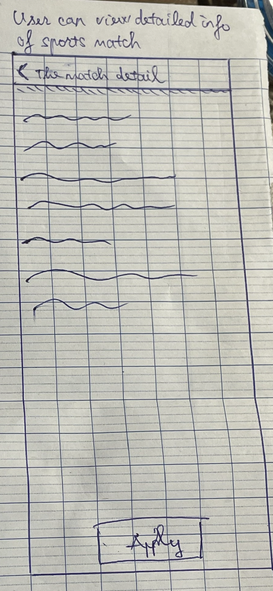
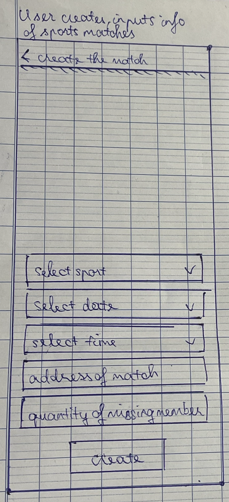
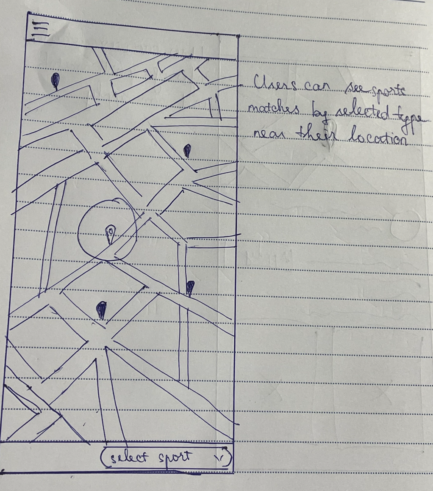
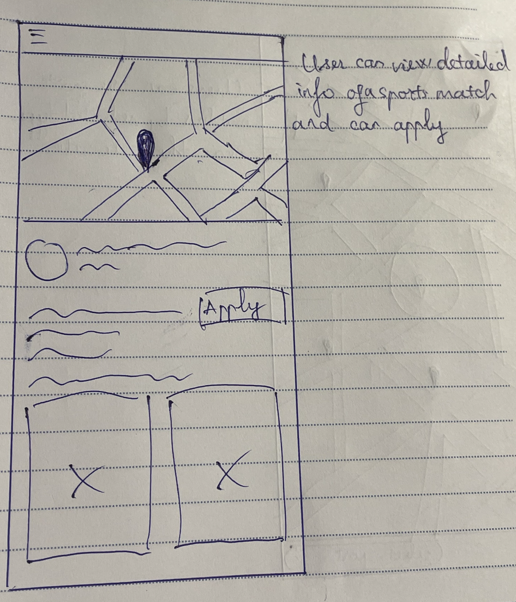
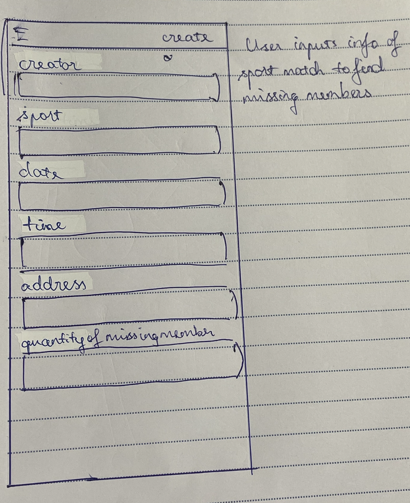
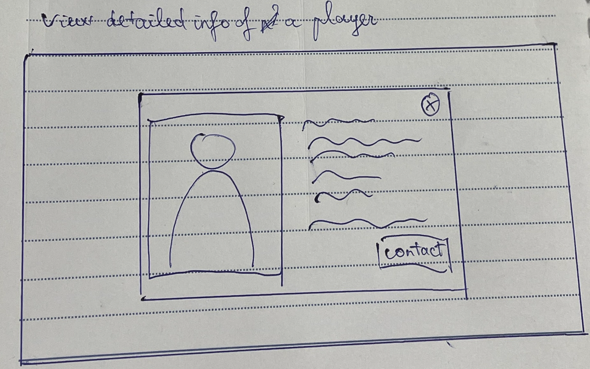
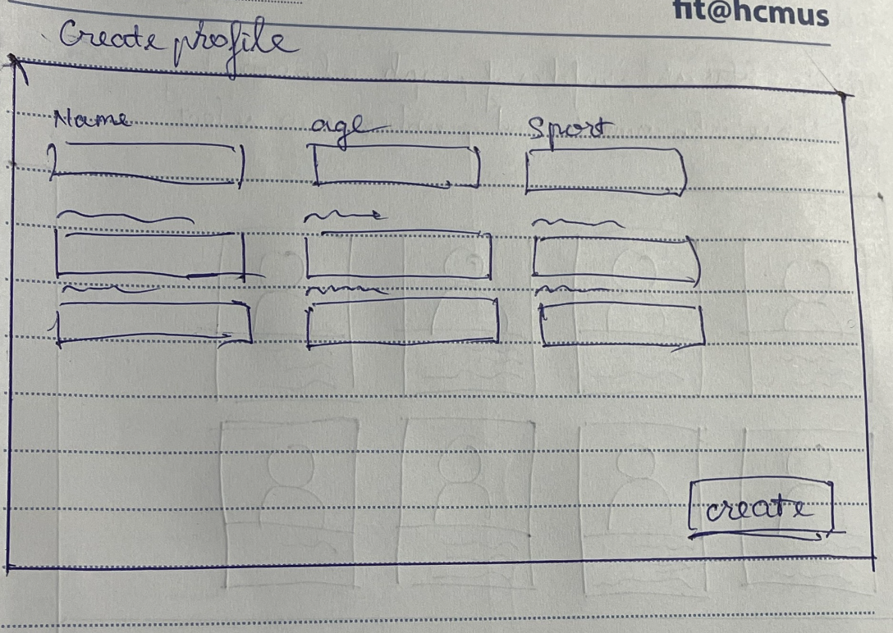

# Overview

As documented in the aforementioned report PA#2, the primary problem that we are facing is the difficulty of finding enough members to participate in a sport match. Moreover, the lack of information about the match also makes it difficult for users to decide whether to join. 

# Aim

The aim of this report is to document the process of brainstorming ideas and the prototyping of the potential solutions. Moreover, we aimed to document evaluative data from the formative testing procedures conducted on the several selected users.

# Potential Solutions

Based on the key findings that we found in the previous report, which for reference, are as follows:

- The primary concern expressed by users is the difficulty in finding enough members to participate in sports activities. Many respondents mentioned that they often face challenges in forming complete teams, leading to canceled or postponed games. This is the primary problem that we are aiming to solve.
- There is an apparent preference for popular sports such as football, basketball, volleyball, etc.
- Struggles in finding a suitable time and location strikes as a common issue among the respondents.

For the above findings, we have conducted several brainstroming sessions to formulate and refine all potential solutions to resolve the problem. Provided with the problem statement, we have had several shallow researches on the existing solutions with their pros and cons, and have gathered inspiration from any resources available out there to construct in order to make at least 3 potential solutions. No idea was marked as unrealistic or not relevant at this point, as the point of this stage was to get a hold of all the ideas the different group members had.

We have come up with the following potential solutions:

| No  | Solution                             | Description                                                                                                                                                                         | Author                 |
| --- | ------------------------------------ | ----------------------------------------------------------------------------------------------------------------------------------------------------------------------------------- | ---------------------- |
| 1   | Traditional-style Mobile Application | A traditional-style mobile application that allows users to post their match information, including the sport type, date and time, location, and the number of members needed, etc. | Nam Hoai, Trung Thieu  |
| 2   | Map-centric Application              | A map-centric application that utilize real-time location to search for matches with visualization of where the match takes place.                                                  | Hieu Nguyen, Man Huynh |
| 3   | "Renting" Website                    | A website platform that allows users to rent a player of their preference for the match.                                                                                            | Hieu Nguyen            |

## Traditional-styled Mobile Application

We notice that the method that users are currently using to find members for their match is to post on social media platforms such as Facebook, Zalo, etc. However, this method is not very effective for the following reasons:

- The information is not centralized, and it is difficult to find the information about the match that the user is interested in (e.g. the sport type, date and time, location, and the number of members needed, etc.) in an organized manner.
- The information is not structured and can be difficult to filter the information based on the user's preference. For example, the post might not be tagged with the sport type since it's text-based.
- Forums are often flooded with spam and commercial posts, making it difficult to find the relevant information.

Therefore, we propose a solution that tackles the mentioned problems as an alternative to the current method: a traditional-style mobile application that allows users to post their match information, including the sport type, date and time, location, and the number of members needed, etc., and other users can search for the match and join the team. In addition, users can manage their posts more easily, change their match information, etc. all in one place, unlinke the forums where the information is scattered and difficult to manage.

### Prototype

<!-- Prototype here -->

This screen shows the overview of the ongoing matches in need of players. The default list is filtered by the user's current location, user's sport preference. Users can fillter out the matches based on other aspects such as date & time or modify their default settings to filter.

Each item in the list holds detailed information about the match. Users can view the details by clicking on an item. The information includes:

- Sport type
- Author (the user who created the match)
- Date & time
- Location
- Number of members needed
- Information of the existing members
- Additional requirements from the author

After considering the information, users can decide whether to join the match by clicking the "Apply" button. This will send a notification to the author of the match, and the author can accept or reject the request.

If the match happens to be lacking in members, the user can register a new post by clicking the "+" button. The user can fill in the information about the match. This post will then be visible to other users, who then can view the information and decide whether to join the match.

Users can manage their own matches that they created, change the information, etc. For example, the number of members can change if some members drop out at the last moment, the date & time, location, etc. can also be changed.

### Pros and Cons

Pros:

- The solution is simple, straigthfoward, an app specialized for sports.
- Easy to develop and maintain with the existing technology stack.
- The information is centralized and structured, making it easy for users to search for matches based on their preference.
- The information is easy to manage, users can change their match information, etc. all in one place.
- The app can be opened to mofiication and extension, e.g. adding a chat feature, etc.

Cons:

- There are still no solutions to solve the unreliable credibility of the information, e.g. skills level of each member, the reliability of the author, etc.
- Abundant in the number of matches, users might be overwhelmed by the number of matches and have difficulty in choosing the right match.

## Map-centric Application

An idea that happened to come up during the brainstorming session was to create a map-centric application. This was inspired by the Pokemon Go game, where the user can see the Pokemon on the map and navigate to the location to catch them. We thought that this idea could be applied to our problem. However with one difference: instead of having to find the matches, users can see the matches that are in need of members on the map and navigate to the location to join them. In addition, users can also filter based on the sport type, location, and the number of members needed, etc.

We observed that there are situations where players drop out at the last moment, jeopardizing the viability of the match. The app's real-time visibility and notification system can help to mitigate this problem by allowing users to see the match in real-time, enable nearby users to step in as substitutes, ensuring that the match can proceed as planned.

In addition, we think the new experience of interacting with the application via its map-centric model can be a refreshing experience for the users, as it is different from the traditional-style application that they are used to, and especially for smartphone users, it's convenient for navigation and entertainment.

<!-- Prototype here -->
### Prototype

This screen shows the overview of the ongoing matches in need of players. The default list is filtered by the user's current location, user's sport preference. 

- Users can visualize the matches on the map based on their current location.
- Navigation, distance, direction, etc. to the match can be viewed.

User can click on a match to view the details. After deciding to join the match, the user can click the "Apply" button.

Users can create a new match by clicking the "+" button. This post will then be visible to other users, who can view the match on the map and decide whether to join the match.

### Pros and Cons

Pros:

- The solution is interesting and has the potential to provide a new experience, while for smartphone users, it's convenient for navigation and entertainment with unique models.
- Realtime visibility and notification system can help to mitigate the problem of players dropping out at the last moment.
- User can "actively" look for matches and visualize them on the map based on the user's current location They can view the distance, the direction, etc. to the match, and navigate to the location to join the match.

Cons:

- Unable to view matches in the future since it's happening in real-time.
- The scope of the app is limited to the user's current location, and the user might not be able to see the matches that are happening in other locations.
- The amount of information displayed on the map can be overwhelming, since it's integrated with map details, e.g. roads, buildings, etc. This can distract the user from the main purpose of the app, which is to find matches.
- The algorithm to filter the matches based on the user's preference can be difficult to implement.
- The match interactive area is displayed as a point on the screen and can be difficult to interact with on a small screen.

## FaceSports

Sometimes skills level is an important factor impacting the quality of a match. For example, a match with "potential-advanced" players might not want to 
include beginners as they are not experienced enough to play with them. Or vice versa, a "beginner" match might not want to include advanced players as they might be too good for them. The problem with traditional way of finding members is that it's difficult to find the information about the skill level of the players. Therefore, we propose a solution where it's player-centric, the information about the players is centralized and structured so that it's easy for users to search for players based on their skill level. The players can also post their information, including their skill level, and other users can search for the players and invite them to join the match.

The concept of "borrowing" (or "renting") players is not new, and in fact, there are many websites that offer this service. Websites such as PlayerDuo, Gamerlink, etc. have been around for a while and they are quite popular. However, sites like these are often focused on gaming and perhaps dating, without the specific focus on sports. We are inspired by the idea of looking for active players and "rent" them and we think that it can be applied to our problem as well. The appact of "renting" players is not literal, but rather, it's a way to describe the process of finding players to join the match. The idea is that the players are "rented" for the match, and after the match, they can go their separate ways.

Our proposal is to create a website platform, like a small, miniture version of Facebook, where users can post their information, including their skill level, and other users can search for the players and invite them to join the match. This, however, doesn't have the full capability of a social media platform, e.g. users cannot post their status, photos, etc., as we think that it's not necessary for the purpose of the app and can add unnecessary complexity.

### Prototype

The dashboard shows the list of players that are available for rent. The list is filtered based on the user's preference, e.g. sport type, skill level, etc. The user can click on a player to view the details. The item shows the general information such as:

- Profile picture
- Name
- Age
- Sport preference
- Skill level: measured by the number of stars, 5 stars being the highest

When clicked on a player, the user can view the detailed personal information of the player. Users can decide to invite the player to join the match by clicking the "Contact" button. This will send a notification to the player, and the player can accept or reject the request.

Users can create a new profile, specifying their personal information, including their skill level, etc. This profile will then be visible to other users to contact.

### Pros and Cons

Pros:

- Skill-centric, focuses on the skill level of the players, which is an important factor in team-based sports such as football, basketball, etc.
- Specifically focuses on the lack of members problem, which is the primary problem that we are aiming to solve, by providing a method of renting other players.
  
Cons:

- Unable to solve the needs of finding a specific game, which limits the users to those who are looking for players and not the other way around.
- Easy to become a "show-off" platform, where users can post their information to show off their skills
- Biased information can be a problem, e.g. users can post fake information about their skills, etc.

# Evaluation

## Criteria

We aim for our solutions to incorporate the following criteria: **Practicality**, **Usability**, and **Accessibility**.

In more details:

- Practicality: The practicality aspect entails an examination of the application's viability and feasibility in mitigating challenges associated with assembling a sufficient number of participants for sporting events. Additionally, the assessment aims to ascertain the economic viability, scalability, and necessity of the solution. A judicious evaluation of these factors is pivotal to inform subsequent developmental decisions pertaining to the complete product.
- Usability: The usability evaluation revolves around the assessment of the application's user-friendliness and intuitive nature. The primary concern is to ascertain whether end-users can seamlessly interact with the solution. A user's ability to engage with the application without encountering impediments is of paramount importance to ensure an optimal user experience.
- Effectiveness: The effectiveness evaluation aims to assess the application's ability to achieve its intended purpose. Systematic recording of task completion times with the application will furnish insights into its efficiency. These data points will be evaluated against predefined benchmarks, effectuating a comprehensive evaluation of the application's efficacy. Simultaneously, the quantification of steps or interactions required to fulfill tasks will illuminate the application's accessibility and effectiveness.

The goal of our testing was to see how users interact with our interface. We really wanted to see if the interface was intuitive for users, if they understood what they needed to do to accomplish the tasks. We also used the user testing to find better and more intuitive ways to do things and to have the overall data to decide which of our prototypes was the best, and which one we should continue to develop and turn into a high-fidelity prototype.

## Participants

We conducted the testing with 2 groups of participants, which are:

- Youngsters, mid 20s, who mostly have experience with technology.
- Middle-aged to seniors, from 35 to 50s, who have limited experience with technology.

For each group, we planned to have 3 participants, each of whom will be given a list of tasks to complete. We will observe how they interact with the interface. We will also ask them to think aloud while they are performing the tasks, so that we can understand their thought process and the reasoning behind their actions. We took notes about every click on our interface so that we could easily find recurring problems between users. After the tasks were all completed we asked for the users thoughts to get more general feedback, which would accompany the specific feedback we got during the tests

Due to the limit of time and resources, we limited the scope of participants to people who we know, and we also asked them to recommend their friends and family to participate in the testing. We also asked them to recommend people from different age groups, so that we can have a diverse range of participants.

# Evaluation Methods

We conducted the following methods to evaluate the effectiveness of the solutions:

- General Evaluation: We created a Google Form to collect the general feedback from the users in order to evaluate and assess the overall effectiveness of the solutions.
- Tasks-based Evaluation: We created a list of tasks for the users to complete, and we observed how they interact with the interface. We also asked them to think aloud while they are performing the tasks, so that we can understand their thought process and the reasoning behind their actions.
- Questionnaire: We created a questionnaire to collect the feedback from the users after they have completed the tasks. The questionnaire consists of questions regarding the user's experience with the interface, the ease of use, etc.

## General Evaluation

The general evaluation serves as a general assessment of the solutions and a introductory survey before the detailed evaluation on each prototype. The form consists of these following important questions:

1. Given the 3 solutions, which of the them you think best solves the mentioned problem?
2. With your chosen option, do you believe that the prototype can be effectively implemented in real-world scenarios?
3. Which of the given interfaces makes the most sense to you in terms of:
   - Intuition.
   - Ease of navigation.
   - Amount of information displayed.
   - You think you can easily "use" in the shortest amount of time.
4. Did you find any features or interactions confusing or counterintuitive with your chosen interface?
5. How likely are you to recommend this prototype to friends or colleagues who face the similar problem?

We expected that by asking these questions, we could formulate a general idea and gather data to evaluate the solutions with respects to the aforementioned criteria:

- Practicality: The probability of the solution to be implemented in real-world scenarios.
- Usability: The ease of use of the interface, like navigation, amount of information displayed, etc.
- Effectiveness: The effectiveness of the solution in solving the problem in terms of the user's perspective.

The link to the form can be found [here](https://forms.gle/TcMpq39kzU6WjejU8).

### Results

- The majority of the participants chose the traditional-styled mobile application as the best solution to solve the problem.

<!-- Image -->

- With the chosen option, the majority of the participants believe that the prototype can be effectively implemented in real-world scenarios.

<!-- Image -->

- For the given interfaces, the majority of the participants votes for the traditional-styled mobile application as the most intuitive, easy to navigate, and easy to use.

<!-- Image -->

- For the confusing or counterintuitive features or interactions, the majority of the participants stated that they might find the information abundant or overwhelming on the screen.

<!-- Image -->

- The majority of the participants stated that they are likely to recommend the prototype to friends or colleagues who face the similar problem.

<!-- Image -->

## Tasks-based Evaluation

We formulated the list of tasks for the users to complete to evaluate the following aspects:

- Navigation: How easy it is for the users to navigate through the interface.
- Information: How easy it is for the users to find the information they need.
- Interaction: How easy it is for the users to interact with the interface.
- Task completion and time measurement: How long it takes for the users to complete the tasks.

The above aspects are common aspects that we tested with all 3 prototypes. We also tested the specific aspects that are unique to each prototype, which we will be discussed in the later sections.

We conduct the test with 4 participants, each of whom will be given a list of tasks to complete. We will observe how they interact with the interface. We will also ask them to think aloud while they are performing the tasks, so that we can understand their thought process and the reasoning behind their actions. We took notes about every click on our interface so that we could easily find recurring problems between users. We also expect that each task will take the users no more than 1 minute to complete.  

### Tasks

Since the third prototype differs from the first 2 prototypes in terms of the purpose and the functionality, we formulated the tasks for the first 2 prototypes and the third prototype separately.

The following tasks apply to the first 2 prototypes, which are the traditional-styled mobile application and the map-centric application:

1. Find the match of your interest.
2. Click on the match to view the details.
3. Apply to join the match.
4. Create a new match, fill in the necessary information.
5. Change the information of the match that you created.

The following tasks apply to the third prototype, which is the "renting" website:

1. Find the player of your interest.
2. Click on the player to view the details.
3. Contact the player to invite them to join the match.
4. Create a new profile, fill in the necessary information.
5. Change your profile information.

### Results

#### Traditional-styled Mobile Application

| Task | Success Rate | Average Time (s) | Notes
