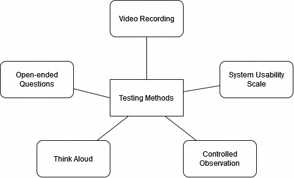

# Abstract

This usability testing report presents the findings and insights derived from a comprehensive evaluation of the user experience of our high fidelity prototype: **The Traditional-styled Mobile Application**, which we have came to finalization based on the data of our previous prototypes testing and have been documented in the previous report.

The results of this usability testing provide actionable recommendations for user interface improvements, feature enhancements, and potential iterations to create a more intuitive and engaging platform. The insights gained from this evaluation will guide future design and development efforts to align the design more closely with user needs and preferences, ultimately increasing user adoption, participation, and satisfaction.

# Objective

The goal of our testing was to see how users interact with our interface. We really wanted to see if the interface was intuitive for users, if they understood what they needed to do to accomplish the tasks. We also used the user testing to find better and more intuitive ways to do things and to have the overall data to back up our design decisions, as well as to find any usability issues that we may have missed.

# Participants

Based on the goals of this study, we conducted the testing with 3 groups of participants, which are:

- Advanced Users: People who are familiar and comfortable with technology and/or have a background in technology or technology-related fields.
- Intermediate Users: People who are familiar with a wide range of digital tools and applications and may use technology regularly in their personal and professional lives, but do not have a background in technology or technology-related fields.
- Novice Users: People with basic knowledge and skills in performing tasks on digital tools and applications.

Due to the limit of time and resources, we limited the scope of participants to people who we know, and we also asked them to recommend their friends and family to participate in the testing. We also asked them to recommend people from different age groups, so that we can have a diverse range of participants.

There were 3 participants in total, all were tested in person with the same testing protocol

<!-- Table cua Trung -->

# Evaluation

## Prerequisites

Since the prototype is a mobile application, we want to test it on a mobile device. Prior to the test, we made sure that the demo of the prototype is properly configured and ready to be tested, and it should be able to carry the main funcationalities of the application. We also made sure that the prototype run smoothly on our devices.

## Methods

One crucial aspect of our evaluation methods is ensuring the conduction of tests within a controlled environment. This strategy enables us to gain comprehensive insights into participants' actions and thought processes. To further foster candid feedback, we prioritize participant comfort and relaxation during testing. Given these considerations, we opted for in-person testing over remote methods. In-person testing allows us to exert greater control over the environment and participants' interactions, facilitating rapport-building and a deeper understanding of their experiences.

We used a mix of qualitative and quantitative methods to evaluate our solution, which can be summarized as follows:

- **Controlled Observation**:  We closely observed participants as they interacted with the prototype in person. By documenting their actions, challenges, moments of confusion, and errors encountered, we aim to gain profound insights. These insights, we believe, will pave the way for refining the prototype's design and elevating user experiences.
- **Tasks-based and Time Completion Testing**: We asked participants to perform a series of tasks on the prototype. The tasks were designed to evaluate the prototype’s usability and effectiveness. We also asked the participants to think aloud as they were performing the tasks, so that we can understand their thought process and the reasoning behind their actions. We also recorded the time taken by participants to complete specific tasks and compare this with predefined benchmarks or alternative methods to evaluate the prototype’s efficiency.
- **System Usability Scale (SUS)**: We used the SUS to measure the participants’ overall satisfaction with the prototype. The SUS is a 10-item questionnaire with a 5-point Likert scale response format. We also included open-ended questions in the questionnaire, so that the participants can provide more detailed feedback about their experience with the prototype.

All of the tests are recorded so that we can review the tests later and analyze the data more thoroughly.

# Metrics

Our evaluation approach centers around the assessment of our solution across three key criteria: Effectiveness, Efficiency, and Satisfaction. This triad of factors collectively informs our understanding of the solution's performance.

Post-interview, we consolidate the data and catalog it within the report. This documentation involves not only data presentation but also a blend of analyses, interpretations, and speculative insights to bridge any informational gaps. Considering the constraints imposed by time limitations and participant availability, we acknowledge that the degree of accuracy in our user study might be slightly compromised. Nevertheless, the insights garnered from this approach are sufficiently robust to fuel substantive discussions for future developmental directions.

## Effectiveness Assessment

- Task Success: A task was deemed successful if the participant was able to accomplish it. If a participant chose to abandon a task, it was classified as a failure. In cases where a participant strayed from the optimal path but still managed to complete the task, it was considered a success.
- Completion Rate: We calculated success and failure rates as percentages. This quantitative measure provided insights into the success ratio of tasks and the overall performance of the prototype.
- Error Tracking: Any deviations or disruptions during task execution were documented as errors. An error was identified as an action that impeded the seamless completion of a task.
- Assistance Instances: Instances where participants were given hints or clues during significant confusion were noted. These moments of assistance helped us gauge the extent to which users required guidance.

## Efficiency Assessment

- Time On Task: We tracked the duration of each task, starting from the moment a participant initiated the task to its completion. The average task time was calculated both on a per-task basis and at an individual level. Additionally, we computed the standard deviation of these time measurements.

## Satisfaction Assessment

- SUS (System Usability Scale): After each task, we asked participants to complete the SUS questionnaire.

## Materials and Tools

### Observation Sheets

This sheet is used to record the participants' actions and thoughts during the test. It is used to record the participants' actions and thoughts during the test. It has some predefined fields to record the participants' actions and thoughts, and also some predefined tasks for the participants to perform.

### Task Instruction Sheet

This sheet is used to instruct the participants on what they need to do during the test. We included the tasks that we want the participants to perform on the prototype.

### Post-test Questionnaire

This questionnaire is used to collect the participants' feedback on the prototype. It includes the SUS questionnaire and some open-ended questions for the participants to provide more detailed feedback.

### Timer

We used a timer to record the time taken by the participants to complete the tasks.

### Tools

- [Figma](https://www.figma.com/): We used Figma to create the prototype.
- [Google Forms](https://www.google.com/forms/about/): We used Google Forms to create the post-test questionnaire and have the participants fill it out.

# Procedure

## Pre-test

- Setup equipment: All the equipment needed for the test are prepared and ready to be used, i.e. mobile phone, computer, camera, etc.
- Sheet preparation: The observation sheets, task instruction sheets, and post-test questionnaire are prepared and ready to be used.
- The moderator record the participants' actions and save the recording on their computer with the following naming convention: `ModeratorName_ParticipantName`

## Test

1. Introduction: We introduced ourselves to the participants and explained the purpose of the test.
2. The test was conducted by our team members in their desired locations, but we made sure that the environment is comfortable and quiet enough for the participants to focus on the test.
3. Moderator handed the participants the task instruction sheet and asked them to read it thoroughly.
4. Moderator provided assists when participants needed it.
5. Moderator starts the timer when the participants start performing the tasks and stops the timer when the participants finish performing the tasks.
6. Moderator asks the participants to fill out the post-test questionnaire after each task.

## Post-test

- Gather data and run analysis.

# Results

<!-- in progress -->

# Appendix

## Task 1: Find a match missing 3 members and apply to that match 

- How easy was it to find that match?
- Observe "The match detail" screen, did you know how to view the author's information ?

## Task 2: Create a match

- How easy was it to find "Create" button?
- Is the layout form convenient for your input?
- Do you want to add any fields to make the form more complete?

## Task 3: Find the candidates who applied to your match and approve them

- How easy was it to find "My match" screen?
- Is the position of "Candidate" button convenient? If not, where do you want to put that button? 
- How do you feel about approving candidate having to go through multiple screens?
- Do you have any solution about approving candidates?

## Task 4: Find your contacts and chat with any 1 person

- Do you think this function is necessary?
- Do you think the position of the "search" button is reasonable?
- Do you want to add any function for this screen?
