# Abstract

This report will be a summary of the work done in the HCI course. It will include the work done in the previous reports and the final prototype. In more detail, it will include the following aspects:

- Overview of the chosen project: Project's name, description, functionalities, etc.
- Project Motivations: Why did we come up with this project? What is the problem we are trying to solve?
- Design Process: Alternative prototypes that were considered with illustrations and explanations of why they were discarded, the final prototype, and the rationales behind the design decisions.
- Evaluation: Methods used to evaluate the prototype, procedures, results, findingss, and conclusions.

# Project Overview

## The problem

The problem we are trying to solve is the lack of members when forming a sports team, may this be for a friendly match or a tournament. We realized that this is a common problem among people who play sports, especially in college, where people are busy with their studies and other activities. This situation can lead to discouragement and stop them from doing any more sports activities due to the insufficient number of members.

Although the current methods to solve this problem has been around for a while, they are not very efficient. For example, the most common way to find members is by asking friends or acquaintances on social medias or via messenging platforms like Messenger, Zalo, etc. However, this is an inefficient method because of the following reasons:

- The information is not centralized, and it is difficult to find the information about the match that the user is interested in (e.g. the sport type, date and time, location, and the number of members needed, etc.) in an organized manner.
- The information is not structured and can be difficult to filter the information based on the user's preference. For example, the post might not be tagged with the sport type since it's text-based.
- Forums are often flooded with spam and commercial posts, making it difficult to find the relevant information.

This is the main problem that we are trying to solve with out project, and have documented various reports on the design process and the prototypes.

## Project description

We propose a solution that tackles the mentioned problems as an alternative to the current methods: **SportsMe**.

SportsMe is a mobile application that centralizes the information about the matches that are happening in the area, and allows users to manage their posts more easily. Users won't have to worry about the hassle of finding members for their team, such as posting on forums, keeping track of the messages, etc. Moreover, the application provides a more structured method to find the matches that the user is interested in, such as filtering the matches based on the sport type, date and time, location, and the number of members needed, etc. In addition, users can manage their posts more easily, change their match information, etc. all in one place, unlinke the forums where the information is scattered and difficult to manage.

Some core functionalities of the application include:

- **Centralized information**: The information about the matches is centralized and organized in a structured manner, making it easier for users to find the matches that they are interested in.
- **Match management**: Users can manage their posts more easily, change their match information, etc. all in one place.
- **Match recommendation**: The application will recommend the matches that the user might be interested in based on their preferences.
- **Match notification**: The application will notify the user when there is a match that matches their preferences.
- **Match history**: The application will keep track of the matches that the user has participated in.
- **Chat**: The application will allow users to chat with each other to discuss about the match, such as the location, date & time, etc.
- **Connect with friends**: The application will allow users to connect with their friends and see the matches that their friends are participating in.

## Project Motivations

We ourselves are also people who play sports, and have encountered the problem of finding members for our team numerous times. We have tried various methods to solve this problem, such as posting on forums, asking friends, etc., but have garnered little to no success. Moreover, we have also faced the problem of managing our time, since we are busy with our studies and other activities, and sometimes forget about the matches that we have signed up for. We have also noticed that this is a common problem among people who are sports enthusiasts, wanting to play sports but not having enough members to form a team.

This is the reason behind our motivation to come up with this solution. We want to create a platform that allows people to find members for their team more easily, and manage their time more efficiently. We hope that this solution will reduce the complexity and the time needed to find members for a team, and allow people to play sports more often. We also hope that by doing this, we can encourage more people to do sports and participate more in sports activities as well as to promote a healthy lifestyle.

# Design Process

## Overview

The design process of the application can be divided into 3 main phases: the **research phase**, the **design phase**, and the **evaluation phase**. 

- The research phase is the phase where we gather information about the problem, the users, and the context of use. This is when we run the contextual inquiry, the interviews, and the surveys with a large number of participants to gather the most information possible. These data will then be analyzed and used to come up with the design ideas and the prototypes.
- The design phase is the phase where we come up with the design ideas and the prototypes. Based on the data gathered in the research phase, we will come up with the design ideas and the prototypes that we think will solve the problem. We held several brainstorming sessions to come up with the design ideas, and then gradually refined them into the prototypes. We also used the paper prototyping method to quickly test our ideas and get feedback from the users, which will then be used as a basis for the next iteration and finalizing the prototype.
- The evaluation phase is the phase where we evaluate the high-fidelity prototype. We invited several participants according to the criteria that we have set to evaluate the prototype. We then collected the data and analyzed them to come up with the findings and conclusions.

## Alternative prototypes

Based on the key findings that we found in the previous report, which for reference, are as follows:

- The primary concern expressed by users is the difficulty in finding enough members to participate in sports activities. Many respondents mentioned that they often face challenges in forming complete teams, leading to canceled or postponed games. This is the primary problem that we are aiming to solve.
- There is an apparent preference for popular sports such as football, basketball, volleyball, etc.
- Struggles in finding a suitable time and location strikes as a common issue among the respondents.

For the above findings, we have conducted several brainstroming sessions to formulate and refine all potential solutions to resolve the problem. Provided with the problem statement, we have had several shallow researches on the existing solutions with their pros and cons, and have gathered inspiration from any resources available out there to construct in order to make at least 3 potential solutions. No idea was marked as unrealistic or not relevant at this point, as the point of this stage was to get a hold of all the ideas the different group members had.s

### Prototype 1 (Map-centric application)s

An idea that happened to come up during the brainstorming session was to create a map-centric application. This was inspired by the Pokemon Go game, where the user can see the Pokemon on the map and navigate to the location to catch them. We thought that this idea could be applied to our problem. However with one difference: instead of having to find the matches, users can see the matches that are in need of members on the map and navigate to the location to join them. In addition, users can also filter based on the sport type, location, and the number of members needed, etc.

We observed that there are situations where players drop out at the last moment, jeopardizing the viability of the match. The app's real-time visibility and notification system can help to mitigate this problem by allowing users to see the match in real-time, enable nearby users to step in as substitutes, ensuring that the match can proceed as planned.

In addition, we think the new experience of interacting with the application via its map-centric model can be a refreshing experience for the users, as it is different from the traditional-style application that they are used to, and especially for smartphone users, it's convenient for navigation and entertainment.

Below are the sketches of the prototype:

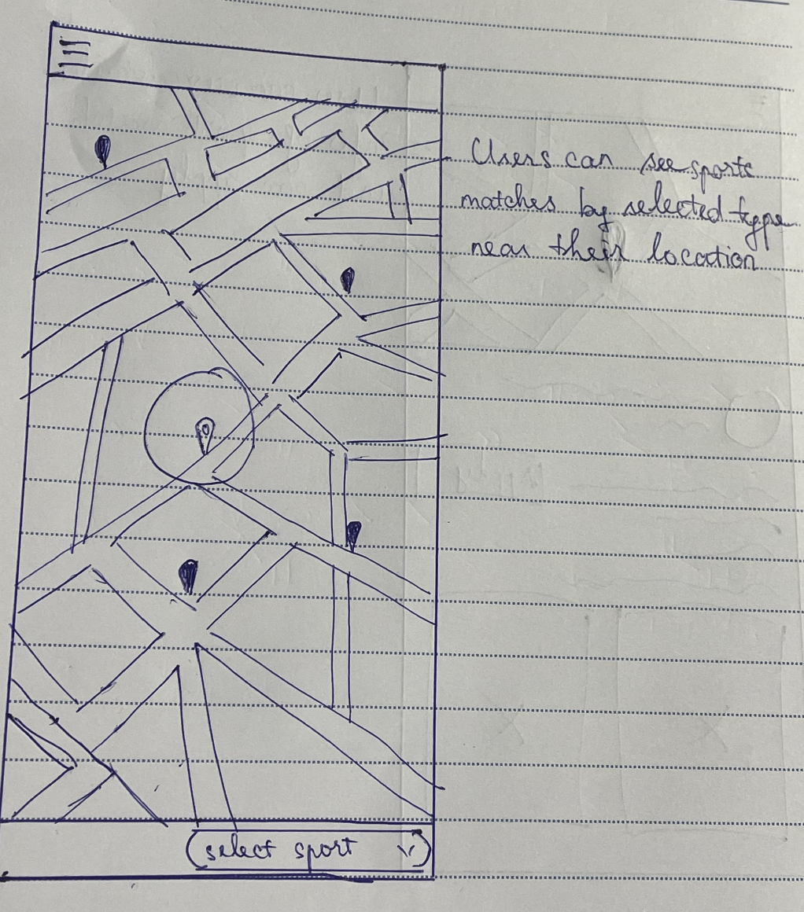

This screen shows the overview of the ongoing matches in need of players. The default list is filtered by the user's current location, user's sport preference. 

- Users can visualize the matches on the map based on their current location.
- Navigation, distance, direction, etc. to the match can be viewed.

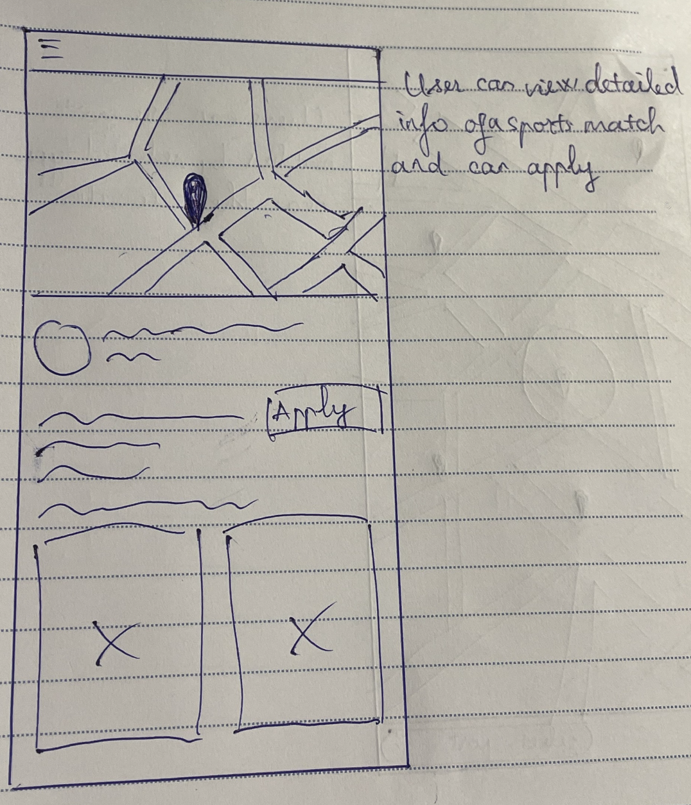

User can click on a match to view the details. After deciding to join the match, the user can click the "Apply" button.

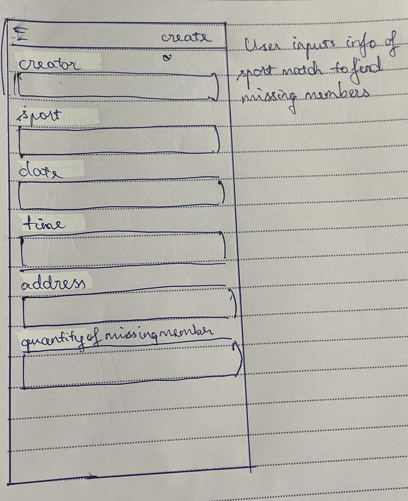

Users can create a new match by clicking the "Create" button. This post will then be visible to other users, who can view the match on the map and decide whether to join the match.

Pros:

- The solution is interesting and has the potential to provide a new experience, while for smartphone users, it's convenient for navigation and entertainment with unique models.
- Realtime visibility and notification system can help to mitigate the problem of players dropping out at the last moment.
- User can "actively" look for matches and visualize them on the map based on the user's current location They can view the distance, the direction, etc. to the match, and navigate to the location to join the match.

Cons:

- Unable to view matches in the future since it's happening in real-time.
- The scope of the app is limited to the user's current location, and the user might not be able to see the matches that are happening in other locations.
- The amount of information displayed on the map can be overwhelming, since it's integrated with map details, e.g. roads, buildings, etc. This can distract the user from the main purpose of the app, which is to find matches.
- The algorithm to filter the matches based on the user's preference can be difficult to implement.
- The match interactive area is displayed as a point on the screen and can be difficult to interact with on a small screen.

### Prototype 2 (FaceSports)

Sometimes skills level is an important factor impacting the quality of a match. For example, a match with "potential-advanced" players might not want to 
include beginners as they are not experienced enough to play with them. Or vice versa, a "beginner" match might not want to include advanced players as they might be too good for them. The problem with traditional way of finding members is that it's difficult to find the information about the skill level of the players. Therefore, we propose a solution where it's player-centric, the information about the players is centralized and structured so that it's easy for users to search for players based on their skill level. The players can also post their information, including their skill level, and other users can search for the players and invite them to join the match.

The concept of "borrowing" (or "renting") players is not new, and in fact, there are many websites that offer this service. Websites such as PlayerDuo, Gamerlink, etc. have been around for a while and they are quite popular. However, sites like these are often focused on gaming and perhaps dating, without the specific focus on sports. We are inspired by the idea of looking for active players and "rent" them and we think that it can be applied to our problem as well. The appact of "renting" players is not literal, but rather, it's a way to describe the process of finding players to join the match. The idea is that the players are "rented" for the match, and after the match, they can go their separate ways.

Our proposal is to create a website platform, like a small, miniture version of Facebook, where users can post their information, including their skill level, and other users can search for the players and invite them to join the match. This, however, doesn't have the full capability of a social media platform, e.g. users cannot post their status, photos, etc., as we think that it's not necessary for the purpose of the app and can add unnecessary complexity.

Below are the sketches of the prototype:

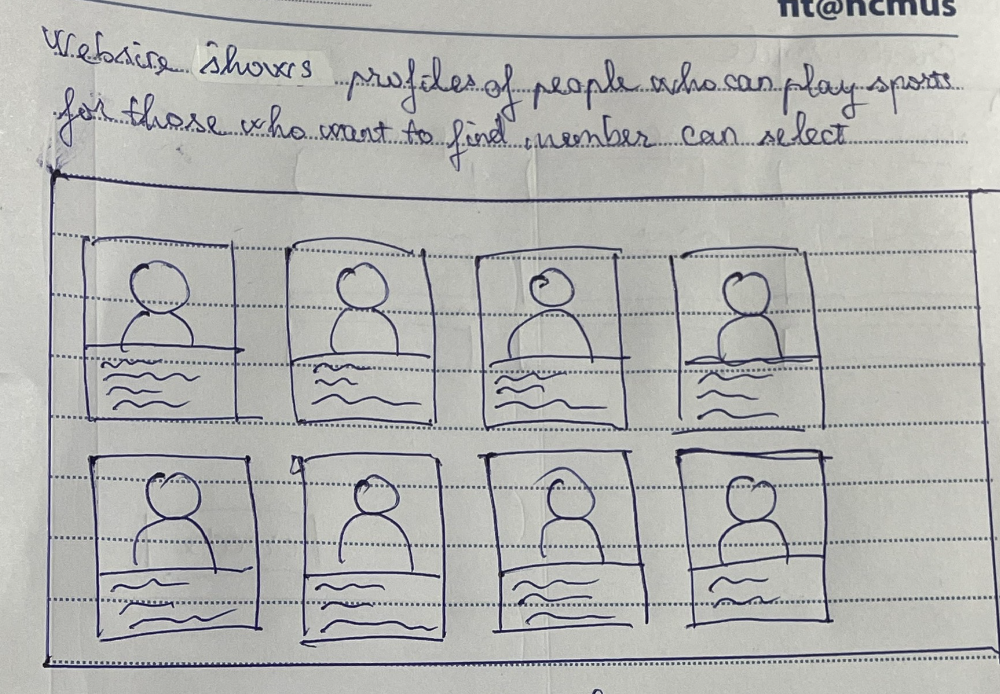

The dashboard shows the list of players that are available for rent. The list is filtered based on the user's preference, e.g. sport type, skill level, etc. The user can click on a player to view the details. The item shows the general information such as:

- Profile picture
- Name
- Age
- Sport preference
- Skill level: measured by the number of stars, 5 stars being the highest

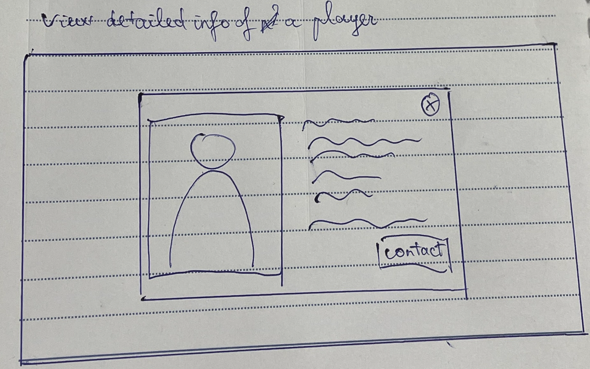

When clicked on a player, the user can view the detailed personal information of the player. Users can decide to invite the player to join the match by clicking the "Contact" button. This will send a notification to the player, and the player can accept or reject the request.

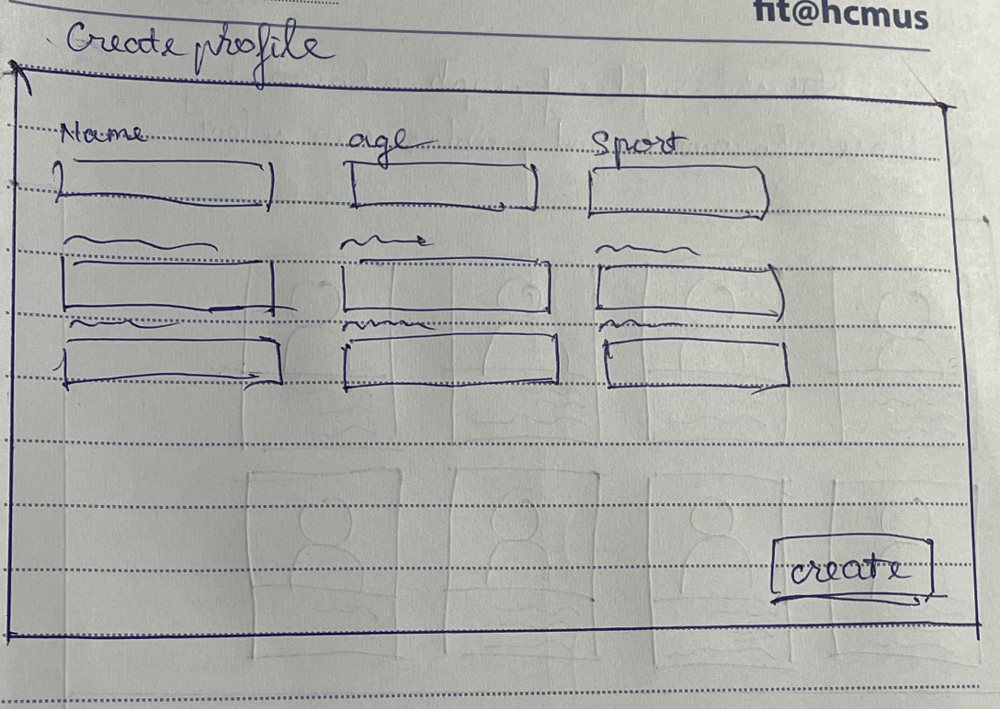

Users can create a new profile, specifying their personal information, including their skill level, etc. This profile will then be visible to other users to contact.

Pros:

- Skill-centric, focuses on the skill level of the players, which is an important factor in team-based sports such as football, basketball, etc.
- Specifically focuses on the lack of members problem, which is the primary problem that we are aiming to solve, by providing a method of renting other players.
  
Cons:

- Unable to solve the needs of finding a specific game, which limits the users to those who are looking for players and not the other way around.
- Easy to become a "show-off" platform, where users can post their information to show off their skills
- Biased information can be a problem, e.g. users can post fake information about their skills, etc.

## Final prototype (SportsMe)

### Low-fidelity prototype

The 3rd prototype is also the final prototype that we have chosen to implement. For referene, the rationale behind the design decisions are as follows:

- The information is centralized and structured, making it easier for users to find the matches that they are interested in.
- The information is structured and can be filtered based on the user's preference.
- Traditional methods such as forums are often flooded with spam and commercial posts, making it difficult to find the relevant information.
- Friendly and easy to use interface, with a simple and intuitive design.

The following are the sketches of the prototype:

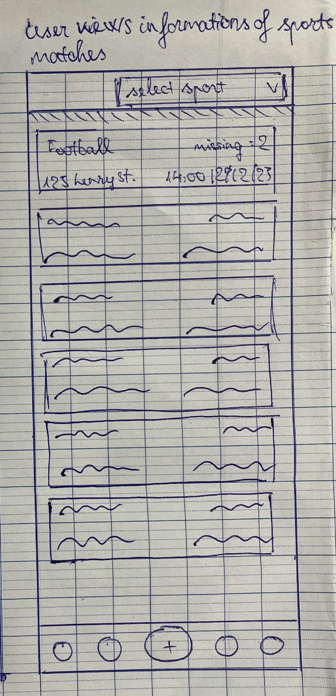

This screen shows the overview of the ongoing matches in need of players. The default list is filtered by the user's current location, user's sport preference. Users can fillter out the matches based on other aspects such as date & time or modify their default settings to filter.

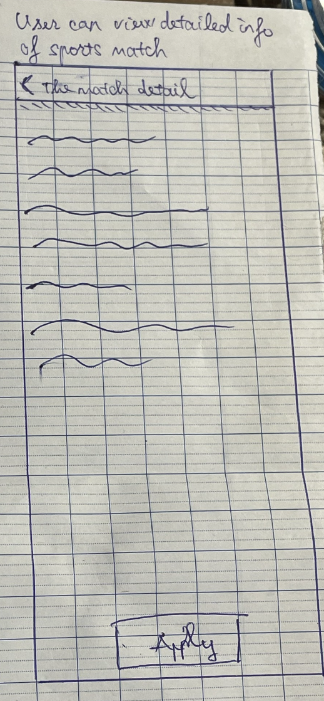

Each item in the list holds detailed information about the match. Users can view the details by clicking on an item. The information includes:

- Sport type
- Author (the user who created the match)
- Date & time
- Location
- Number of members needed
- Information of the existing members
- Additional requirements from the author

After considering the information, users can decide whether to join the match by clicking the "Apply" button. This will send a notification to the author of the match, and the author can accept or reject the request.

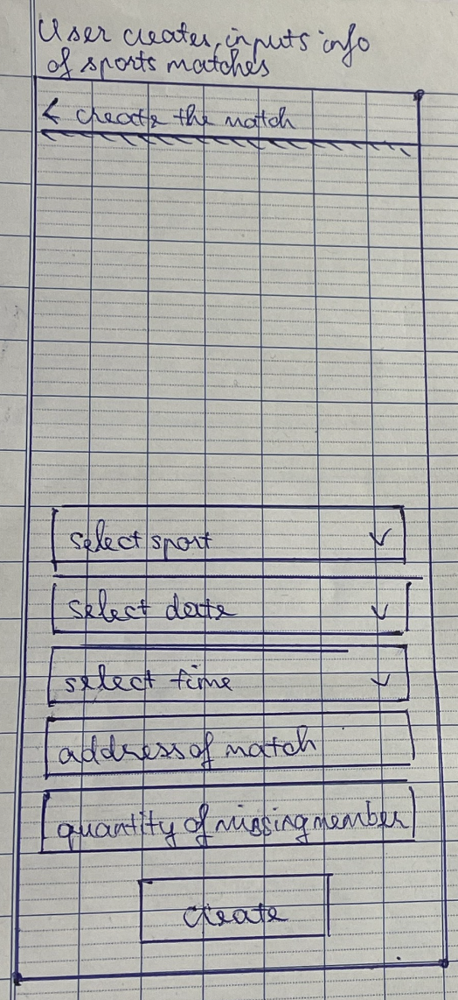

If the match happens to be lacking in members, the user can register a new post by clicking the "+" button. The user can fill in the information about the match. This post will then be visible to other users, who then can view the information and decide whether to join the match.

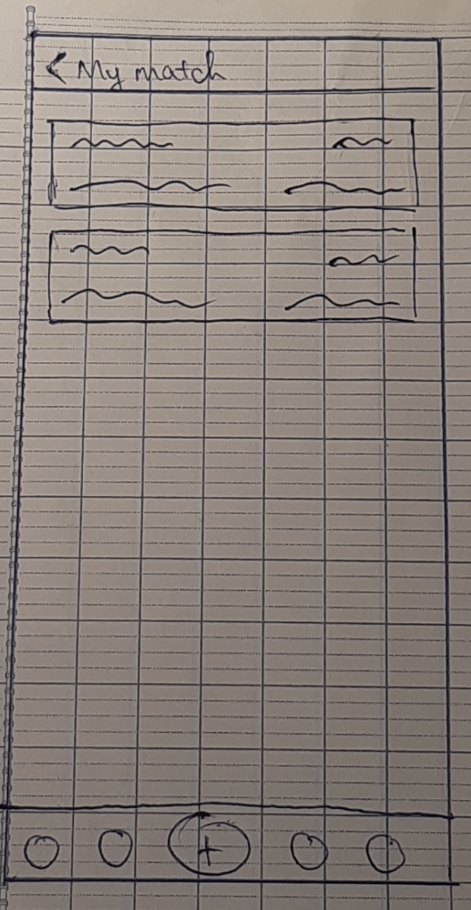

Users can manage their own matches that they created, change the information, etc. For example, the number of members can change if some members drop out at the last moment, the date & time, location, etc., can also be changed.

### High-fidelity prototype

*quang bao cao pdf vao*

# Evaluation

## Overview

The evaluation phase is the phase where we evaluate the high-fidelity prototype. The phase can be divided into 2 main parts:

- Low-fidelity prototypes evaluation: We formed survey questions of the prototypes and asked the participants to fill in. In addition, we also conducted some tests on the 3 prototypes to get feedback from the users. The data collected from the survey and the tests will then be analyzed to come up with the findings and conclusions for the final prototype, which is also the **SportsMe** application.
- High-fidelity prototype evaluation: We invited several participants according to the criteria that we have set to evaluate the prototype. We conducted the tests in a controlled environment where we will observe the participants performing the tasks that we have set, and we will have them to fill out predefined questionnaires. We then collected the data and analyzed them to come up with the findings and conclusions. We also recorded the tests for further analysis.

We will be focusing on the latter part, which is the high-fidelity prototype evaluation and will be using the data collected from the low-fidelity prototypes evaluation as a basis for the final prototype.

## Participants

We conducted the testing with 3 groups of participants, which are:

- Advanced Users: People who are familiar and comfortable with technology and/or have a background in technology or technology-related fields.
- Intermediate Users: People who are familiar with a wide range of digital tools and applications and may use technology regularly in their personal and professional lives, but do not have a background in technology or technology-related fields.
- Novice Users: People with basic knowledge and skills in performing tasks on digital tools and applications.

Due to the limit of time and resources, we limited the scope of participants to people who we know, and we also asked them to recommend their friends and family to participate in the testing. We also asked them to recommend people from different age groups, so that we can have a diverse range of participants.

There were 3 participants in total, all were tested in person with the same testing protocol:

|              | Participant 1 | Participant 2 | Participant 3     |
| ------------ | ------------- | ------------- | ----------------- |
| Name         | Thanh Hien    | Quang Thinh   | Minh Truong       |
| Gender       | Female        | Male          | Male              |
| Age          | 21            | 23            | 21                |
| Background   | Law Major     | Manager       | Software Engineer |
| Type of user | Novice        | Intermediate  | Advanced          |
| Interviewer  | Huynh Man     | Vinh Trung    | Huynh Man         |

<!-- phan con lai cua bao cao pa4 -->
## Prerequisites

Since the prototype is a mobile application, we want to test it on a mobile device. Prior to the test, we made sure that the demo of the prototype is properly configured and ready to be tested, and it should be able to carry the main funcationalities of the application. We also made sure that the prototype run smoothly on our devices.

## Methods

One crucial aspect of our evaluation methods is ensuring the conduction of tests within a controlled environment. This strategy enables us to gain comprehensive insights into participants' actions and thought processes. To further foster candid feedback, we prioritize participant comfort and relaxation during testing. Given these considerations, we opted for in-person testing over remote methods. In-person testing allows us to exert greater control over the environment and participants' interactions, facilitating rapport-building and a deeper understanding of their experiences.

We used a mix of qualitative and quantitative methods to evaluate our solution, which can be summarized as follows:

- **Controlled Observation**: We closely observed participants as they interacted with the prototype in person. By documenting their actions, challenges, moments of confusion, and errors encountered, we aim to gain profound insights. These insights, we believe, will pave the way for refining the prototype's design and elevating user experiences.
- **Tasks-based and Time Completion Testing**: We asked participants to perform a series of tasks on the prototype. The tasks were designed to evaluate the prototype’s usability and effectiveness. We also asked the participants to think aloud as they were performing the tasks, so that we can understand their thought process and the reasoning behind their actions. We also recorded the time taken by participants to complete specific tasks and compare this with predefined benchmarks or alternative methods to evaluate the prototype’s efficiency.
- **System Usability Scale (SUS)**: We used the SUS to measure the participants’ overall satisfaction with the prototype. The SUS is a 10-item questionnaire with a 5-point Likert scale response format. We also included open-ended questions in the questionnaire, so that the participants can provide more detailed feedback about their experience with the prototype.

All of the tests are recorded so that we can review the tests later and analyze the data more thoroughly.

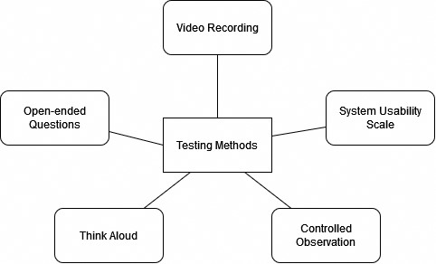

## Metrics

Our evaluation approach centers around the assessment of our solution across three key criteria: **Effectiveness**, **Efficiency**, and **Satisfaction**. This triad of factors collectively informs our understanding of the solution's performance.

Post-interview, we consolidate the data and catalog it within the report. This documentation involves not only data presentation but also a blend of analyses, interpretations, and speculative insights to bridge any informational gaps. Considering the constraints imposed by time limitations and participant availability, we acknowledge that the degree of accuracy in our user study might be slightly compromised. Nevertheless, the insights garnered from this approach are sufficiently robust to fuel substantive discussions for future developmental directions.

### Effectiveness Assessment

- Task Success: A task was deemed successful if the participant was able to accomplish it. If a participant chose to abandon a task, it was classified as a failure. In cases where a participant strayed from the optimal path but still managed to complete the task, it was considered a success.
- Completion Rate: We calculated success and failure rates as percentages. This quantitative measure provided insights into the success ratio of tasks and the overall performance of the prototype.
- Error Tracking: Any deviations or disruptions during task execution were documented as errors. An error was identified as an action that impeded the seamless completion of a task.
- Assistance Instances: Instances where participants were given hints or clues during significant confusion were noted. These moments of assistance helped us gauge the extent to which users required guidance.

### Efficiency Assessment

- Time On Task: We tracked the duration of each task, starting from the moment a participant initiated the task to its completion. The average task time was calculated both on a per-task basis and at an individual level. Additionally, we computed the standard deviation of these time measurements.

### Satisfaction Assessment

- SUS (System Usability Scale): Post-test, we administered the SUS questionnaire to participants to gauge their overall satisfaction with the prototype.

## Materials and Tools

### Observation Form

This form is used to record the participants' actions and thoughts during the test. It is used to record the participants' actions and thoughts during the test. It has some predefined fields to record the participants' actions and thoughts, and also some predefined tasks for the participants to perform.

### Task Instruction Sheet

This sheet is used to instruct the participants on what they need to do during the test. We included the tasks that we want the participants to perform on the prototype.

### Post-test Questionnaire

This questionnaire is used to collect the participants' feedback on the prototype. It includes the SUS questionnaire and some open-ended questions for the participants to provide more detailed feedback.

### Timer

We used a timer to record the time taken by the participants to complete the tasks.

### Tools

- [Figma](https://www.figma.com/): We used Figma to create the prototype.
- [Google Forms](https://www.google.com/forms/about/): We used Google Forms to create the post-task and post-test questionnaire and have the participants fill it out.

## Procedure

### Pre-test

- Setup equipment: All the equipment needed for the test are prepared and ready to be used, i.e. mobile phone, computer, camera, etc.
- Sheet preparation: The observation sheets, task instruction sheets, and post-test questionnaire are prepared and ready to be used.
- The moderator record the participants' actions and save the recording on their computer.

### Test

1. Introduction: We introduced ourselves to the participants and explained the purpose of the test.
2. The test was conducted by our team members in their desired locations, but we made sure that the environment is comfortable and quiet enough for the participants to focus on the test.
3. Moderator handed the participants the task instructions.
4. Moderator provided assists when participants needed it.
5. Moderator starts the timer when the participants start performing the tasks and stops the timer when the participants finish performing the tasks.
6. Moderator asks the participants to fill out the post-task questionnaire after each task.

### Post-test

- Moderator asks the participants to fill out the SUS questionnaire.
- Gather data and run analysis.

## Results

Some of the participants' comments are translated from Vietnamese to English for better understanding, given that the test was conducted in Vietnamese.

### Summary of overall findings

Overall the application is quite intuitive and easy to use, and they described the application as "a modern and easy to use application". Given that the tests were conducted in a *not-so-professional* matter, the participants sometimes ignored the instructions and what we said, and sometimes wandered around the application and did not know what to do at first, but they quickly figured out what to do and how to do it.

Despite the minor drawbacks, the participants were able to complete the tasks with ease, and they were able to provide us with valuable feedback on the application. However, there are some drawbacks that we need to address (implicit and explicit):

- The participants thought that the application should support more languages, especially Vietnamese, since the participants are not comfortable with English. 
- The participants found it hard to find the "My match" screen, which was potentially due to the fact that the icon for that screen is not intuitive enough.
- The participants also had some trouble navigating the application. This might be due to the fact that there are not enough visual cues to guide the users such as breadcrumbs, icons, etc.

### Performance data

Time on task might not be the best metric to evaluate the performance of the application and not the 100% accurate metric, since the prototypes are not fully functional and there are some tasks that the participants cannot perform. However, we still recorded the time taken by the participants to complete the tasks for reference.

#### Task 1: Find a match missing 3 members and apply to that match

| Participant | Task Success | Time On Task (s) | Assists | Errors |
| ----------- | ------------ | ---------------- | ------- | ------ |
| 1           | Yes          | 5.71             | 0       | 0      |
| 2           | Yes          | 7.14             | 0       | 0      |
| 3           | Yes          | 4.67             | 0       | 0      |

Findings:

- Participants seem to have difficult finding where to view the detailed information of the author of the match.
- There should be a "Search" button to find the desired matches.

Participant Comments:

- Participant 1:
  - "There's no swimming or volleyball?"
  - "Well it was pretty easy"
- Participant 2:
  - "There should've been a search button on the top bar here to find the matches. If not then I don't know how far I have to scroll to find the match that I want."
  - "Overall, it was pretty easy to find the match."
- Participant 3:
  - "I found it pretty simple to find the match since on login screen, there is a list of matches that I can choose from."
  - "I think that it's pretty easy to find the information of the author, but there should be a plus button or some sort displayed on the author card."

#### Task 2: Create a match

| Participant | Task Success | Time On Task (s) | Assists | Errors |
| ----------- | ------------ | ---------------- | ------- | ------ |
| 1           | Yes          | 26.14            | 1       | 2      |
| 2           | Yes          | 16.06            | 1       | 0      |
| 3           | Yes          | 11.14            | 0       | 0      |

Findings:

- Some participant had trouble finding the "Create" button.

Participant Comments:

- Participant 1:
  - "The information inputs are enough"
  - "There should be a way to add a specific audience target (from what age to what age) for the match."
- Participant 2:
  - "I think the information inputs are enough"
  - "I press this plus sign here?"
- Participant 3:
  - "It's easy"
  - "The layout looks pretty nice and modern"
  - "I find the information inputs are enough since that's all the information that I need to create a match."

#### Task 3: Find the candidates who applied to your match and approve them

| Participant | Task Success | Time On Task (s) | Assists | Errors |
| ----------- | ------------ | ---------------- | ------- | ------ |
| 1           | Yes          | 48.58            | 1       | 3      |
| 2           | Yes          | 28.27            | 0       | 1      |
| 3           | Yes          | 31.41            | 0       | 0      |

Findings:

- The whole process of approving candidates is quite confusing and time-consuming.
- Screen switching is quite a hassle and may not be necessary.
- Title of the screen should be clearer and more readable.
- The "My Match" icon is not intuitive enough.

Participant Comments:

- Participant 1:
  - "How do I find the candidates?"
  - "This is the My Profile screen, right?"
  - "It's not easy at all"
  - "Is this the My Match screen?"
  - "The font should be bigger and bold. The icon for the My Match should be different"
- Participant 2:
  - "I think the information of candidates should be placed right at the bottom of the match detail screen so that I can see it right away without having to go through multiple screens."
  - "I find it a bit annoying."
- Participant 3:
  - "I think it's ok"
  - "I think all the steps taken are necessary, although it does take a bit of screen transitioning to get to the candidates' information."
  - "There should be a tutorial for new users. I'm fine but it just takes time to get used to at first."

#### Task 4: Find your contacts and chat with any 1 person

| Participant | Task Success | Time On Task (s) | Assists | Errors |
| ----------- | ------------ | ---------------- | ------- | ------ |
| 1           | Yes          | 4.65             | 0       | 0      |
| 2           | Yes          | 2.69             | 0       | 0      |
| 3           | Yes          | 3.79             | 0       | 0      |

Findings:

- There should be a way to create a group chat to chat with multiple people at once, instead of having to chat with each person individually.
- There should be a way to send images and other media files.
- The search button should be at the top bar.

Participant Comments:

- Participant 1:
  - "Here, this one I can find it."
  - "It's like Facebook add friend function"
  - "I think the search button should be at the top bar."
  - "I think like we should have like a priority list of people that we chat with the most."
- Participant 2:
  - "There should be an icon, send images like Messenger"
  - "I think we should place the search button on the top bar, it's more convenient."
  - "I think we should be able to create a group chat to chat with multiple people at once."
- Participant 3:
  - "I think the messenging function is necessary for when we have other things to talk about related to the match"
  - "The search button should be placed on the top bar. The current position is not convenient since when the list gets longer, it may covers the list."
  - "The search button should hide when the user scrolls down the list."
  - "Deleting messages should be a thing."

### Performance data analysis

- 2/3 participants found that it was easy to find the specific match in the test. This shows us that the layout of the match screen is reasonable and intuitive enough for the users to find the match that they want. However, there should be a search function to find the desired match like the participants suggested. Moreover, we think that with the prototypes, the number of matches is relatively small, so it is easy for the participants to find the match that they want. However, in the real application, the number of matches will be much larger, so it is necessary to have a search function to find the desired match.

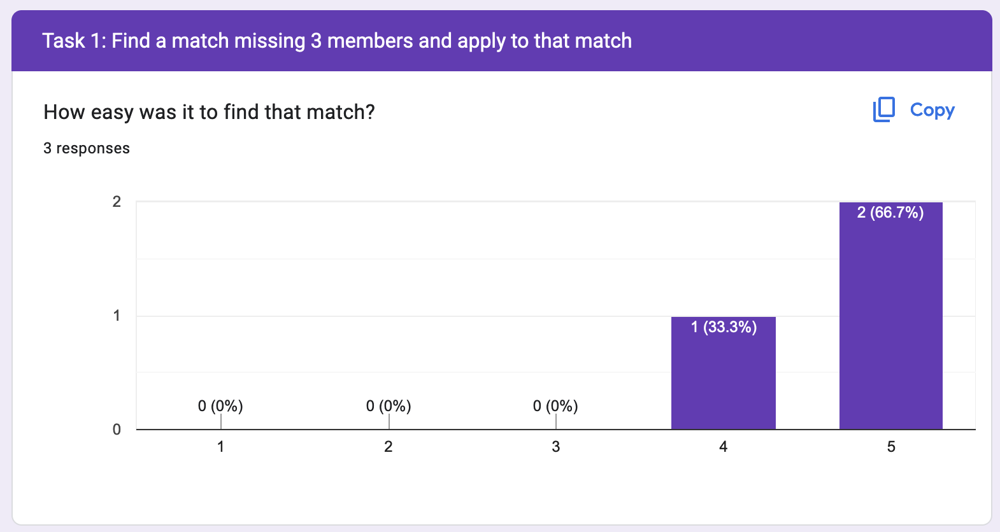

- 2/3 participants stated that it was convenient for them to navigate through multiple screens to find the candidates' information. However, as far as the test in concerned, we noticed that the participants did struggle a little bit to carry out this task. This shows us that the screen switching is quite a hassle and may not be necessary and will affect the user experience.

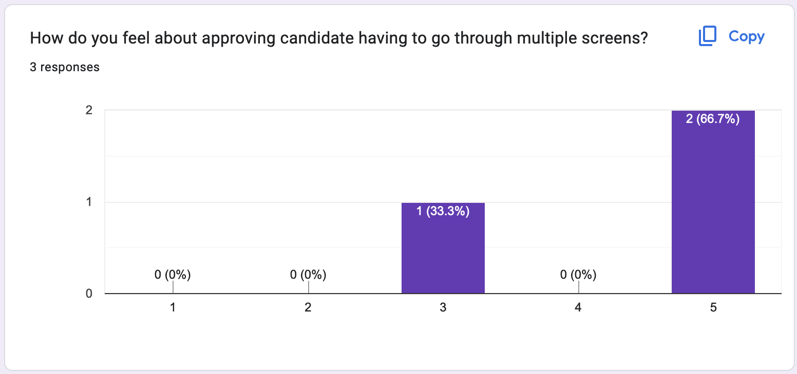

- All 3 participants found the placement of the search button is not convenient. We also think that the current position of the search button may cause some problems in the future, especially when the list gets longer, it may covers the list.

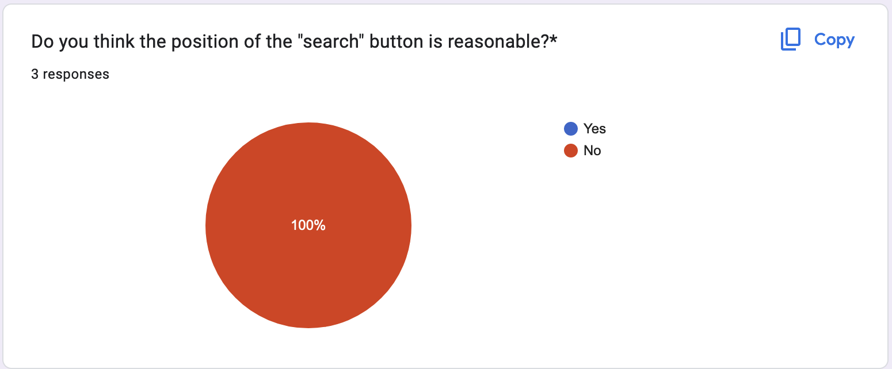

Overall, the tests went quite well, and the participants were able to complete the tasks with ease. They were noticed to be content with the interface and the overall experience. There are still some drawbacks that we need to address, but overall the application is quite intuitive and easy to use.

### SUS

The SUS questionnaire was filled out by the participants after the test. Formula: **(Sum of Odd - 5) + (25 - Sum of Even) x 2.5**
The results are as follows:

| Participant | SUS Score |
| ----------- | --------- |
| 1           | 67.5      |
| 2           | 75        |
| 3           | 77.5      |
| Mean        | 73.33     |
| Std. Dev.   | 5.77      |

- Participant 1: The SUS score is 67.5, which is considered "OK" according to the SUS score interpretation. The participant commented that the application is quite easy to use, but there are some minor drawbacks that need to be addressed. Overall the participant is satisfied with the application.
- Participant 2 and 3: The SUS score is 75 and 77.5, which is considered "Good". They commented that the application is quite easy to use, with the interface perceived as modern and intuitive. Overall, the participants are satisfied with the application.

The average SUS score is 73.33, with which we can conclude that the participants are satisfied with the application. However these numbers may not be 100% accurate for the following reasons:

- The total number of participants is too small (3 in total), which is not enough to represent the whole population.
- The tests are conducted in a *not-so-professional* manner, which may affect the results.
- The prototypes are not fully functional, which may affect the time taken by the participants to complete the tasks.

Despite the drawbacks, we can still use the SUS score as a reference to evaluate the application. In conclusion, we can say that the participants are satisfied with the application.

### User Experience Findings

| #   | Statement                                                                                                               | Redesign Recommendation                                         |
| --- | ----------------------------------------------------------------------------------------------------------------------- | --------------------------------------------------------------- |
| 1   | There is no support for Vietnamese language                                                                             | Add support for Vietnamese language                             |
| 2   | Some icon is not intuitive enough, e.g, the "My Match" icon looks more like a shop icon                                 | Redesign the icon to something more intuitive                   |
| 3   | The placement of the "Search" button is not convenient                                                                  | Place the "Search" button on the top bar                        |
| 4   | There should be a way to create a group chat to chat with multiple people at once                                       | Add a way to create a group chat                                |
| 5   | No functionality to send images and other media files                                                                   | Add functionality to send images and other media files          |
| 6   | No search function for the desired match                                                                                | Add search function and implement the search algorithm          |
| 7   | The contrast between the background and the text is not high enough. Titles should be made bold to increase readability | Increase the contrast between the background and the text       |
| 8   | No visual cues to guide the users such as breadcrumbs, icons, etc.                                                      | Design the application with more visual cues to guide the users |
| 9   | The whole process of approving candidates is quite confusing and time-consuming                                         | Redesign the process to make it less cubersome                  |
| 10  | There should be more functionality for the chat screen, e.g, deleting messages                                          | Add more functionality for the chat screen                      |
| 11  | There should be a tutorial for new users to get used to the application                                                 | Add a tutorial for new users                                    |

# Appendices

## Appendix A: Task Instructions and Post-task Questionnaire

### Task 1: Find a match missing 3 members and apply to that match 

- How easy was it to find that match?
- Observe "The match detail" screen, did you know how to view the author's information ?

### Task 2: Create a match

- How easy was it to find "Create" button?
- Is the layout form convenient for your input?
- Do you want to add any fields to make the form more complete?

### Task 3: Find the candidates who applied to your match and approve them

- How easy was it to find "My match" screen?
- Is the position of "Candidate" button convenient? If not, where do you want to put that button? 
- How do you feel about approving candidate having to go through multiple screens?
- Do you have any solution about approving candidates?

### Task 4: Find your contacts and chat with any 1 person

- Do you think this function is necessary?
- Do you think the position of the "search" button is reasonable?
- Do you want to add any function for this screen?

## Appendix B: Related Links

- [Prototype Figma](https://www.figma.com/file/nbwo7zNp0pIKGvlejzNw8L/PA3?type=design&node-id=0-1&mode=design).
- [Post-test Evaluation Questionnaire](https://docs.google.com/forms/d/e/1FAIpQLScnjuSQduXAjHtYuWBKiBL4llQeNnCmvb3qq1iKSHkf8sxK-w/viewform).
- [SUS Questionnaire](https://docs.google.com/forms/d/e/1FAIpQLScPzmo9yHW6MHqhszgN6rfgzZnCh0_a-WKtWmZ_Koo4G1F6Tg/viewform).
- [Result of post-task Questionnaire](https://docs.google.com/forms/d/1Yd-t1fsY_Ws6aU4Ac7MskPlGl87K0L6oxyLuzk313T0/edit?ts=64f41b26#responses).
- [Result of SUS Questionnaire](https://docs.google.com/forms/d/1zb0ZrLV9v14e9AvwfqXeNWwJ1k2SzHdoNXGvcHlYr-w/edit?ts=64f2fefd#response=ACYDBNiOMA5yKKngOHgm103atJGi4QOsv5qXnTmqXxRMa8RaGb5YE1u64qBPnMLkAkpwzF8).

# Reference

- https://uiuxtrend.com/measuring-system-usability-scale-sus/
- https://library.xtensio.com/usability-testing-report-template-and-examples
- https://www.nist.gov/system/files/documents/itl/vote/Guidelines_CIF_Template_Laboratories.pdf
- https://archive.pen.org/wp-content/uploads/2017/06/PEN-America-Archive-Pratt-Final-Report.pdf
- https://static1.squarespace.com/static/5bce48ba348cd923d5dfd05b/t/5c40ac460ebbe815b79dc814/1547742281627/NYFA_Usability_Report.pdf
